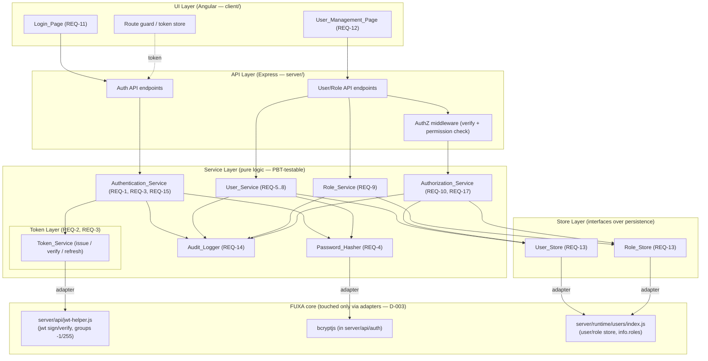

# Design — Authentication & User Management (RBAC)

> **Document role: MASTER MAP.** This `design.md` is the architecture-overview and table
> of contents for the feature. It defines the layered architecture, the adapter seams to
> FUXA, the physical file layout, and the cross-cutting conventions that every module must
> obey. The *detailed* design of each module is authored as its own file under `design/`
> (see [Table of Contents](#table-of-contents--requirement-traceability)). Read this map
> first; then read the per-module section relevant to your task.
>
> **Grounding.** Every claim about FUXA below was verified by reading the actual source
> (files cited inline). Decisions referenced as `D-***`, trade-offs `TO-***`, notes
> `N-***`, deviations `DV-***`, and properties `P-***` live in
> [`decisions/`](./decisions/) and [`decisions/traceability.md`](./decisions/traceability.md).

---

## Overview

The feature delivers a self-contained **Authentication & User Management module with
Role-Based Access Control (RBAC)**, built *inside* the FUXA workspace but bounded so it
touches FUXA core only through thin adapters (**D-003**, CONFIRMED). It provides three
capabilities, decomposed into four architectural layers (**D-001**):

1. **Authentication** — a Login Page plus services that verify credentials and issue/validate/refresh signed session tokens.
2. **User Management** — full CRUD over user accounts through a management page and service.
3. **Authorization (RBAC)** — roles, permissions, and enforcement across every protected operation.

The module **reuses FUXA's existing security primitives** rather than introducing new ones
(**D-002 / TO-001**): `jsonwebtoken` and `bcryptjs` (verified used in
`server/api/auth/index.js`) and the existing user/role persistence in
`server/runtime/users/index.js`. New logic lives behind service/store interfaces so the
FUXA store can be swapped later without changing service contracts (AC-16.5).

### How the module maps to the 17 requirements

| Capability | Requirements | Master-map anchor |
|-----------|--------------|-------------------|
| Login / credential verification | REQ-1 | Authentication_Service |
| Session tokens (issue / validate) | REQ-2 | Token layer |
| Token refresh & sign-out | REQ-3 | Token layer |
| Password hashing & verification | REQ-4 | Password_Hasher |
| User CRUD (create/list/update/delete) | REQ-5, REQ-6, REQ-7, REQ-8 | User_Service |
| Role & permission management | REQ-9 | Role_Service |
| Authorization enforcement | REQ-10 | Authorization_Service |
| Login Page (UI) | REQ-11 | UI layer |
| User Management Page (UI) | REQ-12 | UI layer |
| Serialization round-trip | REQ-13 | Store layer + Data models |
| Security audit logging | REQ-14 | Audit_Logger |
| Brute-force protection | REQ-15 | Authentication_Service |
| Modular architecture | REQ-16 | This master map (Architecture, Components, Principles) |
| Administrator bootstrap (first-run seeding) | REQ-17 | Bootstrap flow (Service layer) |

All 17 requirements map forward to at least one design section; the reverse mapping is in
the [Table of Contents](#table-of-contents--requirement-traceability) and mirrors
[`traceability.md`](./decisions/traceability.md).

---

## Architecture

The module is organized into four strictly separated layers (AC-16.1). The **API layer
never touches the store directly** — it delegates to services (AC-16.3); services expose
capability interfaces that hide storage (AC-16.2); the store implementation is replaceable
without changing service interfaces (AC-16.5).



**Layer responsibilities**

- **UI layer** (`client/`, Angular): renders the Login Page and User Management Page,
  performs client-side validation (AC-11, AC-12.4, **D-004b**), stores the Access_Token, and
  guards routes. It calls only the API layer over HTTP.
- **API layer** (`server/`, Express): HTTP endpoints, request shape validation, and the
  authorization middleware seam. It delegates all business logic to services and **fails
  fast** if a service is unavailable (AC-16.4, **TO-004**). It must not read/write the store
  directly (AC-16.3).
- **Service layer** (pure logic): the four services plus `Password_Hasher`, `Audit_Logger`,
  and the `Token_Service`. This layer holds the testable correctness logic (P-001..P-009).
- **Store layer**: `User_Store` / `Role_Store` interfaces. The default implementation adapts
  FUXA's `runtime/users` (**D-002**); a different backing store may replace it without
  changing service interfaces (AC-16.5).

---

## Components and Interfaces

Each service exposes a capability interface that hides storage (AC-16.2). Signatures below
are the master-map contract; per-module sections refine parameter/return shapes.

| Component | Interface (capabilities) | Requirements |
|-----------|--------------------------|--------------|
| `Authentication_Service` | `signIn(credentials)`, `signOut(session)`; delegates password compare to `Password_Hasher`, token issue to `Token_Service`, throttling to brute-force guard | REQ-1, REQ-3, REQ-15 |
| `Token_Service` | `issueAccessToken(identity)`, `issueRefreshToken(identity)`, `verify(token)`, `refresh(refreshToken)` | REQ-2, REQ-3 |
| `User_Service` | `create(req)`, `list()`, `get(username)`, `update(username, req)`, `delete(username)` | REQ-5..8 |
| `Role_Service` | `create(role)`, `list()`, `update(name, permissions)`, `delete(names)` | REQ-9 |
| `Authorization_Service` | `isAllowed(identity, operation)`; resolves roles→permissions; enforces bootstrap gate | REQ-10, REQ-17 |
| `Password_Hasher` | `hash(plaintext)`, `verify(plaintext, hash)` | REQ-4 |
| `Audit_Logger` | `record(event)` | REQ-14 |
| `User_Store` / `Role_Store` | `read`/`write`/`remove` over records; hides FUXA `info.roles` shape | REQ-13, AC-16.5 |

### Adapter seams to FUXA (anti-upgrade-conflict rationale — D-003)

The workspace is **not** a git repo and is meant to receive future FUXA upgrades (**N-001**).
To minimize `git merge` conflicts and keep logic PBT-testable, the module concentrates all
FUXA coupling into a small number of **thin adapters**. FUXA core route handlers are **not**
edited in place.

| Seam | FUXA primitive (verified) | Adapter (new, module-owned) | Requirements |
|------|---------------------------|-----------------------------|--------------|
| **Token seam** | `server/api/jwt-helper.js` — `jwt.sign({id, groups}, secretCode, {expiresIn})`, `verify`, `verifyAndDecode`, `tokenExpiresIn` default `60*60`s | `TokenAdapter` wrapping sign/verify behind `Token_Service` | REQ-2, REQ-3 |
| **Hash seam** | `bcryptjs` used in `server/api/auth/index.js` via `bcrypt.compareSync` | `BcryptHasherAdapter` implementing `Password_Hasher` | REQ-4 |
| **Store seam** | `server/runtime/users/index.js` — `getUsers/setUsers/removeUsers/getRoles/setRoles/removeRoles/findOne/getUserCache`; roles held in the user `info.roles` array; `usersMap` permission cache | `FuxaUserStoreAdapter` / `FuxaRoleStoreAdapter` implementing `User_Store` / `Role_Store` | REQ-5..9, REQ-13 |

Verified seam facts:

- **Signing / claims.** `server/api/auth/index.js → buildAccessToken` signs
  `{ id: username, groups }` with `secretCode` and `{ expiresIn: tokenExpiresIn }`. The RBAC
  claim mapping (below) is applied *inside* the Token seam so the encoded token remains
  FUXA-compatible.
- **Refresh.** `server/api/auth/index.js` already implements HttpOnly refresh via the
  `fuxa_refresh` cookie (`setRefreshCookie`, `clearRefreshCookie`, `/api/refresh`,
  `/api/signout` → 204). The Token seam reuses this exactly (REQ-3), so no new cookie scheme
  is introduced.
- **Password compare.** Sign-in currently calls `bcrypt.compareSync(req.body.password,
  userInfo[0].password)`. The Hash seam relocates this comparison behind `Password_Hasher`
  so services never compare plaintext directly (AC-1.5, AC-4.*).
- **Store shape.** `runtime/users` persists a user as `{ username, fullname, password,
  groups, info }` where `info` is a JSON string and role identifiers live in `info.roles`
  (verified in `removeRoles`, which filters `user.info.roles`). The Store seam is the only
  place that knows this shape.
- **API authorization hook.** `server/api/users/index.js` guards each route with
  `secureFnc` (FUXA's `jwt-helper.verifyToken`) then `checkGroupsFnc(req)` and
  `authJwt.haveAdminPermission(permission)`. The module replaces this admin-only gate with a
  permission-based check via `Authorization_Service` at the API-layer seam.

### Reconciling FUXA group codes (−1 / 255 admin, `'guest'` guest) with RBAC

FUXA's `jwt-helper.js` defines `adminGroups = [-1, 255]` and `haveAdminPermission()` treats
**both** those group codes as full admin; the seeded default admin uses `groups = -1`
(integer). A **guest** is the string `'guest'` (or an absent/invalid token) — NOT numeric
`-1` (verified in `server/api/jwt-helper.js` and `server/runtime/users/usrstorage.js`). The
new model is role→permission based (REQ-9, REQ-10). The seam reconciles the two **without
breaking FUXA tokens**:

- **Token still carries `groups`.** The Access_Token keeps the FUXA `groups` claim so
  existing FUXA endpoints keep working during and after the migration.
- **Mapping rule** (detailed in `design/05-rbac-authorization.md`):
  - Group `255` and `-1` (integers) ⇒ administrator ⇒ grants the `ADMIN_PERMISSION_SET` as a
    compatibility input (satisfies AC-10.4).
  - Group `'guest'` (string) or an absent/invalid token ⇒ unauthenticated/guest identity ⇒
    denied protected operations with **401** (feeds AC-10.3).
  - Any other numeric group code ⇒ standard user ⇒ no admin contribution; permissions come
    only from RBAC roles.
  - New RBAC roles (from `info.roles` + `Role_Store`) resolve to a permission set that the
    `Authorization_Service` evaluates per operation (AC-10.1, AC-10.2).
- **Direction of authority.** RBAC permissions are the source of truth for the module's own
  protected operations; the legacy group code is a *compatibility input* mapped into the RBAC
  model, never the other way around. This keeps a single decision path for AC-10.5
  determinism (P-006).

> The exact mapping table, precedence rules, and the bootstrap-gate interaction (REQ-17,
> AC-17.2) are specified in [`design/05-rbac-authorization.md`](./design/05-rbac-authorization.md)
> and [`design/12-admin-bootstrap.md`](./design/12-admin-bootstrap.md).

---

## Data Models

The full model definitions and their round-trip properties are authored in
[`design/11-data-models.md`](./design/11-data-models.md) and
[`design/06-persistence-and-serialization.md`](./design/06-persistence-and-serialization.md).
Master-map summary of the entities (aligned with the FUXA store shape verified above):

| Model | Fields (summary) | Notes |
|-------|------------------|-------|
| `User_Record` | `username` (unique), `fullname`, `passwordHash`, `roles[]`, `groups`, `info` (metadata object) | Persisted via FUXA store as `{ username, fullname, password, groups, info }`; roles live in `info.roles`. Password stored only as hash (AC-4.2). |
| `Role` | `name` (unique), `permissions[]` | Persisted via FUXA `setRoles/getRoles` (JSON value rows). |
| `Permission` | `id` (e.g. `user.create`) | Named capability gating one operation (REQ-10). |
| `Audit_Event` | `operation`, `subject`, `outcome`, `timestamp` | Secrets sanitized by caller before logging (AC-14.5). |
| `Access_Token` / `Refresh_Token` | signed claims `{ id, groups, ... }`; refresh `{ id, type: 'refresh' }` | Reuses FUXA JWT + `fuxa_refresh` cookie. |

Serialization boundaries carry explicit round-trip properties (P-003, P-004, P-005) so no
field is lost across persistence (REQ-13).

---

## Physical Layout (proposed)

### Module source (inside FUXA `client/` and `server/`)

New, module-owned code is grouped under an `auth-management` boundary in each tier so it is
easy to git-track and to diff against future FUXA upgrades. FUXA core files are left
unedited except for a **single, minimal wiring line** where the new API router mounts
(documented in the API section).

```
server/
  auth-management/                     # module-owned server code (new)
    api/                               # API layer (Express routers)
      authentication.router.js         # REQ-1, REQ-3
      users.router.js                  # REQ-5..8, REQ-12 backend
      roles.router.js                  # REQ-9
      authorization.middleware.js      # REQ-10 API seam (permission check)
    services/                          # Service layer (pure, PBT-testable)
      authentication.service.js        # REQ-1, REQ-15
      token.service.js                 # REQ-2, REQ-3
      user.service.js                  # REQ-5..8
      role.service.js                  # REQ-9
      authorization.service.js         # REQ-10, REQ-17 gate
      password-hasher.js               # REQ-4
      audit-logger.js                  # REQ-14
      bootstrap.js                     # REQ-17
      brute-force.js                   # REQ-15
    store/                             # Store layer (interfaces + adapters)
      user-store.interface.js          # REQ-13, AC-16.5
      role-store.interface.js
      serialization.js                 # REQ-13 round-trip
    adapters/                          # thin FUXA seams (D-003)
      fuxa-jwt.adapter.js              # -> server/api/jwt-helper.js
      fuxa-bcrypt.adapter.js           # -> bcryptjs
      fuxa-user-store.adapter.js       # -> server/runtime/users/index.js
    models/                            # REQ-13 data models
      user-record.js  role.js  permission.js  audit-event.js
    index.js                           # module composition root + router export

client/src/app/
  auth-management/                     # module-owned client code (new)
    login/                             # REQ-11 (may absorb/replace existing app/login)
    user-management/                   # REQ-12 (may absorb/replace existing app/users)
    services/                          # HTTP clients to the API layer
    guards/                            # route guard + token store (extends app/auth.guard.ts)
    models/                            # UI DTOs
```

> Existing FUXA UI folders `client/src/app/login/` and `client/src/app/users/` already exist
> (verified). Whether the module *extends* or *supersedes* them is a per-section decision
> recorded in `07-ui-login-page.md` / `08-ui-user-management-page.md`; the master rule is that
> new logic lands under `auth-management/` to preserve the module boundary.

### Design section files (this spec)

```
.kiro/specs/auth-user-management/
  design.md                            # THIS master map
  design/
    01-authentication.md
    02-token-and-session.md
    03-password-security.md
    04-user-management.md
    05-rbac-authorization.md
    06-persistence-and-serialization.md
    07-ui-login-page.md
    08-ui-user-management-page.md
    09-audit-logging.md
    10-brute-force-protection.md
    11-data-models.md
    12-admin-bootstrap.md
```

---

## API Composition Root & Cutover Strategy (D-014 / D-018 — added 2026-07-13)

> This section closes two verified defects: **N-014** (the module reuses FUXA's URLs but the design
> never specified how it becomes authoritative — a "mount-after" leaves it shadowed) and **N-013**
> (the `account.rotatePassword` gate-exception operation had no HTTP endpoint). Grounded in
> `server/api/index.js`, `server/api/auth/index.js`, `server/api/users/index.js` (all read 2026-07-13).

### Verified precedence problem

`server/api/index.js` mounts, in order: `apiApp.use(authLimiter)` → `apiApp.use(limiter)` →
`prjApi` → `usersApi` (`/api/users`, `/api/roles`) → `authApi` (`/api/signin`, `/api/refresh`,
`/api/signout`) → … Express resolves the **first** handler that ends the response. The module
reuses these exact URLs, so mounting the module **after** `usersApi`/`authApi` would let FUXA's
handlers answer first and the module's RBAC/audit/`mustRotate`/brute-force would never run.

### Cutover decision — SUPERSEDE at the composition root (D-014, option 1)

The module is **authoritative** for the identity URLs; FUXA's overlapping routers are **not mounted**:

1. In `server/api/index.js`, **stop mounting** FUXA's `usersApi` and `authApi` for the superseded
   paths — i.e. remove (or guard behind a legacy flag) the `usersApi.init/app()` and
   `authApi.init/app()` mounts. This is the **only** FUXA-core edit and remains within the D-003
   "single wiring touch" boundary (composition wiring, not FUXA business logic).
2. **Mount the module router after `apiApp.use(authLimiter)`** so `/api/signin` and
   `/api/refresh` are still IP-rate-limited by FUXA's existing limiter (verified: `authLimiter`
   skips all paths except those two), then after `apiApp.use(limiter)`.
3. The module router owns: `POST /api/signin`, `POST /api/refresh`, `POST /api/signout`,
   `GET|POST|PUT|DELETE /api/users[/:username]`, `GET|POST|PUT|DELETE /api/roles[...]`, and the new
   rotate endpoint below. All flow through the authorization middleware (§05) + services.

> **Behavioral change (intended).** `/api/users` and `/api/roles` are now governed by RBAC
> permissions (§05), not FUXA's `haveAdminPermission(groups)` admin-group gate; `/api/signin` now
> runs the module's `Authentication_Service` (brute-force + audit + `mustRotate`). Any FUXA code or
> test expecting the old admin-group behavior must migrate. **Client cutover (D-011) MUST land in
> the same change**: `AuthGuard`/interceptor point at the module's routed Login/User-Management
> pages instead of the FUXA dialog/`app/users`.
>
> **Alternative on file (not chosen):** a parallel `/api/v2/identity/*` namespace with a dual-run
> migration (TO-011 option 2) — heavier (client URL migration + dual stack); kept only as a
> fallback if a gradual cutover is later required.

### The bootstrap-gate endpoint (D-018 — closes N-013)

`account.rotatePassword` (§12 §4, permission `account.rotatePassword` per §05 §2.2) is exposed as:

- **`POST /api/account/rotate-password`** → `Account_Service.rotatePassword(identity, { currentPassword, newPassword })`.
- It requires an authenticated identity and verifies the **current** secret; it is the **only**
  operation the authorization middleware permits while `identity.mustRotate` is true (§05 §4.2
  step 2), so a seeded/migrated admin can always reach it and nothing else until it rotates.
- The **composition root** (`server/auth-management/index.js`) MUST instantiate `Account_Service`
  (currently missing) and mount this route. On success it clears `mustRotate` and **bumps
  `tokenVersion`** (D-015) so any token minted before the rotation is invalidated.

### Correctness property

**P-014** (owned by this composition/API layer): *for every superseded identity URL, a request is
handled by the module (its RBAC/authentication decision is applied) and never by a residual FUXA
handler; and a `mustRotate` identity can reach `POST /api/account/rotate-password` but no other
protected operation.* Verified by an integration test (G3/G4).

---

## Table of Contents & Requirement Traceability

Each per-module section (authored in later invocations) covers the requirements and
correctness properties shown below. This mirrors
[`decisions/traceability.md`](./decisions/traceability.md) §A–C.

| # | Section file | Design ID | Requirements | Properties |
|---|--------------|-----------|--------------|-----------|
| 01 | [`design/01-authentication.md`](./design/01-authentication.md) | DES-AUTH | REQ-1 | — |
| 02 | [`design/02-token-and-session.md`](./design/02-token-and-session.md) | DES-TOKEN | REQ-2, REQ-3 | P-007, P-008 |
| 03 | [`design/03-password-security.md`](./design/03-password-security.md) | DES-PWD | REQ-4 | P-001, P-002 |
| 04 | [`design/04-user-management.md`](./design/04-user-management.md) | DES-USER | REQ-5, REQ-6, REQ-7, REQ-8 | — |
| 05 | [`design/05-rbac-authorization.md`](./design/05-rbac-authorization.md) | DES-RBAC | REQ-9, REQ-10 | P-006 |
| 06 | [`design/06-persistence-and-serialization.md`](./design/06-persistence-and-serialization.md) | DES-STORE | REQ-13 | P-003, P-004, P-005 |
| 07 | [`design/07-ui-login-page.md`](./design/07-ui-login-page.md) | DES-UI-LOGIN | REQ-11 | — |
| 08 | [`design/08-ui-user-management-page.md`](./design/08-ui-user-management-page.md) | DES-UI-USERS | REQ-12 | — |
| 09 | [`design/09-audit-logging.md`](./design/09-audit-logging.md) | DES-AUDIT | REQ-14 | — |
| 10 | [`design/10-brute-force-protection.md`](./design/10-brute-force-protection.md) | DES-BRUTE | REQ-15 | — |
| 11 | [`design/11-data-models.md`](./design/11-data-models.md) | DES-DATA | REQ-13, cross-cutting | P-003, P-004, P-005 |
| 12 | [`design/12-admin-bootstrap.md`](./design/12-admin-bootstrap.md) | DES-BOOT | REQ-17 | P-009 |

**Coverage check:** REQ-1..17 each appear at least once above (no orphan requirements);
each section maps back to at least one requirement (no orphan sections). This satisfies the
anti-drift orphan check ([`README.md`](./decisions/README.md) §4).

---

## Security Posture (cross-cutting)

- **No plaintext passwords anywhere.** Comparison and hashing happen only inside
  `Password_Hasher` (AC-1.5, AC-4.1, AC-4.2); the Store persists only the hash and excludes
  it on read (AC-4.2, AC-6.2).
- **Tokens always expire by default.** Per **TO-002 / DV-003**, an unconfigured deployment
  still issues tokens with a safe default TTL of **1 hour** (AC-2.7); non-expiring tokens are
  an explicit dev-only mode (AC-2.8). This matches FUXA's existing `tokenExpiresIn = 60*60`
  default in `jwt-helper.js` but forbids silent non-expiry.
- **Refresh via HttpOnly cookie** (`fuxa_refresh`), reusing FUXA's existing mechanism; refresh
  failures clear the cookie and return 401 (AC-3.3).
- **Bootstrap safety.** The seeded first admin cannot perform any protected action except
  password rotation until it rotates its password (REQ-17, AC-17.2; **D-005 / TO-005 /
  DV-004**), proven by P-009.
- **Brute-force throttling** on repeated failed sign-ins (REQ-15), including the fail-closed
  edge where a threshold of zero rejects all attempts (AC-15.3).
- **Audit trail** for sign-in, user/role changes, and authorization denials, with secrets
  sanitized by the calling service before logging (AC-14.5, **D-004c**).
- **Network exposure note (N-002):** FUXA currently binds `127.0.0.1`. Any deployment that
  exposes these authentication-bearing endpoints beyond localhost must terminate TLS and set
  the `secure` cookie flag.

---

## Error Handling

Aligned with the existing FUXA API surface (verified in `auth/index.js` and `users/index.js`):

| Situation | Status | Shape |
|-----------|--------|-------|
| Success (data) | 200 | `{ status: 'success', data: {...} }` or resource JSON |
| Success (no content) — e.g. sign-out | 204 | empty |
| Missing required field | 400 | `{ error, message }` |
| Bad credentials at sign-in — wrong password **or** unknown username (DV-006) | 401 | `{ status: 'error', error: 'invalid_credentials', message }` (identical for both, no enumeration oracle) |
| Unauthenticated protected request | 401 | `{ error: 'unauthorized_error', message }` |
| Authenticated but lacking permission | 403 | `{ error, message }` |
| Unknown username on an **authenticated admin lookup/CRUD** (user update/delete, AC-7.4/AC-8.3) | 404 | `{ error: 'user_not_found', username, message }` |
| Rate-limited (brute force) | 429 | `{ error, message }` |
| Service layer unavailable (fail fast, AC-16.4) | 5xx | `{ error, message }` |

Every error carries a stable **error identifier** so the UI can branch and audit entries are
greppable. Serialization failures on a single stored metadata string must report a
descriptive error **without** terminating the containing operation for unrelated records
(AC-13.4).

---

## Testing Strategy

**Dual approach.** Example/edge/integration unit tests verify concrete behavior (HTTP status
codes, cookie clearing, fail-fast, invalid inputs); property-based tests verify universal
properties across generated inputs. FUXA already ships `mocha`/`chai`/`sinon` (verified in
`server/node_modules`), so server-side tests use that runner.

**Where PBT applies (and where it does not).** PBT targets the pure service/store logic —
hashing, serialization round-trips, authorization decisions, and token validity. PBT is
**not** applied to Angular UI rendering (REQ-11, REQ-12) or to pure wiring/config; those use
example-based component tests and integration tests.

**Rules for every property-based test** (enforced in per-section designs and tasks):
- Use the ecosystem's PBT library (`fast-check` for TypeScript/JS); do not hand-roll a
  property framework.
- Minimum **100 iterations** per property.
- Tag format: `Feature: auth-user-management, Property {n}: {property text}`.
- Each property test references its owning design section's property ID.

---

## Correctness Properties

> *A property is a characteristic or behavior that should hold true across all valid
> executions of a system — a formal statement about what the system should do. Properties are
> the bridge between human-readable specifications and machine-verifiable correctness.*

This master map formalizes the nine cross-cutting properties (P-001..P-009 from
[`traceability.md`](./decisions/traceability.md) §C) as universally-quantified statements.
Each property's *test implementation detail* (generators, fakes, edge cases) is authored in
its owning per-module section (see the Table of Contents).

### Property 1: Password hash verifies its own plaintext

*For any* plaintext password `p`, `verify(p, hash(p))` is true; and two independently produced
hashes of the same `p` each verify true against `p`.

**Validates: Requirements 4.3, 4.4** — (P-001)

### Property 2: Password hash rejects a different plaintext

*For any* two distinct plaintext passwords `A` and `B` (`A ≠ B`) **within the enforced valid-password
domain (UTF-8 byte length ≤ 72, AC-4.6)**, `verify(B, hash(A))` is false. (The bound is required
because bcrypt truncates input beyond 72 bytes — D-017 / N-012; passwords exceeding 72 bytes are
rejected at validation, not hashed.)

**Validates: Requirements 4.5, 4.6** — (P-002)

### Property 3: User_Record write→read round-trip

*For any* valid `User_Record`, writing it to the `User_Store` and reading it back returns a
record whose `username`, `fullname`, `roles`, and `metadata` equal the written values.

**Validates: Requirements 13.1** — (P-003)

### Property 4: Role write→read round-trip

*For any* valid `Role`, writing it to the `Role_Store` and reading it back returns a role whose
`name` and `permission set` equal the written values.

**Validates: Requirements 13.2** — (P-004)

### Property 5: Metadata serialization is an identity round-trip

*For any* valid metadata object `m`, `deserialize(serialize(m))` equals `m`.

**Validates: Requirements 13.3** — (P-005)

### Property 6: Authorization decisions are deterministic

*For any* identity and protected operation, evaluating authorization twice — with no change to
the identity's roles or those roles' permissions — yields the same decision on the second
evaluation as on the first.

**Validates: Requirements 10.5** — (P-006)

### Property 7: A token is authenticated iff its signature is valid and it is unexpired

*For any* Access_Token, the `Token_Service` reports it as authenticated if and only if its
signature is valid and its expiry time is in the future; an invalid signature or a past
expiry yields not-authenticated.

**Validates: Requirements 2.3, 2.4, 2.5**

### Property 8: Unconfigured deployments still issue finite-TTL tokens

*For any* token issuance when no expiry duration is configured and non-expiring dev mode is not
enabled, the issued Access_Token carries a finite expiry set to the safe default of one hour.

**Validates: Requirements 2.7**

### Property 9: A seeded admin cannot act before password rotation

*For any* protected operation other than password rotation, a freshly seeded default
Administrator that has not completed a password rotation is denied; after rotation the account
is granted its administrator permissions.

**Validates: Requirements 17.2, 17.3**

---

## Design Principles & Constraints (modular boundary rules)

Restating the boundary contract from REQ-16 (AC-16.1..16.5). These are binding on every
per-module section and every task:

1. **AC-16.1 — Four separated layers.** UI, API, Service, and Store are distinct components;
   no layer collapses into another.
2. **AC-16.2 — Interface-hidden storage.** Authentication, User, Role, and Authorization
   services each expose a capability interface that hides storage details from callers.
3. **AC-16.3 — API does not touch the store.** API-layer handlers delegate to services and
   never read/write `User_Store` / `Role_Store` directly.
4. **AC-16.4 — Fail fast.** If the service layer is unavailable when the API receives a
   request, the API fails the request immediately with an error (no silent queue/retry;
   **TO-004**).
5. **AC-16.5 — Replaceable store.** Changing the store implementation must not change any
   service interface; the FUXA store adapter is the only component aware of FUXA's
   `info.roles` shape.

**Boundary discipline (D-003):** the module lives inside FUXA but edits FUXA core only through
the three adapters in *Components and Interfaces*. No design task may edit FUXA route handlers
or `runtime/users` logic in place; the one permitted core touch is the minimal router-mount
wiring line noted in the API section. This is what keeps future `git merge origin/master`
upgrades low-conflict (**N-001**) and keeps the logic PBT-testable.

---

## Next Steps

This master map is complete and ready for review. On approval, the per-module section files
listed in the Table of Contents will be authored one at a time — each running its own
acceptance-criteria prework and formalizing its owning correctness properties (P-001..P-009).
If review reveals a gap in the requirements, we can return to requirements clarification
before proceeding.
