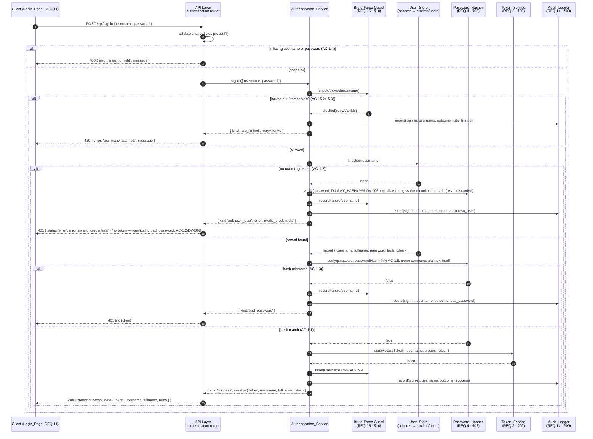

# Design Section 01 — Authentication (Sign-In) · `DES-AUTH`

> **Section role: DETAILED DESIGN.** This file details the sign-in path of the
> `Authentication_Service` (REQ-1). Read [`../design.md`](../design.md) (the **master map**)
> first — it owns the layered architecture, the adapter seams, the Error Handling
> status/shape table, and the module-boundary rules (D-003, AC-16.*). This section refines
> those decisions for REQ-1 only; it does not restate or override them.
>
> **Covers:** REQ-1 (User Authentication / Login), acceptance criteria AC-1.1 … AC-1.5.
> **Owns properties:** none (see [§8](#8-testing-notes-req-1)); it *references* P-001/P-002
> (owned by [`03-password-security.md`](./03-password-security.md)) and P-007 (owned by
> [`02-token-and-session.md`](./02-token-and-session.md)).
>
> **Grounding.** Every FUXA claim below was verified by reading the actual source:
> `server/api/auth/index.js`, `server/api/jwt-helper.js`, `server/runtime/users/index.js`.
> Files are cited inline. Decisions/notes referenced as `D-***` / `N-***` live in
> [`../decisions/`](../decisions/) and [`../decisions/traceability.md`](../decisions/traceability.md).

---

## 1. Purpose & Scope

This section specifies **how a registered user exchanges a username and password for an
authenticated session**, and exactly how every sign-in outcome maps to an HTTP response.

Scope is deliberately narrow: the **credential-verification decision** and its response
contract. Everything the sign-in path *collaborates with* is designed elsewhere and only
referenced here (see [§6](#6-collaborators--boundaries)):

- token issuance/claims → [`02-token-and-session.md`](./02-token-and-session.md) (REQ-2, REQ-3);
- password hashing/verification → [`03-password-security.md`](./03-password-security.md) (REQ-4);
- brute-force throttling → [`10-brute-force-protection.md`](./10-brute-force-protection.md) (REQ-15);
- audit event recording → [`09-audit-logging.md`](./09-audit-logging.md) (REQ-14).

### Where it sits in the layered architecture

Per the master map's four layers (AC-16.1, **D-001**), sign-in flows **UI → API → Service →
Store**, with the Service layer holding the decision logic:

- **API layer** — `server/auth-management/api/authentication.router.js` exposes
  `POST /api/signin`. It validates request *shape* only (presence of fields, AC-1.4),
  delegates to the service, and never touches the store directly (AC-16.3). It fails fast if
  the service layer is unavailable (AC-16.4).
- **Service layer** — `server/auth-management/services/authentication.service.js` owns
  `signIn(...)`: it looks a user up via `User_Store`, delegates comparison to
  `Password_Hasher` (AC-1.5), asks `Token_Service` to issue the token, records the attempt
  via `Audit_Logger`, and consults the brute-force guard.
- **Store layer** — `User_Store` (the `FuxaUserStoreAdapter`, **D-002**) is the only
  component that knows FUXA's `{ username, fullname, password, groups, info }` record shape;
  role identifiers live in `info.roles` (verified in `server/runtime/users/index.js`).

> **Boundary note (D-003).** FUXA today performs the entire sign-in inline inside the route
> handler at `server/api/auth/index.js` (it calls `runtime.users.findOne`, then
> `bcrypt.compareSync`, then `jwt.sign` in one function). This module **does not edit that
> handler in place**; it re-expresses the same flow as a layered service reachable through a
> new, module-owned router, so the logic becomes PBT-testable and low-conflict on future FUXA
> upgrades (**N-001**).

---

## 2. `Authentication_Service` Sign-In Contract

The master map lists `signIn(credentials)` as the capability (AC-16.2). This section fixes
its precise, testable shape.

### 2.1 Input

```
SignInRequest = {
  username: string,   // required, non-empty after trim
  password: string    // required, non-empty
}
```

- The API layer maps the HTTP body to `SignInRequest`. Only `username` and `password` are
  read; any other body fields are ignored by the service (they are not forwarded to the
  store as query filters — see the edge case in [§7](#7-error-handling--edge-cases-specific-to-sign-in)).

### 2.2 Output (outcome type)

`signIn` resolves to exactly one **outcome**, which the API layer translates to HTTP
([§4](#4-outcome--http-response-mapping)). Modeling the result as a closed set of outcomes —
rather than throwing for control flow — keeps the decision deterministic and directly
testable.

```
SignInOutcome =
  | { kind: 'success',        session: SignInSession }
  | { kind: 'missing_field',  error: 'missing_field',      field: 'username' | 'password' }
  | { kind: 'unknown_user',   error: 'invalid_credentials' }   // DV-006: client-facing id + body identical to bad_password; `kind` kept only for server-side audit granularity
  | { kind: 'bad_password',   error: 'invalid_credentials' }
  | { kind: 'rate_limited',   error: 'too_many_attempts',  retryAfterMs: number }   // REQ-15 (§10)

SignInSession = {
  token:    string,       // Access_Token issued by Token_Service (REQ-2)
  username: string,
  fullname: string,
  roles:    string[]      // derived from the stored record (see §2.3)
}
```

### 2.3 Success payload and the `roles` field (AC-1.1)

AC-1.1 requires the success response to contain **token, username, full name, and assigned
roles**. The store record exposes roles inside the `info` metadata object as `info.roles`
(verified in `server/runtime/users/index.js` — `removeRoles` and `_loadUsers` both read
`user.info.roles`). The `User_Store` adapter is responsible for surfacing `roles` as a
first-class field so the service and API never parse `info` themselves (AC-16.2 / AC-16.5).

> **Reconciliation with the FUXA response (verified).** FUXA's current `/api/signin` returns
> `data: { username, fullname, groups, info, token }` (`server/api/auth/index.js`). AC-1.1
> instead mandates `roles`. The module's success payload therefore returns
> `{ token, username, fullname, roles }`; `groups` is retained inside the signed token claim
> for FUXA compatibility (see the Token seam in the master map and
> [`02-token-and-session.md`](./02-token-and-session.md)), not surfaced as a top-level
> sign-in field. This is a deliberate, minimal contract change scoped to the module's own
> router.

### 2.4 Error identifiers

Every non-success outcome carries a **stable string error identifier** (the `error` field
above) so the Login Page can branch on it (REQ-11, AC-11.4) and audit entries are greppable
(REQ-14). The identifiers are the contract; the HTTP status is derived from them in [§4](#4-outcome--http-response-mapping).

---

## 3. Sign-In Sequence

The diagram shows the full collaboration for a single `POST /api/signin`, including the
brute-force guard checkpoints (REQ-15 — the guard's internal counting/lockout logic is
**detailed in [`10-brute-force-protection.md`](./10-brute-force-protection.md)**, referenced
here only at its checkpoints).



**Checkpoint summary (brute-force, REQ-15 — referenced, not specified here):**

- **Pre-check** `checkAllowed(username)` runs *before* store lookup and password compare so a
  locked account short-circuits to `429` without touching credentials (AC-15.2, AC-15.3).
- **On any failed outcome** (`unknown_user`, `bad_password`) the service calls
  `recordFailure(username)` to advance the consecutive-failure count.
- **On success** the service calls `reset(username)` to zero the count (AC-15.4).

The exact threshold, lockout duration, counter storage, and the “lockout elapsed → resume”
behavior (AC-15.1, AC-15.5) are the property of [`10-brute-force-protection.md`](./10-brute-force-protection.md).

---

## 4. Outcome → HTTP Response Mapping

This mapping is the concrete, REQ-1 instance of the master map's **Error Handling**
status/shape table (see [`../design.md`](../design.md#error-handling)). It must not diverge
from it.

| Outcome (`SignInOutcome`) | AC | HTTP status | Response body | Token returned? |
|---------------------------|----|-------------|---------------|-----------------|
| `success` | AC-1.1 | **200** | `{ status: 'success', data: { token, username, fullname, roles } }` | **Yes** |
| `unknown_user` | AC-1.2 (DV-006) | **401** | `{ status: 'error', error: 'invalid_credentials', message }` — **byte-identical** to `bad_password` | **No** |
| `bad_password` | AC-1.3 | **401** | `{ status: 'error', error: 'invalid_credentials', message }` | **No** |
| `missing_field` | AC-1.4 | **400** | `{ error: 'missing_field', message }` (carries an error identifier) | **No** |
| `rate_limited` | AC-15.2/15.3 (collaborator) | **429** | `{ error: 'too_many_attempts', message }` | **No** |

**Verified alignment with FUXA (`server/api/auth/index.js`):**

- **200 success** — FUXA responds `res.json({ status:'success', ..., data:{ ... token } })`.
  The module keeps `status:'success'` and the `token`, and adjusts `data` to
  `{ token, username, fullname, roles }` per AC-1.1 ([§2.3](#23-success-payload-and-the-roles-field-ac-11)).
- **401 bad password** — FUXA responds `res.status(401).json({ status:'error', message:'Invalid email/password!!!', data:null })` from the `else` branch of `bcrypt.compareSync`.
  The module preserves the `401` + `status:'error'` shape and adds the stable
  `error:'invalid_credentials'` identifier.
- **Unknown user (DV-006 — diverges from FUXA on purpose).** FUXA responds `res.status(404).end()`
  when `findOne` yields no record (the outer `else`, verified). The module **intentionally departs**
  from this: an unknown username returns the **same `401 { status:'error', error:'invalid_credentials' }`**
  as a bad password, with **no token**, plus a dummy-hash `verify` to equalize timing — so neither the
  status/body nor the response latency reveals whether the username exists (removes the
  username-enumeration oracle). This is the approved requirement change AC-1.2 (DV-006), also applied
  to post-delete sign-in (AC-8.4).
- **400 missing field** — FUXA reaches `400` only via its `.catch(...)`
  (`{ error: err.code || 'unexpected_error', message }`). The module instead validates field
  presence *up front* at the API layer and returns `400 { error:'missing_field', ... }`
  deterministically (see [§7](#7-error-handling--edge-cases-specific-to-sign-in)).

> **Distinct 401s.** A *bad password* at sign-in (this section, AC-1.3) and an *unauthenticated
> protected request* (AC-10.3, `{ error:'unauthorized_error' }` from
> `jwt-helper.requireAuth`, verified) are both `401` but carry **different error
> identifiers**. Keeping them distinct lets the UI and audit log tell “wrong password” from
> “no/invalid token” apart.

---

## 5. Structural Enforcement of AC-1.5 (no plaintext comparison in the service)

AC-1.5 requires the `Authentication_Service` to **delegate password comparison to
`Password_Hasher` and never compare plaintext directly.** This is enforced *structurally*,
not merely by convention:

1. **The service has no hashing/compare capability of its own.** It depends only on the
   `Password_Hasher` interface (`verify(plaintext, hash) → boolean`) injected at construction.
   It does not import `bcryptjs` and does not use `===`, `==`, or any string comparison on the
   password. The only thing the service does with the submitted plaintext is pass it, once, to
   `Password_Hasher.verify`.
2. **The stored value never leaves the store as plaintext.** `User_Store` returns
   `passwordHash` (a one-way hash), never a plaintext password (AC-4.2). There is therefore no
   plaintext-vs-plaintext comparison available to make.
3. **The comparison lives inside `Password_Hasher`.** The `BcryptHasherAdapter`
   ([`03-password-security.md`](./03-password-security.md)) is the sole caller of
   `bcrypt.compareSync`. This **relocates** the comparison that FUXA currently performs inline
   in the route handler (`bcrypt.compareSync(req.body.password, userInfo[0].password)`,
   verified in `server/api/auth/index.js`) behind the `Password_Hasher` boundary.
4. **Post-verification, plaintext is discarded.** The service holds no reference to the
   plaintext after the single `verify` call; only the outcome (`true`/`false`) flows onward.

Consequence for testing: because comparison is a single delegated call, a test can inject a
fake `Password_Hasher` and assert the service (a) calls `verify` with the submitted plaintext
and the stored hash and (b) never receives or logs the stored hash beyond that call
([§8](#8-testing-notes-req-1)). The *correctness* of comparison itself (P-001/P-002) is proven
in section 03, not here.

---

## 6. Collaborators & Boundaries

What this section **owns** vs. **delegates** (kept DRY — details live with the owner):

| Concern | Owned here? | Owner | Contract used by sign-in |
|---------|-------------|-------|--------------------------|
| Sign-in decision + outcome→HTTP mapping | **Yes** | this section | `signIn(credentials) → SignInOutcome` |
| Field-presence validation (AC-1.4) | **Yes** | this section (API layer) | reject before service call |
| Password comparison (AC-1.5) | No | [`03`](./03-password-security.md) (REQ-4) | `Password_Hasher.verify(plaintext, hash)` |
| Access_Token issuance & claims (AC-1.1 token) | No | [`02`](./02-token-and-session.md) (REQ-2) | `Token_Service.issueAccessToken(identity)` |
| Brute-force throttling (429) | No | [`10`](./10-brute-force-protection.md) (REQ-15) | `checkAllowed / recordFailure / reset` |
| Recording the sign-in attempt | No | [`09`](./09-audit-logging.md) (REQ-14) | `Audit_Logger.record(event)` |
| User lookup + record/`roles` shape | No | [`06`](./06-persistence-and-serialization.md) / store adapter | `User_Store.findUser(username)` |
| Refresh token & sign-out (204) | No | [`02`](./02-token-and-session.md) (REQ-3) | out of scope for the sign-in path |

**Boundary rules honored (from the master map, AC-16.*):** the API layer delegates to the
service and never reads the store (AC-16.3); the service depends on interfaces, not on FUXA
internals (AC-16.2); the FUXA record shape is confined to the store adapter (AC-16.5); the
API fails fast when the service is unavailable (AC-16.4, [§7](#7-error-handling--edge-cases-specific-to-sign-in)).

---

## 7. Error Handling & Edge Cases Specific to Sign-In

- **Missing field precedence (AC-1.4).** Field-presence is validated *first*, before the
  brute-force check and before any store lookup. A request missing `username` **or** `password`
  returns `400 { error:'missing_field' }` and is **not** counted as a failed attempt (a
  malformed request is not a credential-guess). This closes a gap in FUXA's current handler,
  which only yields `400` via its `.catch(...)` rather than by explicit up-front validation
  (verified in `server/api/auth/index.js`).
- **Query-injection via extra body fields.** FUXA passes the *entire* request body to
  `runtime.users.findOne(req.body)` (verified), which forwards it to the store as a query
  filter. The module's service extracts **only** `username` and passes a normalized
  `findUser(username)` to `User_Store`, so additional attacker-supplied body fields cannot
  widen or alter the lookup.
- **Empty / whitespace username or password.** Treated as a **missing field** (AC-1.4) after
  trimming `username`; an all-whitespace or empty password is rejected as `missing_field`
  rather than being sent to `Password_Hasher`.
- **Record present but hash absent/blank.** FUXA guards with `userInfo[0].password` before
  comparing (verified). The module mirrors this: if the located record has no usable
  `passwordHash`, the outcome is `bad_password` (**401**, no token) and the attempt is counted
  as a failure — a record cannot authenticate without a hash.
- **Uniform failure responses (enumeration oracle removed — DV-006).** Unknown-user and
  bad-password now return an **identical** `401 { status:'error', error:'invalid_credentials' }`
  body (no echo of the submitted username, no reason beyond the stable generic id). To also close
  the *timing* side-channel, the unknown-user path performs a comparable-cost `Password_Hasher.verify`
  against a fixed **dummy hash** (result discarded) so the response latency does not distinguish
  "no such user" from "wrong password". Consequently a client cannot tell whether an account exists
  from either the status/body or the timing. (Server-side audit still records the finer
  `unknown_user` vs `bad_password` outcome — that granularity never reaches the client.)
- **Runtime not ready.** FUXA’s auth app returns `404` when `!runtime.project` (verified
  middleware). The module’s router applies the same fail-fast guard and, more generally, if the
  **service layer is unavailable**, the API returns an immediate error rather than hanging
  (AC-16.4).
- **`Token_Service` issuance failure after a valid credential match.** Credentials were correct,
  but the token could not be minted. The sign-in is **not** reported as `success`; the API
  returns a `5xx` service-error (per the master map’s “service unavailable” row) and the audit
  event records the attempt outcome. No partial/empty token is ever returned.
- **Audit never blocks the response.** Audit recording (REQ-14) is best-effort with respect to
  the sign-in result: an `Audit_Logger` failure is itself logged but does not convert a
  successful authentication into an error. Secrets (plaintext password, hash) are sanitized by
  this service before the event is handed to the logger (AC-14.5).

---

## 8. Testing Notes (REQ-1)

**PBT applicability for this section: not applicable to REQ-1's own criteria.** REQ-1's
acceptance criteria are HTTP status-code and response-shape behaviors — they are best covered
by **example / edge / integration tests**, not property-based tests. The universal properties
the sign-in path *depends on* are owned and proven elsewhere and are only **referenced** here
(no redefinition, keeping traceability §C single-owner):

- **P-001 / P-002** (password hash verifies its own plaintext / rejects a different plaintext)
  — owned by [`03-password-security.md`](./03-password-security.md). Sign-in relies on these
  for the correctness of the `bad_password` vs `success` decision but does not re-assert them.
- **P-007** (a token is authenticated iff signature valid and unexpired) — owned by
  [`02-token-and-session.md`](./02-token-and-session.md). Sign-in relies on it for the token it
  hands back in the `success` payload.

This matches the master-map Table of Contents, where **DES-AUTH lists no owned properties**.

### 8.1 Example / edge tests (status-code behaviors)

Using FUXA’s existing `mocha` / `chai` / `sinon` runner (verified available in the master map’s
Testing Strategy), with `Password_Hasher`, `Token_Service`, `User_Store`, `Audit_Logger`, and
the brute-force guard replaced by test doubles so the decision logic is isolated:

1. **AC-1.1 — success.** Given a store record whose hash verifies the submitted password,
   `signIn` yields `{ kind:'success' }` and the API returns **200** with
   `data = { token, username, fullname, roles }`; `roles` equals the record’s roles; `token` is
   the value returned by the (faked) `Token_Service`.
2. **AC-1.2 — unknown user (DV-006).** Given `User_Store.findUser` returns none, the API returns
   **401** with `error:'invalid_credentials'` and **no token** — a response **byte-identical** to the
   bad-password case (item 3); assert the unknown-user path still invokes `Password_Hasher.verify`
   (against the dummy hash) so timing matches, and the brute-force guard’s `recordFailure` was called.
3. **AC-1.3 — bad password.** Given a located record but `Password_Hasher.verify` returns
   `false`, the API returns **401** with `error:'invalid_credentials'` and **no token**;
   `recordFailure` was called. **Enumeration-safety assertion:** capture the full response for an
   unknown username and for a wrong password and assert they are **identical** (status + body).
4. **AC-1.4 — missing field.** For a body missing `username`, and again for one missing
   `password`, the API returns **400** with `error:'missing_field'`; `User_Store.findUser` and
   the brute-force guard are **never** called (validated before delegation).
5. **AC-1.5 — delegation.** On any sign-in with a located record, assert `Password_Hasher.verify`
   is invoked exactly once with `(submittedPassword, storedHash)`, and assert the service makes
   **no** direct equality comparison on the password (verified via the injected fake being the
   sole comparison path; the service module does not import `bcryptjs`).
6. **Success resets, failure counts (REQ-15 seam).** A `success` outcome calls guard `reset`;
   `unknown_user`/`bad_password` outcomes call guard `recordFailure`. (The guard’s own counting
   correctness is tested in section 10.)

### 8.2 Integration tests (1–3 representative examples)

End-to-end through the real router against the FUXA store adapter and real
`Token_Service`/`Password_Hasher` (no mocks) to confirm the layers are wired correctly:

- A seeded user with a known password signs in and receives a **200** with a token that
  `Token_Service.verify` accepts (ties into P-007, owned by section 02).
- A wrong password for that same user returns **401** with no token.
- An unknown username returns the **same 401** (identical status + body) with no token (DV-006).

These integration cases verify the **wiring** (API → service → store/hasher/token); they are
intentionally few, because the exhaustive input coverage lives in the property tests owned by
sections 02 and 03.

---

## 9. Traceability (this section)

| AC | Behavior | Verified FUXA anchor | Test type |
|----|----------|----------------------|-----------|
| AC-1.1 | success → 200 with token, username, fullname, roles | `buildAccessToken`, `res.json({status:'success', data})` in `auth/index.js` | example + integration |
| AC-1.2 (DV-006) | unknown username → **401 identical to bad-password** (status+body+timing), no token | departs from FUXA `res.status(404).end()` — unified to remove enumeration oracle | example (identical-response assertion) + integration |
| AC-1.3 | password mismatch → 401, no token | `401 { status:'error' }` after `bcrypt.compareSync` in `auth/index.js` | example + integration |
| AC-1.4 | missing field → 400 + error id | `400 { error, message }` (`.catch`) in `auth/index.js`; hardened to up-front check | example |
| AC-1.5 | delegate compare to `Password_Hasher`, no plaintext compare | relocates inline `bcrypt.compareSync` behind the Hash seam | example (delegation) + P-001/P-002 in §03 |

No orphan criteria: AC-1.1 … AC-1.5 each map to at least one test above. This section maps
back to REQ-1 only, matching [`../decisions/traceability.md`](../decisions/traceability.md) §A/§B
(`DES-AUTH → REQ-1`).
