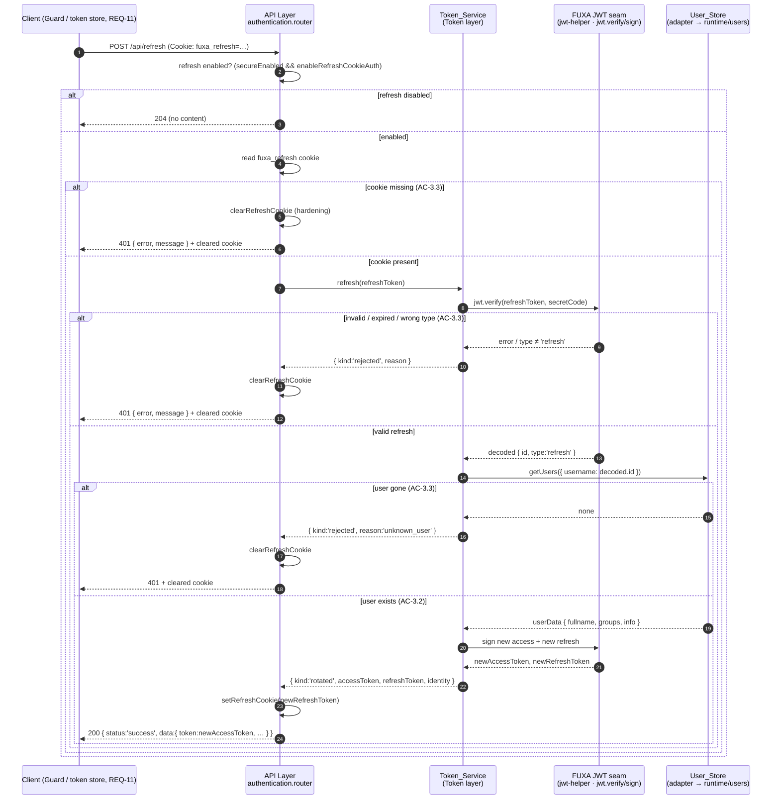

# Design Section 02 — Token & Session · `DES-TOKEN`

> **Section role: DETAILED DESIGN.** This file details the `Token_Service` (session token
> issuance/validation) and the refresh/sign-out path (REQ-2, REQ-3). Read
> [`../design.md`](../design.md) (the **master map**) first — it owns the layered
> architecture, the adapter seams, the Error Handling status/shape table, the Security
> Posture, and the module-boundary rules (D-003, AC-16.*). This section refines those
> decisions for REQ-2 and REQ-3 only; it does not restate or override them.
>
> **Covers:** REQ-2 (Session Token Issuance and Validation), AC-2.1 … AC-2.8; and REQ-3
> (Token Refresh and Sign-Out), AC-3.1 … AC-3.4.
> **Owns properties:** **P-007** and **P-008** (formalized in full in [§8](#8-correctness-properties)).
> It *references* P-001/P-002 (owned by [`03-password-security.md`](./03-password-security.md))
> and is *referenced by* [`01-authentication.md`](./01-authentication.md) for
> `issueAccessToken`.
>
> **Grounding.** Every FUXA claim below was verified by reading the actual source:
> `server/api/jwt-helper.js` and `server/api/auth/index.js`. Files and exact behaviors are
> cited inline. Decisions/trade-offs/notes/deviations referenced as `D-***` / `TO-***` /
> `N-***` / `DV-***` live in [`../decisions/`](../decisions/) and
> [`../decisions/traceability.md`](../decisions/traceability.md).

---

## 1. Purpose & Scope

This section specifies **how an authenticated identity's session is represented as a signed
token, how that token is validated on subsequent requests, and how the session is refreshed
and ended.** It is the design of the module's **Token layer** — the `Token_Service` and its
FUXA JWT adapter — plus the refresh and sign-out request paths.

Scope, precisely:

- **REQ-2 — issuance & validation.** Minting an `Access_Token` that encodes the username and
  roles (AC-2.1), signing it with the configured secret (AC-2.2), and reporting a presented
  token as authenticated *iff* its signature is valid and it is unexpired (AC-2.3, AC-2.4,
  AC-2.5). It also owns the **expiry policy**: configured duration (AC-2.6), a safe default
  of one hour when unconfigured (AC-2.7), and an explicit dev-only non-expiring mode (AC-2.8).
- **REQ-3 — refresh & sign-out.** Issuing a `Refresh_Token` into an `HttpOnly` cookie when
  refresh authentication is enabled (AC-3.1), rotating both tokens on a valid refresh
  (AC-3.2), rejecting a missing/expired/invalid refresh with `401` while clearing the cookie
  (AC-3.3), and clearing the cookie on sign-out with `204` (AC-3.4).

What this section **delegates** and only references (see [§6.5](#65-collaborators--boundaries)):

- credential verification and the sign-in decision → [`01-authentication.md`](./01-authentication.md) (REQ-1);
- password hashing → [`03-password-security.md`](./03-password-security.md) (REQ-4);
- the RBAC `groups`↔role mapping semantics → [`05-rbac-authorization.md`](./05-rbac-authorization.md) (REQ-9, REQ-10).

### Where it sits in the layered architecture

Per the master map's four layers (AC-16.1, **D-001**), the `Token_Service` is a **Service-layer
component inside the Token layer** (`TOK` subgraph in the master-map architecture diagram). It
is reached by the `Authentication_Service` during sign-in and by the API-layer refresh/sign-out
routes; it reaches FUXA only through the **Token seam** adapter (**D-003**):

- **API layer** — `server/auth-management/api/authentication.router.js` exposes
  `POST /api/refresh` and `POST /api/signout`. It reads/writes only the HTTP request/response
  and the refresh cookie; it delegates all token logic to the service and never touches the
  store directly (AC-16.3), failing fast if the service is unavailable (AC-16.4).
- **Service / Token layer** — `server/auth-management/services/token.service.js` owns
  `issueAccessToken`, `issueRefreshToken`, `verify`, and `refresh`. This is the PBT-testable
  logic layer that owns P-007 and P-008.
- **Adapter seam** — `server/auth-management/adapters/fuxa-jwt.adapter.js` wraps FUXA's
  `server/api/jwt-helper.js` (`jwt.sign` / `jwt.verify`, `secretCode`, `tokenExpiresIn`). It is
  the *only* component that imports the FUXA JWT helper, so future FUXA upgrades stay
  low-conflict (**N-001**).

> **Boundary note (D-003).** FUXA today mints and refreshes tokens **inline** inside route
> handlers: `buildAccessToken`/`buildRefreshToken` in `server/api/auth/index.js` call
> `jwt.sign(...)` directly, and `server/api/jwt-helper.js` performs `jwt.verify(...)` inside
> `verify`, `verifyAndDecode`, `verifyToken`, and `requireAuth`. This module **does not edit
> those files in place**; it re-expresses the same signing/verifying flow behind the
> `Token_Service` interface and the Token-seam adapter, reusing FUXA's exact JWT scheme and the
> existing `fuxa_refresh` cookie so tokens stay FUXA-compatible.

---

## 2. `Token_Service` Interface & Contract

The master map lists the capability as
`issueAccessToken(identity)`, `issueRefreshToken(identity)`, `verify(token)`,
`refresh(refreshToken)` (AC-16.2). This section fixes the precise, testable shapes. All
signing/verifying is delegated to the Token seam, which holds the `secretCode` and expiry
configuration verified in `jwt-helper.js`.

### 2.1 Identity input

```
Identity = {
  username: string,      // becomes the token 'id' claim (FUXA-compatible)
  groups:   number | number[] | string[],   // FUXA group code(s), carried for compat (D-007)
  roles:    string[]     // RBAC role identifiers (from info.roles), encoded per D-007
}
```

- `username` maps to the JWT `id` claim, matching FUXA's `buildAccessToken`, which signs
  `{ id: user.username, groups: user.groups }` (verified in `server/api/auth/index.js`).
- `groups` is retained verbatim so existing FUXA endpoints and `jwt-helper.haveAdminPermission`
  (which treats `adminGroups = [-1, 255]` as admin, verified) keep working during/after
  migration.
- `roles` is the RBAC claim added by this module (see [§3](#3-access_token-claims-structure)),
  per **D-007** (groups kept in token for compat; roles carried for the RBAC model).

### 2.2 Operations

```
issueAccessToken(identity: Identity): string
  // returns a signed JWT string encoding { id, groups, roles } (AC-2.1), signed with the
  // configured secret (AC-2.2), with expiry set by the policy in §4.

issueRefreshToken(identity: Identity): string
  // returns a signed JWT string encoding { id, type: 'refresh' } (matches FUXA
  // buildRefreshToken), with the configured refresh TTL (default '7d', verified).

verify(token: string): VerifyResult
  // validates signature + expiry and, on success, exposes the decoded claims (AC-2.3..2.5).

refresh(refreshToken: string | null): RefreshOutcome
  // rotates access + refresh tokens on a valid refresh; otherwise signals failure (AC-3.2/3.3).
```

### 2.3 `verify` result shape

Modeling the result as a closed outcome (rather than throwing for control flow) makes the
authenticated/not-authenticated decision deterministic and directly testable (this is what
P-007 asserts over):

```
VerifyResult =
  | { authenticated: true,  claims: { id: string, groups: any, roles: string[] } }
  | { authenticated: false, reason: 'bad_signature' | 'expired' | 'malformed' | 'missing' }
```

- `authenticated: true` is returned **iff** the signature is valid under the configured secret
  **and** the `exp` claim (if present) is in the future (AC-2.3). When authenticated, the
  decoded `id`, `groups`, and `roles` are exposed to downstream components (AC-2.3).
- An invalid signature yields `{ authenticated: false, reason: 'bad_signature' }` (AC-2.4);
  a past `exp` yields `{ authenticated: false, reason: 'expired' }` (AC-2.5). This maps onto
  FUXA's `jwt.verify` error kinds: a `JsonWebTokenError` (bad signature/malformed) and a
  `TokenExpiredError` (past `exp`) both cause FUXA's `verify`/`requireAuth` to reject (verified
  — `jwt-helper.js` rejects/branches to `401` in the `err` callback).

### 2.4 `refresh` outcome shape

```
RefreshOutcome =
  | { kind: 'rotated',  accessToken: string, refreshToken: string, identity: Identity }  // AC-3.2
  | { kind: 'disabled' }                                    // refresh auth not enabled → 204
  | { kind: 'rejected', reason: 'missing' | 'expired' | 'invalid' | 'wrong_type' | 'unknown_user' } // AC-3.3 → 401 + clear cookie
```

The API layer translates `RefreshOutcome` to HTTP (see [§6.3](#63-refresh--sign-out-http-mapping)).

---

## 3. `Access_Token` Claims Structure

The `Access_Token` is a JWT signed with the configured secret (AC-2.2). Its payload extends
FUXA's existing claim set minimally so the token stays FUXA-compatible while also carrying the
RBAC information REQ-2 requires.

| Claim | Source | Purpose | Grounding |
|-------|--------|---------|-----------|
| `id` | `identity.username` | Subject / username (AC-2.1) | FUXA `buildAccessToken` signs `{ id: user.username, ... }` (verified) |
| `groups` | `identity.groups` | FUXA compatibility; legacy admin check | FUXA signs `{ ..., groups: user.groups }`; `haveAdminPermission` reads `adminGroups=[-1,255]` (verified) |
| `roles` | `identity.roles` | RBAC roles the session carries (AC-2.1) | New, per **D-007** (roles carried in token; groups retained for compat) |
| `iat` | signer | Issued-at (auto by `jsonwebtoken`) | `jsonwebtoken` sets `iat` automatically |
| `exp` | expiry policy ([§4](#4-expiry-policy-decision-table)) | Expiry instant; **absent only in dev-only mode** | `jwt.sign(..., { expiresIn })` sets `exp`; omitting `expiresIn` yields no `exp` |

**AC-2.1 (encodes username and roles).** `issueAccessToken` MUST populate `id` from `username`
and `roles` from `identity.roles`. The `roles` list is the RBAC claim; FUXA's `groups` is kept
alongside for legacy compatibility (**D-007**). Downstream, `verify` exposes both `groups` and
`roles` so the `Authorization_Service` ([`05`](./05-rbac-authorization.md)) can reconcile them.

**AC-2.2 (signed with the configured secret).** Signing uses the Token seam, which signs with
`jwt-helper.secretCode` — a persistent configured secret when provided to `init(...)`, else a
runtime fallback `utils.generateSecretCode()` (verified in `jwt-helper.js`). The service never
holds its own secret; it delegates to the seam, so there is exactly one signing key path
(see [§7](#7-security-posture-tokens-specific)).

> **Role encoding & size (D-007 detail).** `roles` are RBAC role *identifiers* (strings from
> `info.roles`); the resolution of roles → permissions is **not** encoded in the token — it is
> computed at authorization time by [`05-rbac-authorization.md`](./05-rbac-authorization.md).
> This keeps the token small and avoids stale permission snapshots in long-lived tokens.

---

## 4. Expiry Policy Decision Table

REQ-2 defines three mutually exclusive expiry regimes. The `Token_Service` resolves exactly one
per issuance, in this precedence order. This table is the authoritative resolution for AC-2.6,
AC-2.7 (**P-008**), and AC-2.8.

| # | Condition (evaluated in order) | `expiresIn` passed to signer | Resulting `exp` | AC |
|---|--------------------------------|------------------------------|-----------------|----|
| 1 | An explicit expiry duration **is configured** | the configured duration | finite, = configured duration | **AC-2.6** |
| 2 | **No** expiry configured **AND** dev-only non-expiring mode is **off** | `3600` seconds (1 hour) | finite, = 1 hour | **AC-2.7 (P-008)** |
| 3 | Dev-only non-expiring mode is **explicitly on** | *omitted* | **no `exp` claim** (never expires) | **AC-2.8** |

**Mapping to the verified FUXA seam.** `jwt-helper.js` defines `tokenExpiresIn = 60 * 60`
(one hour) and only overrides it in `init(_secureEnabled, _secretCode, _tokenExpires)` when
`_tokenExpires` is truthy (verified). FUXA's `buildAccessToken` then signs with
`{ expiresIn: tokenExpiresIn }`. The module's expiry resolver therefore behaves as:

- **Row 1 (AC-2.6):** a configured duration is passed straight through to `expiresIn` — exactly
  FUXA's behavior when `init` receives a truthy `_tokenExpires`.
- **Row 2 (AC-2.7 / P-008 / TO-002 / DV-003):** when nothing is configured, the resolver
  **forces `3600`** rather than allowing a falsy value to reach the signer. This closes the
  root-cause risk called out in **TO-002/DV-003**: `jwt.sign` with an omitted/undefined
  `expiresIn` mints a **non-expiring** token, which cannot be revoked by expiry. FUXA's own
  default already equals one hour, so this row is aligned with FUXA but hardened to forbid a
  silent non-expiry if `tokenExpiresIn` were ever configured to a falsy value.
- **Row 3 (AC-2.8):** the *only* way to obtain a non-expiring token is the explicit dev-only
  flag, which causes the resolver to omit `expiresIn` entirely (no `exp` claim).

### 4.1 Making non-expiring mode hard to enable by accident (AC-2.8)

Because a non-expiring access token is a serious security downgrade (no revocation window), the
dev-only mode is guarded so it cannot be turned on silently:

1. **Dedicated, explicit flag.** A single boolean setting (proposed
   `settings.auth.devNonExpiringTokens`) — separate from the normal `tokenExpiresIn`
   configuration — must be `true`. An unset/absent value is treated as `false`.
2. **Requires non-production posture.** The flag is honored **only** when the deployment is not
   in production posture (e.g. `NODE_ENV !== 'production'`). In production the flag is ignored
   and Row 2 (1-hour default) applies, so a stray dev flag cannot weaken a production
   deployment.
3. **Loud on startup.** When the mode is active the module logs a prominent warning at
   initialization so the non-expiry is never invisible.
4. **Never the fallback.** Absence of expiry configuration resolves to Row 2 (finite 1-hour
   default), **never** Row 3. Non-expiry is opt-in only, never a default. This is exactly what
   **P-008** asserts.

---

## 5. Validation Semantics for `verify()` (AC-2.3 / AC-2.4 / AC-2.5)

`verify(token)` decides authentication by delegating signature-and-expiry checking to the
Token seam (FUXA `jwt.verify(token, secretCode, ...)`, verified) and classifying the result.
The semantics are expressed below to make **P-007** directly testable.

Let `sigValid(token)` be true iff `token` was signed with the configured secret and is
structurally a well-formed JWT, and let `unexpired(token)` be true iff the token either has no
`exp` claim (dev-only mode) or has `exp` strictly in the future relative to the verification
instant. Then:

```
verify(token):
  if token is null/empty                      -> { authenticated: false, reason: 'missing' }
  decoded = seam.verifyAndDecode(token)        // FUXA jwt.verify under secretCode
  on JsonWebTokenError (bad signature/format)  -> { authenticated: false, reason: 'bad_signature' | 'malformed' }
  on TokenExpiredError (exp in the past)       -> { authenticated: false, reason: 'expired' }
  on success                                   -> { authenticated: true, claims: { id, groups, roles } }
```

The resulting equivalence, which P-007 pins down:

> `verify(token).authenticated === true`  **⟺**  `sigValid(token) && unexpired(token)`.

- **AC-2.3 (valid signature + future expiry → authenticated, expose username & roles).** When
  both conditions hold, `verify` returns `authenticated: true` and surfaces `id`, `groups`, and
  `roles` from the decoded payload to downstream components. This mirrors FUXA's
  `verifyToken`/`requireAuth`, which on success set `req.userId = decoded.id` and
  `req.userGroups = decoded.groups` (verified); the module additionally surfaces `roles`.
- **AC-2.4 (invalid signature → not authenticated).** A signature that does not verify under
  `secretCode` yields `authenticated: false`. FUXA's `jwt.verify` invokes its callback with an
  error and the helper rejects/branches to `401` (verified in `verify`, `requireAuth`).
- **AC-2.5 (past expiry → not authenticated).** A token whose `exp` is in the past yields
  `authenticated: false`. `jsonwebtoken` raises `TokenExpiredError`, which the seam surfaces as
  a rejection exactly as FUXA does today.

> **Guest handling boundary.** FUXA's `verifyToken` substitutes a *guest* token when the
> `x-access-token` header is absent and marks `req.isAuthenticated = false` (verified). Guest
> substitution is an API-layer concern reconciled in [`05-rbac-authorization.md`](./05-rbac-authorization.md)
> (AC-10.3 unauthenticated handling); `Token_Service.verify` itself treats a missing token as
> `{ authenticated: false, reason: 'missing' }` and does not fabricate a guest identity.

---

## 6. Refresh & Sign-Out (REQ-3)

The module **reuses FUXA's existing refresh mechanism verbatim** — the `fuxa_refresh` HttpOnly
cookie and the `/api/refresh` and `/api/signout` routes (verified in `server/api/auth/index.js`)
— rather than inventing a new scheme (**D-002**). This section specifies the behavior behind the
`Token_Service` interface and the API-layer mapping.

### 6.1 Refresh-token issuance on sign-in (AC-3.1)

When refresh-token authentication is enabled and a user authenticates successfully, a
`Refresh_Token` is issued and stored in an `HttpOnly` cookie:

- **Enablement flag.** FUXA gates this on `enableRefreshCookieAuth` (default `false`, verified);
  the sign-in path sets the cookie only when the flag is on
  (`if (enableRefreshCookieAuth) { setRefreshCookie(res, buildRefreshToken(userInfo[0])); }`,
  verified). The module preserves this gate (AC-3.1's `WHERE refresh-token authentication is
  enabled`).
- **Token shape.** `issueRefreshToken(identity)` signs `{ id: username, type: 'refresh' }` with
  the configured secret and the refresh TTL (`refreshTokenExpiresIn`, default `'7d'`, verified),
  matching FUXA `buildRefreshToken`.
- **Cookie attributes (verified `setRefreshCookie`).** `httpOnly: true`, `sameSite: 'lax'`,
  `path: '/api/refresh'`, `maxAge` derived from the refresh TTL, and
  `secure: !!runtime?.settings?.https`. The `secure` flag policy for non-localhost exposure is
  covered in [§7](#7-security-posture-tokens-specific) (N-002).

### 6.2 Refresh rotation (AC-3.2) and failure (AC-3.3)

On `POST /api/refresh`, the flow (verified against `auth/index.js`) is:

1. **Short-circuit when disabled.** If `runtime.settings.secureEnabled` is off **or**
   `enableRefreshCookieAuth` is off, FUXA responds `204` and does nothing (verified). The module
   maps this to `RefreshOutcome.kind = 'disabled'` → `204`.
2. **Missing cookie → reject.** If the `fuxa_refresh` cookie is absent, respond `401`
   (`'Refresh token missing'`, verified). Per AC-3.3, the module additionally issues a
   cookie-clear on this path (a defensive no-op when no cookie exists — see the hardening note
   below).
3. **Verify + type check.** `jwt.verify(refreshToken, secretCode)`; if `decoded.type !==
   'refresh'`, clear the cookie and respond `401` (verified). Maps to `rejected/wrong_type`.
4. **User still exists.** `getUsers({ username: decoded.id })`; if none, clear the cookie and
   respond `401` (verified). Maps to `rejected/unknown_user`.
5. **Rotate (AC-3.2).** Build a **new** access token and a **new** refresh token, set the new
   refresh cookie, and return `200` with the new access token in `data.token` (verified — FUXA
   calls `buildAccessToken`, `buildRefreshToken`, `setRefreshCookie` and returns
   `{ status:'success', data:{ ..., token: newAccessToken } }`). Maps to
   `RefreshOutcome.kind = 'rotated'`. **Both** tokens are replaced — a rotation, not a partial
   refresh — satisfying AC-3.2 exactly.
6. **Any thrown verify error → reject + clear.** FUXA's `catch` clears the cookie and responds
   `401` (verified). Covers expired (`TokenExpiredError`) and invalid (`JsonWebTokenError`)
   refresh tokens → `rejected/expired` | `rejected/invalid`.

> **AC-3.3 clear-cookie hardening.** FUXA clears the cookie on the type-mismatch, unknown-user,
> and thrown-error paths, but the **missing-cookie** path returns `401` *without* an explicit
> clear (verified — it simply returns the `'Refresh token missing'` message). AC-3.3 requires a
> clear on **missing, expired, or invalid**. The module therefore emits `clearRefreshCookie(res)`
> on **all** rejection paths, including missing, so every `401` refresh result leaves the client
> with no residual `fuxa_refresh` cookie. This is a minimal, additive hardening confined to the
> module's router; it does not change FUXA's cookie name, path, or scheme.

### 6.3 Refresh / sign-out HTTP mapping

This is the concrete REQ-3 instance of the master map's **Error Handling** table; it must not
diverge from it.

| Trigger | `RefreshOutcome` / action | AC | HTTP | Cookie effect |
|---------|---------------------------|----|------|---------------|
| Refresh disabled (`!secureEnabled` or `!enableRefreshCookieAuth`) | `disabled` | — (verified FUXA) | **204** | none |
| Valid refresh presented | `rotated` | **AC-3.2** | **200** `{ status:'success', data:{ token, ... } }` | set new `fuxa_refresh` |
| Missing refresh cookie | `rejected/missing` | **AC-3.3** | **401** `{ status:'error', message }` | **clear** (hardening) |
| Expired refresh | `rejected/expired` | **AC-3.3** | **401** `{ status:'error', message }` | **clear** |
| Invalid / wrong-type / unknown-user | `rejected/invalid`\|`wrong_type`\|`unknown_user` | **AC-3.3** | **401** `{ status:'error', message }` | **clear** |
| Sign-out | clear + no content | **AC-3.4** | **204** empty | **clear** `fuxa_refresh` |

**AC-3.4 (sign-out).** `POST /api/signout` clears the refresh cookie (when refresh auth is
enabled) and returns `204` with an empty body (verified: FUXA calls `clearRefreshCookie(res)`
then `res.status(204).end()`). Sign-out is owned by the `Authentication_Service` per the master
map (`signOut(session)`), which delegates the cookie clear to the Token layer; the response
contract (`204`, empty) is fixed here.

### 6.4 Refresh sequence (mermaid)



### 6.5 Collaborators & Boundaries

| Concern | Owned here? | Owner | Contract |
|---------|-------------|-------|----------|
| Access/refresh token minting, `verify`, `refresh` rotation | **Yes** | this section | `Token_Service` (§2) |
| Expiry policy (configured / default 1h / dev-only) | **Yes** | this section | §4 resolver |
| Refresh/sign-out HTTP mapping + cookie effects | **Yes** | this section (API layer) | §6.3 |
| Credential verification & the sign-in decision | No | [`01`](./01-authentication.md) (REQ-1) | calls `issueAccessToken` on success |
| Password hashing/verification | No | [`03`](./03-password-security.md) (REQ-4) | not used by the token path |
| User lookup on refresh (`getUsers`) & record shape | No | [`06`](./06-persistence-and-serialization.md) / store adapter | `User_Store.getUsers({username})` |
| `groups`↔role reconciliation, guest/admin mapping | No | [`05`](./05-rbac-authorization.md) (REQ-9/10) | consumes `verify().claims` |

**Boundary rules honored (AC-16.*):** the API layer delegates token logic to the service and
never reads the store directly (AC-16.3); the service depends on the Token-seam interface, not
on `jwt-helper` internals (AC-16.2); the FUXA JWT scheme and `runtime/users` shape are confined
to the adapters (AC-16.5); the API fails fast if the Token service is unavailable (AC-16.4).

---

## 7. Security Posture (tokens-specific)

Refines the master map's **Security Posture** for the Token layer:

- **Single signing-key path (AC-2.2).** All signing/verifying goes through the Token seam,
  which uses `jwt-helper.secretCode`. That secret is a **persistent configured secret** when
  provided to `init(...)`; otherwise `jwt-helper` falls back to a per-process
  `utils.generateSecretCode()` (verified). Operationally, a persistent secret MUST be configured
  so tokens survive restarts and are not forgeable across instances; the runtime fallback is for
  dev only. The service never embeds or logs the secret.
- **Tokens always expire by default (TO-002 / DV-003).** An unconfigured deployment still mints
  finite 1-hour tokens ([§4](#4-expiry-policy-decision-table) Row 2, **P-008**). Non-expiry is
  reachable only via the explicit, non-production dev flag ([§4.1](#41-making-non-expiring-mode-hard-to-enable-by-accident-ac-28), AC-2.8).
- **Refresh cookie is `HttpOnly`.** The `fuxa_refresh` cookie is `httpOnly: true`,
  `sameSite: 'lax'`, and scoped to `path: '/api/refresh'` (verified), so it is not readable by
  JavaScript and is sent only to the refresh endpoint.
- **`secure` cookie flag beyond localhost (N-002).** FUXA sets `secure: !!runtime?.settings?.https`
  (verified). Per **N-002**, any deployment that exposes these endpoints beyond `127.0.0.1` MUST
  terminate TLS and enable the `https` setting so the refresh cookie carries the `secure` flag;
  otherwise the long-lived refresh token could traverse plaintext.
- **Rotation limits refresh-token replay.** Every successful refresh rotates *both* tokens
  (AC-3.2), and every refresh failure clears the cookie (AC-3.3 hardening, [§6.2](#62-refresh-rotation-ac-32-and-failure-ac-33)),
  shrinking the window in which a leaked refresh token is useful.
- **No plaintext or secret in claims.** The `Access_Token` payload carries only `id`, `groups`,
  `roles`, `iat`, `exp` ([§3](#3-access_token-claims-structure)) — never a password, hash, or
  the signing secret.

---

## 8. Correctness Properties

> *A property is a characteristic or behavior that should hold true across all valid
> executions of a system — a formal statement about what the system should do. Properties are
> the bridge between human-readable specifications and machine-verifiable correctness.*

This section is the **single owner** of **P-007** and **P-008** (per the master-map Table of
Contents and [`../decisions/traceability.md`](../decisions/traceability.md) §C). The prework
consolidation established that AC-2.3/2.4/2.5 form one biconditional (⇒ P-007, supported by the
signature mechanism of AC-2.2 and the claim-exposure of AC-2.1), and that AC-2.7/2.8 form one
expiry-decision property (⇒ P-008, with AC-2.6 as sibling decision-table coverage). REQ-3's
criteria are wiring/side-effect/status behaviors and are verified by example/edge/integration
tests ([§9](#9-testing-notes-req-2--req-3)), not by property-based tests.

### Property 7: A token is authenticated iff its signature is valid and it is unexpired

*For any* identity and *for any* choice of signing secret, expiry offset, and possible
post-signing tampering, the `Token_Service` reports the resulting `Access_Token` as
authenticated **if and only if** the token's signature is valid under the configured secret
**and** its expiry is in the future; and whenever it is authenticated, the decoded `id`
(username) and `roles` it exposes equal the values that were encoded at issuance. Equivalently,
across all four quadrants: (valid signature ∧ future expiry) ⇒ authenticated with exposed
username and roles; (invalid signature) ⇒ not authenticated; (past expiry) ⇒ not authenticated;
(invalid signature ∧ past expiry) ⇒ not authenticated.

**Validates: Requirements 2.3, 2.4, 2.5** — (P-007; signature mechanism AC-2.2, claim exposure AC-2.1)

### Property 8: Unconfigured deployments issue finite 1-hour tokens; non-expiry is dev-only

*For any* identity, when no expiry duration is configured and dev-only non-expiring mode is
**not** enabled, the issued `Access_Token` carries a finite expiry with `exp − iat` equal to
exactly one hour (3600 seconds); and *for any* identity, when — and only when — dev-only
non-expiring mode is explicitly enabled, the issued `Access_Token` carries no `exp` claim. The
absence of an `exp` claim never arises as the default: with the dev flag off, every issued
token is finite.

**Validates: Requirements 2.7** — (P-008; dev-only branch AC-2.8; configured-duration sibling AC-2.6)

---

## 9. Testing Notes (REQ-2 & REQ-3)

**PBT applicability.** The `Token_Service` is pure input/output logic over the JWT seam, so PBT
applies to its issuance and validation logic (P-007, P-008). The refresh/sign-out path (REQ-3)
is HTTP status + cookie side-effect wiring with no meaningful input variation, so it uses
example/edge/integration tests instead (per the prework classification).

**Rules for every property-based test** (from the master map's Testing Strategy):

- Use **`fast-check`** (the TypeScript/JS PBT library); do not hand-roll a property framework.
- Minimum **100 iterations** per property.
- Tag format: `Feature: auth-user-management, Property {n}: {property text}`.
- Each property test references its owning design-section property ID (P-007 / P-008).

### 9.1 Property tests (fast-check)

**P-007 — authenticated ⟺ signature valid ∧ unexpired.**
Tag: `Feature: auth-user-management, Property 7: A token is authenticated iff its signature is valid and it is unexpired`.

- **Generators.**
  - `identityArb`: `{ username: fc.string() (incl. unicode/empty), groups: fc.oneof(fc.integer(), fc.array(fc.integer())), roles: fc.array(fc.string(), {maxLength: 8}) }`.
  - `secretArb`: two distinct secrets `configuredSecret` and `otherSecret` (fast-check
    `fc.string({minLength: 8})` with a filter ensuring inequality) to drive the signature quadrant.
  - `expiryOffsetArb`: `fc.integer({ min: -10_000, max: 10_000 })` seconds relative to "now",
    covering past (negative, incl. boundary near 0), future, and far-future.
  - `tamperArb`: `fc.boolean()` deciding whether to corrupt the signature segment after signing
    (flip/replace bytes) to force `bad_signature` independently of expiry.
- **Strategy.** Sign a token for `identity` with `configuredSecret` and `expiresIn =
  expiryOffset` (using a controllable clock/`iat` so expiry is deterministic; use `fast-check`
  with an injected clock or `jsonwebtoken`'s `clockTimestamp`/fake timers). Configure `verify`'s
  seam with `configuredSecret`. Compute the oracle `expected = sigValid && unexpired`, where
  `sigValid = (!tampered && signedWith === configuredSecret)` and `unexpired = expiryOffset > 0`.
  Assert `verify(token).authenticated === expected`. In the authenticated case, additionally
  assert `claims.id === identity.username` and `claims.roles` deep-equals `identity.roles`
  (covers AC-2.1 exposure). Include a variant signed with `otherSecret` to exercise AC-2.2's
  wrong-secret quadrant (`authenticated === false`, `reason === 'bad_signature'`).
- **Edge cases covered by generators.** `exp` at/near the verification instant (boundary),
  empty `roles`, many `roles`, unicode `username`, array vs scalar `groups`.

**P-008 — unconfigured ⇒ finite 1h; dev-only ⇒ no exp.**
Tag: `Feature: auth-user-management, Property 8: Unconfigured deployments issue finite 1-hour tokens; non-expiry is dev-only`.

- **Generators.**
  - `identityArb`: as above.
  - `configArb`: `fc.record({ configuredExpiry: fc.option(fc.integer({min:1,max:86_400}), {nil: undefined}), devNonExpiring: fc.boolean(), production: fc.boolean() })`.
- **Strategy.** Drive the expiry resolver ([§4](#4-expiry-policy-decision-table)) with `configArb`
  and issue a token for `identity`, decoding `iat`/`exp`:
  - When `configuredExpiry === undefined` **and** effective dev-mode is off
    (`!(devNonExpiring && !production)`): assert `exp` is present and `exp − iat === 3600`
    (Row 2 / AC-2.7). This is the core P-008 assertion — the default is **always** finite 1h.
  - When dev-mode is effectively on (`devNonExpiring && !production`): assert the decoded token
    has **no** `exp` claim (Row 3 / AC-2.8).
  - Sibling coverage (AC-2.6): when `configuredExpiry === d` (defined): assert `exp − iat === d`
    (Row 1). Same harness, not a separately numbered owned property.
  - Safety: assert that with `devNonExpiring === false`, **no** generated case yields a missing
    `exp` (non-expiry never the default), and that a `production === true` case with
    `devNonExpiring === true` still yields finite 1h (the flag is ignored in production, §4.1).

### 9.2 Example / edge / integration tests (REQ-3 and non-property REQ-2 checks)

Using FUXA's existing `mocha` / `chai` / `sinon` runner (verified available), with the
`User_Store` and clock faked where useful:

1. **AC-3.1 — refresh cookie issuance (enabled).** With `enableRefreshCookieAuth` on, a
   successful sign-in emits a `Set-Cookie` for `fuxa_refresh` with `HttpOnly`, `SameSite=Lax`,
   and `Path=/api/refresh` (verified `setRefreshCookie` attributes). With the flag off, no
   `fuxa_refresh` cookie is set.
2. **AC-3.2 — rotation on valid refresh.** Given a valid `fuxa_refresh` cookie, `POST
   /api/refresh` returns **200** with `data.token` present, the new access token verifies via
   `Token_Service.verify` (leans on P-007), and a **new** `fuxa_refresh` `Set-Cookie` is emitted
   (differs from the presented one).
3. **AC-3.3 — failure branches → 401 + clear cookie.** For each of {missing cookie, expired
   refresh, tampered/invalid refresh, `type !== 'refresh'`, unknown user}, assert **401** and a
   clearing `Set-Cookie` for `fuxa_refresh`. Explicitly assert the **missing-cookie** path also
   clears (the module's AC-3.3 hardening over FUXA's verified behavior).
4. **Refresh disabled short-circuit.** With `secureEnabled` off or `enableRefreshCookieAuth`
   off, `POST /api/refresh` returns **204** and sets no cookie (verified FUXA behavior).
5. **AC-3.4 — sign-out.** `POST /api/signout` returns **204** with an empty body and emits a
   clearing `Set-Cookie` for `fuxa_refresh` (verified: `clearRefreshCookie` then
   `res.status(204).end()`).
6. **AC-2.2 — sole signer (example).** Assert the `Token_Service` signs only via the Token-seam
   adapter (uses `jwt-helper.secretCode`) and does not embed its own secret; a token issued by
   the service verifies under the seam's secret and fails under any other secret (ties to the
   P-007 wrong-secret quadrant).

These integration cases verify **wiring** (API → Token service → seam/store and the cookie
side-effects); exhaustive input coverage lives in the P-007/P-008 property tests above.

---

## 10. Traceability (this section)

| AC | Behavior | Verified FUXA anchor | Test type |
|----|----------|----------------------|-----------|
| AC-2.1 | Access_Token encodes username (`id`) + roles | `buildAccessToken` signs `{ id: user.username, groups }` in `auth/index.js`; module adds `roles` (D-007) | property (claim exposure in P-007) |
| AC-2.2 | Signed with the configured secret | `jwt.sign(..., secretCode, ...)`; `jwt-helper.secretCode` (persistent or `generateSecretCode()` fallback) | property (P-007 wrong-secret quadrant) + example |
| AC-2.3 | Valid sig + future exp → authenticated, exposes username/roles | `verifyToken`/`requireAuth` set `req.userId=decoded.id`, `req.userGroups=decoded.groups` on success | property **P-007** |
| AC-2.4 | Invalid signature → not authenticated | `jwt.verify` err callback rejects/→401 in `jwt-helper.js` | property **P-007** |
| AC-2.5 | Past expiry → not authenticated | `jwt.verify` `TokenExpiredError` rejects/→401 in `jwt-helper.js` | property **P-007** |
| AC-2.6 | Configured expiry → that duration | `init(_,_,_tokenExpires)` overrides `tokenExpiresIn`; `sign({expiresIn})` | property (P-008 resolver harness, Row 1) |
| AC-2.7 | Unconfigured + dev-off → finite 1h default | `tokenExpiresIn = 60*60` default in `jwt-helper.js`; hardened to force 3600 | property **P-008** |
| AC-2.8 | Explicit dev-only mode → non-expiring | omit `expiresIn` ⇒ no `exp`; gated by explicit non-production flag (§4.1) | property **P-008** (dev branch) |
| AC-3.1 | Refresh enabled → issue Refresh_Token in HttpOnly cookie | `enableRefreshCookieAuth` gate; `buildRefreshToken` `{id,type:'refresh'}`; `setRefreshCookie` HttpOnly/SameSite/path | example + integration |
| AC-3.2 | Valid refresh → new access + new refresh | `/api/refresh` builds new access+refresh, `setRefreshCookie`, 200 with `data.token` | example + integration (rotated token validity leans on P-007) |
| AC-3.3 | Missing/expired/invalid refresh → 401 + clear cookie | `/api/refresh` clears cookie + 401 on type/unknown/catch; module hardens missing-cookie path | edge (per branch) |
| AC-3.4 | Sign-out → clear cookie + 204 | `/api/signout`: `clearRefreshCookie` then `res.status(204).end()` | example |

**No orphan criteria:** AC-2.1 … AC-2.8 and AC-3.1 … AC-3.4 each map to at least one test above.
This section maps back to **REQ-2 and REQ-3** only, matching
[`../decisions/traceability.md`](../decisions/traceability.md) §A/§B (`DES-TOKEN → REQ-2, REQ-3`)
and owns exactly **P-007** and **P-008** per §C.
