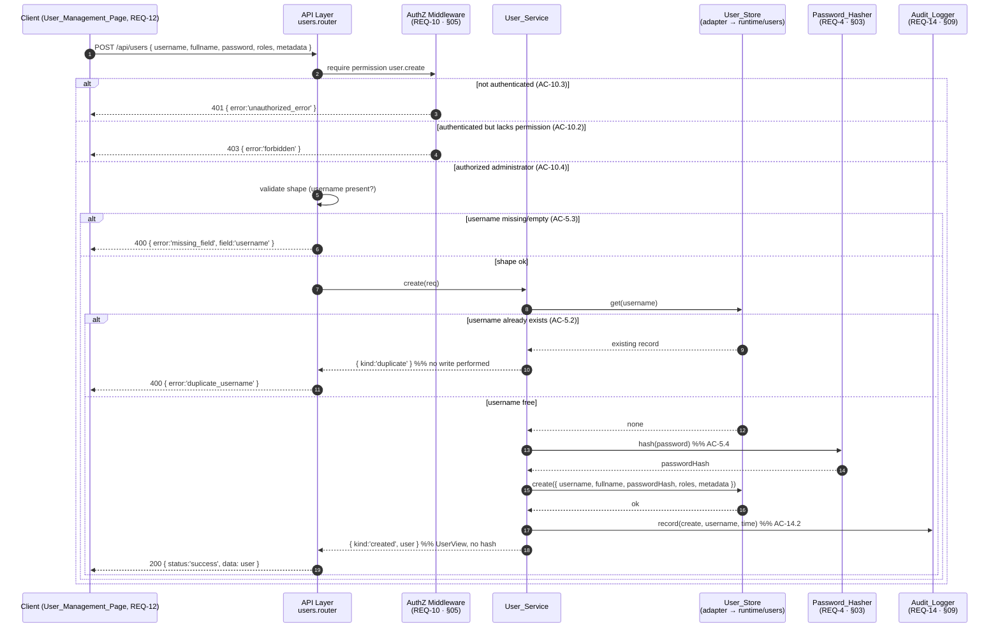

# Design Section 04 — User Management (CRUD) · `DES-USER`

> **Section role: DETAILED DESIGN.** This file details the `User_Service` — create, list,
> view, update, and delete of user accounts (REQ-5, REQ-6, REQ-7, REQ-8). Read
> [`../design.md`](../design.md) (the **master map**) first — it owns the layered
> architecture, the adapter seams, the Error Handling status/shape table, the Security
> Posture, and the module-boundary rules (D-003, AC-16.*). This section refines those
> decisions for REQ-5…8 only; it does not restate or override them.
>
> **Covers:** REQ-5 (Create User, AC-5.1…5.4), REQ-6 (List and View Users, AC-6.1…6.4),
> REQ-7 (Update User, AC-7.1…7.5), REQ-8 (Delete User, AC-8.1…8.5).
> **Owns properties:** **none.** Per the master-map Table of Contents and
> [`../decisions/traceability.md`](../decisions/traceability.md) §C, the write→read
> round-trip **P-003** (User_Record) is owned by
> [`06-persistence-and-serialization.md`](./06-persistence-and-serialization.md); this
> section *references* P-003 for read-back consistency and otherwise covers REQ-5…8 with
> example / edge / integration tests.
>
> **Grounding.** Every FUXA claim below was verified by reading the actual source:
> `server/api/users/index.js`, `server/runtime/users/index.js`,
> `server/runtime/users/usrstorage.js`. Exact function names are cited inline. It also relies
> on the hashing contract in [`03-password-security.md`](./03-password-security.md)
> (`Password_Hasher.hash`) and cross-references [`01-authentication.md`](./01-authentication.md)
> for the post-delete sign-in outcome (AC-8.4) and
> [`05-rbac-authorization.md`](./05-rbac-authorization.md) for the administrator permission
> checks. Decisions/trade-offs/notes referenced as `D-***` / `TO-***` / `N-***` live in
> [`../decisions/`](../decisions/) and
> [`../decisions/traceability.md`](../decisions/traceability.md).

---

## 1. Purpose & Scope

This section specifies **how an administrator creates, lists, views, updates, and deletes
user accounts** through the `User_Service`, and exactly how each outcome maps to an HTTP
response. It is the design of the `User_Service` (CRUD) named in the master map's
*Components and Interfaces* table (`create/list/get/update/delete`, REQ-5…8).

Scope, precisely:

- **REQ-5 (Create).** Create a `User_Record` from an administrator's request (AC-5.1); reject a
  duplicate username **without modifying the existing record** (AC-5.2); reject a request
  missing the username with a validation error (AC-5.3); store the password **only** as a hash
  produced by `Password_Hasher` (AC-5.4).
- **REQ-6 (List / View).** Return every stored record with `username`/`fullname`/`roles` equal
  to the store (AC-6.1); **exclude the password hash** from any returned record (AC-6.2); return
  the exact matching record for a single existing username (AC-6.3); return an **empty result**
  for a single username that does not exist (AC-6.4).
- **REQ-7 (Update).** Apply submitted `fullname`/`roles`/`metadata` to an existing record
  (AC-7.1); re-hash and store a supplied new password (AC-7.2); **retain the existing hash** when
  the password field is omitted (AC-7.3); reject an update for a missing username with an error
  identifying it (AC-7.4); on validation/authorization failure, reject **without modifying** the
  record (AC-7.5).
- **REQ-8 (Delete).** Remove an existing record and return success (AC-8.1); also remove the user
  from the **in-memory permission cache** (AC-8.2); return an error identifying a missing username
  (AC-8.3); after deletion, subsequent sign-in for that username is rejected with **404** (AC-8.4,
  cross-referenced to section 01); and **reject deletion of the last remaining administrator**,
  making no store mutation (AC-8.5, admin-determination referenced from section 05).

What this section **delegates** and only references (see [§7](#7-authorization-boundary-req-5-8)
and [§9](#9-testing-notes-req-5-8)):

- the password hashing/verification contract → [`03-password-security.md`](./03-password-security.md)
  (REQ-4; `Password_Hasher.hash` used at AC-5.4 / AC-7.2);
- the administrator permission checks (`user.create` / `user.read` / `user.update` /
  `user.delete`) → [`05-rbac-authorization.md`](./05-rbac-authorization.md) (REQ-10);
- the `User_Record` write→read round-trip (P-003), the read-path hash exclusion, and the FUXA
  store shape / `info.roles` handling → [`06-persistence-and-serialization.md`](./06-persistence-and-serialization.md)
  and [`11-data-models.md`](./11-data-models.md) (REQ-13);
- the post-delete sign-in outcome (AC-8.4 → 404) → [`01-authentication.md`](./01-authentication.md)
  (REQ-1, AC-1.2).

### 1.1 Where it sits in the layered architecture

Per the master map's four layers (AC-16.1, **D-001**), every CRUD operation flows **UI → API →
Service → Store**, with the Service layer holding the decision logic:

- **API layer** — `server/auth-management/api/users.router.js` exposes the CRUD endpoints. It
  validates request *shape* only, applies the authorization middleware seam
  ([§7](#7-authorization-boundary-req-5-8)), delegates to `User_Service`, and **never touches the
  store directly** (AC-16.3). It fails fast if the service layer is unavailable (AC-16.4).
- **Service layer** — `server/auth-management/services/user.service.js` owns
  `create/list/get/update/delete`. It performs validation and duplicate/existence checks, calls
  `Password_Hasher.hash(...)` before any password reaches the store (AC-5.4 / AC-7.2), records
  changes via `Audit_Logger` (REQ-14, referenced), and returns a closed set of outcomes.
- **Store layer** — `User_Store` (the `FuxaUserStoreAdapter`, **D-002**) is the only component
  that knows FUXA's `{ username, fullname, password, groups, info }` record shape; role
  identifiers live in `info.roles` (verified in `server/runtime/users/index.js` and
  `server/runtime/users/usrstorage.js`). The adapter surfaces `roles` and `metadata` as
  first-class fields (**D-007**) and hides `info` (AC-16.5).

> **Boundary note (D-003).** FUXA today implements user writes as an **upsert with no
> create/update distinction**: `server/api/users/index.js` routes `POST /api/users` to
> `runtime.users.setUsers(req.body.params)` → `usrstorage.setUser(...)`, which performs
> `INSERT OR REPLACE` / `UPDATE` and **neither rejects a duplicate username on create nor errors
> on an update to a missing username** (verified). It also hashes *inside the store*
> (`bcrypt.hashSync(pwd, 10)` in `setUser`). This module **does not edit those handlers in
> place**; it re-expresses CRUD as a layered service reachable through a new, module-owned
> router that (a) separates create from update so AC-5.2 and AC-7.4 hold, and (b) lifts hashing
> up into the service so the store adapter receives an already-hashed value (AC-5.4, AC-16.5).
> The exact persistence mechanics — including ensuring the adapter does **not** re-hash an
> already-hashed value (see [§3.3](#33-hashing-before-persist-ac-54)) — are owned by
> [`06-persistence-and-serialization.md`](./06-persistence-and-serialization.md).

---

## 2. `User_Service` Interface & Contract

The master map lists the capability as `create(req)`, `list()`, `get(username)`,
`update(username, req)`, `delete(username)` (AC-16.2). This section fixes the precise, testable
shapes. Each operation resolves to exactly one **outcome**, which the API layer translates to
HTTP ([§8.2](#82-outcome--http-response-mapping)). Modeling results as a closed set of outcomes —
rather than throwing for control flow — keeps each decision deterministic and directly testable
(same discipline as [`01-authentication.md`](./01-authentication.md) §2).

### 2.1 Shared shapes

```
// Request payloads (the API layer maps the HTTP body to these; only listed fields are read —
// extra body fields are ignored and never forwarded to the store as query filters, D-006)

CreateUserRequest = {
  username: string,          // required, non-empty after trim (AC-5.3)
  fullname: string,          // display name
  password: string,          // required plaintext; hashed before store (AC-5.4)
  roles:    string[],        // assigned role identifiers (surfaced from info.roles, D-007)
  metadata?: object          // optional metadata object (persisted in info, REQ-13)
}

UpdateUserRequest = {
  fullname?: string,         // applied when present (AC-7.1)
  roles?:    string[],       // applied when present (AC-7.1)
  metadata?: object,         // applied when present (AC-7.1)
  password?: string          // WHERE present → re-hash (AC-7.2); omitted → retain hash (AC-7.3)
}

// Returned record view — NEVER carries the password hash (AC-6.2)
UserView = {
  username: string,
  fullname: string,
  roles:    string[],
  metadata: object           // the non-role remainder of info (see §4.1)
}
```

`UserView` is deliberately the **only** record shape the service returns to callers; it has no
`password` / `passwordHash` field, so the hash cannot leak on any read path (AC-6.2). The store
adapter is responsible for splitting FUXA's `info` into first-class `roles` (`info.roles`) and
`metadata` (the remainder) and recomposing them on write; that split/serialization is owned by
[`06-persistence-and-serialization.md`](./06-persistence-and-serialization.md) /
[`11-data-models.md`](./11-data-models.md).

### 2.2 Operation outcome types

```
create(req: CreateUserRequest): CreateOutcome
CreateOutcome =
  | { kind: 'created',        user: UserView }                              // AC-5.1
  | { kind: 'missing_field',  error: 'missing_field',      field: 'username' }  // AC-5.3
  | { kind: 'duplicate',      error: 'duplicate_username', username: string }   // AC-5.2

list(): ListOutcome
ListOutcome =
  | { kind: 'ok',             users: UserView[] }                           // AC-6.1, AC-6.2

get(username: string): GetOutcome
GetOutcome =
  | { kind: 'found',          user: UserView }                             // AC-6.3
  | { kind: 'empty' }                                                       // AC-6.4 (NOT an error)

update(username: string, req: UpdateUserRequest): UpdateOutcome
UpdateOutcome =
  | { kind: 'updated',        user: UserView }                             // AC-7.1, AC-7.2, AC-7.3
  | { kind: 'unknown_user',   error: 'user_not_found',  username: string } // AC-7.4
  | { kind: 'invalid',        error: 'validation_error', detail: string }  // AC-7.5

delete(username: string): DeleteOutcome
DeleteOutcome =
  | { kind: 'deleted' }                                                     // AC-8.1, AC-8.2
  | { kind: 'unknown_user',   error: 'user_not_found',  username: string } // AC-8.3
  | { kind: 'last_admin',     error: 'last_admin',      username: string } // AC-8.5
```

### 2.3 Contract notes

- **Stable error identifiers.** Every non-success outcome carries a stable string `error`
  identifier so the User Management Page (REQ-12) can branch on it and audit entries are
  greppable (REQ-14). The identifier is the contract; the HTTP status is derived from it
  ([§8.2](#82-outcome--http-response-mapping)).
- **`get` "empty" is not an error (AC-6.4).** A single lookup for a non-existent username is a
  *successful* query with an empty result, distinct from `update`/`delete` on a missing username
  which are *errors* (AC-7.4 / AC-8.3). This mirrors FUXA's store, where `getUsers`/`findOne`
  resolve to `undefined`/`[]` for no match rather than rejecting (verified,
  `server/runtime/users/index.js`).
- **Authorization is applied at the API seam, not inside these outcomes.** The unauthenticated
  (401) and unauthorized (403) outcomes for these administrator operations are produced by the
  authorization middleware **before** `User_Service` is invoked ([§7](#7-authorization-boundary-req-5-8)),
  so the outcome types above assume an already-authorized administrator caller.
- **Idempotent inputs are normalized (D-006).** `username` is trimmed and used as the sole store
  key on every lookup/write; extra request fields are dropped by the API mapping and never reach
  the store as filters.

---

## 3. Create Design (REQ-5)

### 3.1 Flow

`create(req)` executes in a fixed order so validation and duplicate detection happen **before**
any store mutation:

1. **Validate shape (AC-5.3).** If `username` is missing or empty-after-trim, return
   `{ kind:'missing_field', field:'username' }`. No store call is made.
2. **Duplicate detection (AC-5.2).** Look the username up via `User_Store.get(username)` (the
   normalized single lookup). If a record already exists, return
   `{ kind:'duplicate', username }` and **make no write** — the existing record is left exactly
   as it was.
3. **Hash the password (AC-5.4).** Call `Password_Hasher.hash(req.password)` and keep only the
   resulting hash. The plaintext is never forwarded to the store.
4. **Persist.** Write a new `User_Record` `{ username, fullname, passwordHash, roles, metadata }`
   via `User_Store.create(...)`; the adapter composes FUXA's `{ username, fullname, password,
   groups, info }` shape with `info.roles = roles` (owned by §06).
5. **Audit + return.** Record the create via `Audit_Logger` (operation, username, time —
   AC-14.2; secrets sanitized, AC-14.5) and return `{ kind:'created', user }` where `user` is the
   `UserView` (no hash).

### 3.2 Duplicate detection without mutation (AC-5.2)

This is a deliberate **divergence from FUXA's upsert**. FUXA's `usrstorage.setUser` checks
existence and then does `INSERT OR REPLACE` (new) or `UPDATE` (existing) — a create request for
an already-existing username would **overwrite** the stored record (verified). AC-5.2 forbids
this: a duplicate create must be rejected and the existing record left unmodified. The service
therefore performs an explicit pre-write existence check and returns `duplicate` **before** any
write occurs, so there is no code path in which a duplicate create mutates the existing record.

### 3.3 Hashing before persist (AC-5.4)

Hashing occurs in the **service layer**, upstream of the store, using the `Password_Hasher.hash`
contract owned by [`03-password-security.md`](./03-password-security.md) §2. The store adapter
receives an **already-hashed** value and never sees plaintext (AC-16.5 boundary discipline; the
service-side ordering guarantee for AC-4.1).

> **Grounded coordination note (double-hash hazard).** FUXA's `usrstorage.setUser` re-hashes any
> truthy `pwd` argument (`bcrypt.hashSync(pwd, 10)`, verified). Because this module hands the
> store an already-hashed value, the `FuxaUserStoreAdapter` must persist that value **without
> routing it through `setUser`'s re-hash path** (otherwise a hash-of-a-hash would be stored and
> verification would fail). Ensuring the adapter writes the hash into the `password` column
> verbatim is a persistence concern **owned by**
> [`06-persistence-and-serialization.md`](./06-persistence-and-serialization.md); this section
> only fixes the service-side precondition (the store receives a hash, not a plaintext).

### 3.4 Create sequence



---

## 4. List / View Design (REQ-6)

### 4.1 List returns all records with equal values (AC-6.1)

`list()` returns a `UserView[]` containing **every** stored record. The store adapter reads all
rows via FUXA's `runtime.users.getUsers()` → `usrstorage.getUsers()` (`SELECT username,
fullname, password, groups, info FROM users`, verified) and maps each row to a `UserView`:

- `username`, `fullname` are copied verbatim from the row;
- `roles` is surfaced from the parsed `info.roles` array (**D-007**; the adapter owns the
  `info` parse, §06);
- `metadata` is the remainder of `info` after `roles` is lifted out.

The values returned therefore equal the values held in the store (AC-6.1); equality across the
persistence boundary for `username`/`fullname`/`roles`/`metadata` is exactly the round-trip
**P-003**, owned by [`06-persistence-and-serialization.md`](./06-persistence-and-serialization.md)
and *referenced* here.

### 4.2 Password-hash exclusion on read (AC-6.2)

Every returned record is a `UserView`, which structurally has **no** `password`/`passwordHash`
field ([§2.1](#21-shared-shapes)). Exclusion is performed on the **read path** as the record is
mapped to `UserView`, so the hash never leaves the store layer.

> **Verified FUXA anchor.** FUXA already strips the hash at its API layer:
> `server/api/users/index.js` defines `sanitizeUser(user)` which does `delete sanitized.password`
> and applies `sanitizeUsers(result)` to the `GET /api/users` response (verified). The module
> keeps this guarantee but moves exclusion **up into the service/store read mapping** (the
> `UserView` has no hash field at all), so no caller — API or otherwise — can observe the hash.
> This is the read-path counterpart to the persist-only-hash invariant in
> [`03-password-security.md`](./03-password-security.md) §4 (AC-4.2), whose ownership sits with
> section 06.

### 4.3 Single exact match (AC-6.3) and empty result for missing (AC-6.4)

`get(username)` performs a normalized single lookup via `User_Store.get(username)`, which maps to
FUXA's `getUsers({ username })` / `findOne({ username })` (`... WHERE username = ?`, verified):

- **Exact match (AC-6.3).** When a row matches, return `{ kind:'found', user }` where `user` is
  the `UserView` carrying the stored `username`/`fullname`/`roles` (and `metadata`), hash
  excluded.
- **No match (AC-6.4).** When no row matches, FUXA's `getUsers` resolves to `undefined` and
  `findOne` resolves empty (verified); the service returns `{ kind:'empty' }` — a successful,
  empty result, **not** an error.

---

## 5. Update Design (REQ-7)

### 5.1 Flow

`update(username, req)` executes in a fixed order so a missing target or a failed
validation/authorization check cannot mutate any record:

1. **Existence check (AC-7.4).** Look up `username` via `User_Store.get(username)`. If no record
   exists, return `{ kind:'unknown_user', username }` and make **no write**.
2. **Validate (AC-7.5).** Validate the submitted fields (e.g. role identifiers well-formed,
   metadata serializable). On failure, return `{ kind:'invalid', detail }` and make **no write**;
   the matching record is left unmodified. (Authorization is enforced earlier at the API seam,
   [§7](#7-authorization-boundary-req-5-8); an authorization failure likewise never reaches a
   write.)
3. **Resolve the password (AC-7.2 / AC-7.3).**
   - **Password present (AC-7.2).** Call `Password_Hasher.hash(req.password)` and use the new
     hash. The plaintext never reaches the store.
   - **Password omitted (AC-7.3).** Do **not** call `hash`; retain the record's existing stored
     hash unchanged.
4. **Apply fields (AC-7.1).** Apply the submitted `fullname`, `roles`, and `metadata` to the
   matching record and persist via `User_Store.update(username, patch)`.
5. **Audit + return.** Record the update via `Audit_Logger` (AC-14.2; secrets sanitized,
   AC-14.5) and return `{ kind:'updated', user }` (`UserView`, no hash).

### 5.2 Retain-hash-on-omit is grounded in FUXA (AC-7.3)

FUXA's `usrstorage.setUser` already demonstrates the retain-on-omit behavior: when `pwd` is
falsy and the user exists, it runs `UPDATE users SET groups = ?, info = ?, fullname = ? WHERE
username = ?` — **the `password` column is not in the SET list, so the existing hash is retained**
(verified). The module preserves this semantics explicitly: an `UpdateUserRequest` that omits
`password` results in a patch that does not touch `passwordHash`. Conversely, when `pwd` is truthy
FUXA re-hashes with `bcrypt.hashSync(pwd, 10)`; the module performs the equivalent re-hash in the
service via `Password_Hasher.hash` (AC-7.2), subject to the same no-double-hash coordination note
as [§3.3](#33-hashing-before-persist-ac-54).

### 5.3 Missing-username update is an error (AC-7.4) — divergence from FUXA upsert

FUXA's `setUser` for a **non-existent** username with no matching row performs an
`INSERT OR REPLACE` (i.e. it silently **creates** the user) rather than reporting an error
(verified). AC-7.4 requires the opposite: an update targeting a username that does not exist must
be **rejected** with an error identifying the missing username. The service's up-front existence
check ([§5.1](#51-flow) step 1) closes this gap; there is no path in which an update to a missing
username creates a record.

### 5.4 No-modification-on-failure (AC-7.5)

Because the existence check and validation run **before** any `User_Store.update` call, a request
that fails validation (or that was rejected by authorization at the API seam) never reaches a
write. The matching record is therefore byte-for-byte unchanged on any rejected update — the
service holds no partially-applied write path.

---

## 6. Delete Design (REQ-8)

### 6.1 Flow

`delete(username)` executes in a fixed order so a missing target or a last-administrator
violation cannot mutate any record:

1. **Existence check (AC-8.3).** Look up `username`. If no record exists, return
   `{ kind:'unknown_user', username }` and make **no** store mutation.
2. **Last-administrator guard (AC-8.5).** Determine whether the target is an administrator using
   the admin-determination predicate owned by
   [`05-rbac-authorization.md`](./05-rbac-authorization.md) (a user is an administrator when its
   assigned roles grant the user-/role-management permission set, reconciled with FUXA's `groups`
   code `255` / admin-usage `-1` — `adminGroups = [-1, 255]` in `server/api/jwt-helper.js`,
   verified). If the target **is** an administrator, count the **remaining** administrators —
   every stored record that the same predicate classifies as an administrator, excluding the
   target. If that remaining count is **zero** (the target is the last administrator), return
   `{ kind:'last_admin', username }` and make **no** store mutation. This guard runs **before**
   the removal step, so a rejected last-admin delete never reaches `User_Store.delete` (details in
   [§6.5](#65-last-administrator-determination-ac-85)).
3. **Remove + evict cache (AC-8.1 / AC-8.2).** Call `User_Store.delete(username)`, which maps to
   FUXA's `runtime.users.removeUsers(username)`. That function removes the row
   (`usrstorage.removeUser` → `DELETE FROM users WHERE username = ?`) **and** evicts the user from
   the in-memory permission cache via `usersMap.delete(username)` (verified,
   `server/runtime/users/index.js`).
4. **Audit + return.** Record the delete via `Audit_Logger` (AC-14.2) and return
   `{ kind:'deleted' }`.

### 6.2 Permission-cache eviction (AC-8.2) — verified FUXA anchor

FUXA maintains an in-memory permission cache named **`usersMap`** (a `Map`) in
`server/runtime/users/index.js`; it is populated by `_loadUsers()` and `setUsers()`, read via
`getUserCache(username)` (`return usersMap.get(username)`), and — critically for AC-8.2 —
**evicted on delete**: `removeUsers(username)` calls `usrstorage.removeUser(username)` and then
`usersMap.delete(username)` (verified). The module's `User_Store.delete` relies on this exact
sequence so that, after deletion, `getUserCache(username)` returns `undefined` and no stale
roles/permissions linger for the removed user. (The adjacent `removeRoles` path also prunes role
ids from cached `info.roles`; that is REQ-9's concern, owned by section 05.)

### 6.3 Existence check before delete is a divergence from FUXA (AC-8.3)

FUXA's `removeUsers` rejects only when `username` is **falsy**; for a *non-existent* username it
still runs `DELETE FROM users WHERE username = ?`, which affects zero rows and **resolves
successfully** (verified) — i.e. FUXA does not report "no such user". AC-8.3 requires an error
identifying the missing username. The service's up-front existence check
([§6.1](#61-flow) step 1) supplies that error (`{ kind:'unknown_user' }` → 404) before invoking
the store.

### 6.4 Post-delete sign-in returns 404 (AC-8.4) — cross-reference to section 01

AC-8.4 requires that, once a user is deleted, subsequent sign-in for that username is rejected
with **404**. This falls out of the delete removing the store row: the `Authentication_Service`
looks the user up via `User_Store.findUser(username)`, which now returns none, yielding the
`unknown_user` sign-in outcome mapped to **404** (owned by
[`01-authentication.md`](./01-authentication.md) §4, AC-1.2). This section guarantees the
*precondition* (the row and its cache entry are gone); section 01 owns the sign-in outcome. An
integration test spanning delete → sign-in verifies the end-to-end behavior
([§9.2](#92-integration-tests-13-representative-examples)).

### 6.5 Last-administrator determination (AC-8.5)

AC-8.5 forbids deleting the **last remaining administrator**, preserving the system-wide
invariant that at least one administrator always exists — the delete-path counterpart to the
REQ-17 bootstrap guarantee that seeds a first administrator when none exists. The guard sits in
the delete flow **before** any store mutation ([§6.1](#61-flow) step 2), so a rejected request
leaves the store byte-for-byte unchanged (no row removal, no cache eviction).

**Who counts as an administrator.** Administrator status is **not** re-specified here; it is the
admin-determination predicate owned by [`05-rbac-authorization.md`](./05-rbac-authorization.md)
(REQ-10, AC-10.4). Grounded in FUXA, that predicate reconciles two sources (verified in
`server/api/jwt-helper.js`):

- an identity whose **assigned roles** resolve to the user-/role-management permission set is an
  administrator (the RBAC source of truth); and
- FUXA's legacy **group code** `255` (and admin-usage `-1`) — `adminGroups = [-1, 255]`, consulted
  by `haveAdminPermission` — is mapped **into** that same administrator classification as a
  compatibility input, never the other way around (the same direction-of-authority rule the
  master map fixes for AC-10.5 determinism).

**How the count is taken.** The service asks the predicate to classify the target; only if the
target is an administrator does it enumerate the other stored records (read through the
`User_Store` interface, never the FUXA store directly — AC-16.3) and count those the predicate
also classifies as administrators. "Last administrator" means that remaining count is **zero**.
Because the classification is delegated to §05, this section adds no second, divergent definition
of "administrator" (single-owner discipline); it owns only the *ordering* guarantee (guard before
removal) and the `last_admin` outcome.

> **Divergence from FUXA (AC-8.5).** FUXA's `removeUsers` applies no last-administrator check — it
> deletes any existing row regardless of how many admins remain (verified,
> `server/runtime/users/index.js`). The module adds this guard in the service layer so that no
> code path can remove the final administrator, matching REQ-17's inverse guarantee.

---

## 7. Authorization Boundary (REQ-5…8)

All five operations are **administrator operations**. Authorization is enforced at the **API-layer
seam** by the authorization middleware **before** `User_Service` runs, not inside the service
outcomes ([§2.3](#23-contract-notes)):

- The middleware requires the operation's permission — `user.create` (REQ-5), `user.read`
  (REQ-6), `user.update` (REQ-7), `user.delete` (REQ-8) — resolved from the caller's roles by the
  `Authorization_Service` (AC-10.1, AC-10.4).
- An **unauthenticated** request is denied with **401** (AC-10.3); an **authenticated but
  unpermitted** request is denied with **403** (AC-10.2).

The full permission model, the FUXA group-code (`-1`/`255`) reconciliation, the
`haveAdminPermission` replacement, and the bootstrap-gate interaction (REQ-17, AC-17.2) are
**owned by** [`05-rbac-authorization.md`](./05-rbac-authorization.md) and are **not** specified
here.

> **Verified FUXA anchor.** FUXA guards every user/role route in `server/api/users/index.js` with
> `secureFnc` (JWT verify) then `checkGroupsFnc(req)` and
> `authJwt.haveAdminPermission(permission)`, returning `401 { error:'unauthorized_error' }` when
> the caller is not an admin (verified). The module replaces this admin-only, group-code gate with
> the permission-based `Authorization_Service` check at the same seam, preserving the
> "administrators may manage users" guarantee (AC-10.4) while making the decision role/permission
> driven.

---

## 8. Error Handling & Edge Cases

### 8.1 Edge cases

- **Input normalization / query-injection (D-006).** The API layer maps the HTTP body to the
  typed request shapes in [§2.1](#21-shared-shapes) and reads **only** the listed fields;
  `username` is trimmed and used as the sole store key. Extra attacker-supplied body fields are
  dropped and never forwarded to the store as query filters — the same discipline section 01
  applies to sign-in (FUXA otherwise forwards whole request objects into store lookups; verified
  for the auth path in `findOne`).
- **Empty / whitespace username on create (AC-5.3).** An all-whitespace username is treated as
  missing after trim and rejected as `missing_field` — it is never sent to the store. (This also
  mirrors FUXA's `runtime.users.setUsers`, which rejects when `query.username` is falsy;
  verified.)
- **Create with an omitted password.** REQ-5 lists the password as part of a create request
  (AC-5.1). A create missing a usable password is rejected as a validation error rather than
  creating a hash-less account (FUXA's `setUser` would insert a row with no `password` column;
  the module forbids a credential-less created account). *(This tightens, and does not
  contradict, AC-5.1/AC-5.4.)*
- **`get` empty vs. update/delete missing.** A single `get` for an unknown username is a
  successful empty result (AC-6.4), whereas `update`/`delete` on an unknown username are errors
  (AC-7.4 / AC-8.3). The three are intentionally distinct outcomes.
- **Duplicate detection is race-tolerant.** The pre-write existence check ([§3.1](#31-flow)) plus
  the store's `username` **PRIMARY KEY** (`CREATE TABLE ... users (username TEXT PRIMARY KEY,
  ...)`, verified in `usrstorage.js`) mean that even under a concurrent create, the second write
  cannot silently overwrite — the primary key rejects it and the service surfaces `duplicate`
  (AC-5.2) rather than corrupting the first record.
- **Service unavailable (AC-16.4).** If the service layer is unavailable when the API receives a
  request, the API fails fast with an error response rather than touching the store directly
  (master-map fail-fast rule; FUXA's own `!runtime.project` guard returns `404`, verified).
- **Audit never blocks the mutation result.** As in section 01, an `Audit_Logger` failure is
  itself logged but does not convert a successful create/update/delete into an error; secrets
  (plaintext password, hash) are sanitized out of the event before logging (AC-14.5).

### 8.2 Outcome → HTTP response mapping

This mapping is the concrete, REQ-5…8 instance of the master map's **Error Handling** status/shape
table (see [`../design.md`](../design.md#error-handling)); it must not diverge from it.

| Operation | Outcome | AC | HTTP status | Response body |
|-----------|---------|----|-------------|---------------|
| create | `created` | AC-5.1 | **200** | `{ status:'success', data: UserView }` |
| create | `missing_field` | AC-5.3 | **400** | `{ error:'missing_field', field:'username', message }` |
| create | `duplicate` | AC-5.2 | **400** | `{ error:'duplicate_username', message }` |
| list | `ok` | AC-6.1, AC-6.2 | **200** | `{ status:'success', data: UserView[] }` (no hash) |
| get | `found` | AC-6.3 | **200** | `{ status:'success', data: UserView }` |
| get | `empty` | AC-6.4 | **200** | `{ status:'success', data: null }` (empty result, not an error) |
| update | `updated` | AC-7.1–7.3 | **200** | `{ status:'success', data: UserView }` |
| update | `unknown_user` | AC-7.4 | **404** | `{ error:'user_not_found', username, message }` |
| update | `invalid` | AC-7.5 | **400** | `{ error:'validation_error', message }` |
| delete | `deleted` | AC-8.1, AC-8.2 | **200** | `{ status:'success' }` |
| delete | `unknown_user` | AC-8.3 | **404** | `{ error:'user_not_found', username, message }` |
| delete | `last_admin` | AC-8.5 | **400** | `{ error:'last_admin', username, message }` |
| (any) | unauthenticated | AC-10.3 | **401** | `{ error:'unauthorized_error', message }` |
| (any) | unpermitted | AC-10.2 | **403** | `{ error:'forbidden', message }` |

> **Note on duplicate-create status.** A duplicate username is semantically a *conflict* (HTTP
> 409). The module maps it to **400** with the stable identifier `duplicate_username` to stay
> aligned with the master-map Error Handling table (which enumerates 400 for client input errors
> and does not define 409) and with FUXA's existing `res.status(400).json({ error: err.code, ...})`
> convention for user-write failures (verified in `server/api/users/index.js`). The stable
> `error` identifier — not the status — is what the UI branches on, so this choice does not weaken
> AC-5.2. *(Open item flagged in [§8.3](#83-open-items-flagged-for-review) if a 409 is preferred.)*

> **Note on last-administrator status.** Refusing to delete the last administrator is semantically
> a *state conflict* (HTTP 409). Consistent with the duplicate-create decision above and with the
> master-map Error Handling table — which enumerates **400** for client-side errors and does not
> define 409 — the module maps this outcome to **400** with the stable identifier `last_admin`. As
> everywhere in this module, the UI and audit trail branch on the stable `error` identifier rather
> than the status, so the 400-vs-409 choice does not weaken AC-8.5; the `last_admin` identifier is
> the contract. *(If review prefers 409, only the status column changes — the outcome contract and
> the `last_admin` id are unaffected.)*

### 8.3 Open items (flagged for review)

These concern behaviors **not** covered by any current acceptance criterion; they are flagged
rather than silently invented (no new property IDs are created here — see the header):

- **Self-deletion of a non-last administrator.** With AC-8.5 now **normative** — the **last**
  administrator cannot be deleted (specified in [§6.5](#65-last-administrator-determination-ac-85)
  and the delete flow) — one related behavior remains unspecified: whether an administrator may
  delete **their own** account while other administrators still exist. REQ-8 is silent on
  self-deletion as such; the module currently **allows** it, because AC-8.5 protects only the
  *last* administrator (a non-last admin, including the caller, is deletable). **Recommendation:**
  confirm during review whether self-deletion should be additionally restricted; until then no
  extra self-deletion rule is encoded, to avoid inventing an unspecified constraint.
- **Duplicate-create HTTP status (409 vs 400).** See [§8.2](#82-outcome--http-response-mapping);
  resolvable during review without changing the outcome contract. *(The identical 400-vs-409
  reasoning now also applies to the `last_admin` outcome; both are decided **400** here for
  master-map consistency and remain contract-stable regardless of a later status change.)*

---

## 9. Testing Notes (REQ-5…8)

**PBT applicability for this section: not applicable to REQ-5…8's own criteria.** These criteria
are CRUD status-code / state-transition behaviors (create/reject-duplicate, list, exclude-hash,
retain-hash-on-omit, remove + cache-evict, missing-target errors). They are best covered by
**example / edge / integration tests**, not property-based tests. The one universal property in
this territory — that a written `User_Record`'s `username`/`fullname`/`roles`/`metadata` survive
a write→read round-trip — is **P-003**, owned by
[`06-persistence-and-serialization.md`](./06-persistence-and-serialization.md); it is only
**referenced** here (no redefinition, keeping traceability §C single-owner). This matches the
master-map Table of Contents, where **DES-USER lists no owned properties**.

> **Assessment: no new property needed.** The read-back consistency that create/update/list/get
> depend on is exactly P-003's round-trip; introducing a DES-USER-owned property would duplicate
> it. Should review conclude a genuinely new universal property is required (e.g. an
> "update is field-selective" invariant), it must be added as a numbered property with an
> assigned ID via the decisions ledger and traceability §C — **flagged, not invented here.**

> **AC-8.5 property assessment (candidate — flagged, not invented).** AC-8.5's own behavior —
> reject deleting the last administrator with no store mutation, while still allowing deletion of
> a non-last administrator — is a state-transition rule best covered by the **example tests** in
> [§9.1](#91-example--edge-tests-service-layer-with-test-doubles) (item 14) and the integration
> example in [§9.2](#92-integration-tests-13-representative-examples). However, the *system-wide
> invariant it protects* — **"at least one administrator always exists"** — is a genuine universal
> property that spans two requirements: the delete-path guard (**REQ-8, AC-8.5**) and the bootstrap
> seeding that establishes the first admin (**REQ-17**). Because a property crossing REQ-8 + REQ-17
> is **cross-cutting** and this section (DES-USER) owns no properties, it must not be minted here.
> **Recommendation:** add a numbered property — **candidate `P-010`** (*"For any* sequence of user
> deletions applied to a store that starts with ≥ 1 administrator, the store always retains ≥ 1
> administrator"*) — via the decisions ledger and traceability §C, owned jointly by this delete
> design and [`12-admin-bootstrap.md`](./12-admin-bootstrap.md). The ID `P-010` is a **suggestion
> pending confirmation**, not an assigned or owned property of this section.

### 9.1 Example / edge tests (Service layer, with test doubles)

Using FUXA's existing `mocha` / `chai` / `sinon` runner (verified available, master-map Testing
Strategy), with `Password_Hasher`, `User_Store`, and `Audit_Logger` replaced by test doubles so
the decision logic is isolated:

1. **AC-5.1 — create success.** `create(validReq)` yields `{ kind:'created' }`; the returned
   `UserView` carries `username`/`fullname`/`roles` from the request and **no** hash;
   `Password_Hasher.hash` was called once with the plaintext; `User_Store.create` received the
   hash, never the plaintext.
2. **AC-5.2 — duplicate rejected, existing untouched.** With `User_Store.get` returning an
   existing record, `create` yields `{ kind:'duplicate' }` and `User_Store.create`/`update` is
   **never** called (existing record unmodified).
3. **AC-5.3 — missing username.** `create` with absent/whitespace username yields
   `{ kind:'missing_field', field:'username' }`; no store call.
4. **AC-5.4 — hash only.** Assert the value passed to `User_Store.create` is the
   `Password_Hasher.hash` output and that no field equal to the plaintext is present.
5. **AC-6.1 / AC-6.2 — list.** `list()` returns one `UserView` per stored row with equal
   `username`/`fullname`/`roles`; assert **no** returned object has a `password`/`passwordHash`
   key.
6. **AC-6.3 / AC-6.4 — get.** `get(existing)` → `{ kind:'found' }` with the exact stored fields;
   `get(unknown)` → `{ kind:'empty' }` (not an error).
7. **AC-7.1 — apply fields.** `update` applies submitted `fullname`/`roles`/`metadata` to the
   patch sent to `User_Store.update`.
8. **AC-7.2 — re-hash.** `update` with a `password` calls `Password_Hasher.hash` and sends the new
   hash; plaintext never reaches the store.
9. **AC-7.3 — retain hash.** `update` **omitting** `password` produces a patch that does **not**
   include `passwordHash`, and `Password_Hasher.hash` is **not** called.
10. **AC-7.4 — missing username.** `update(unknown, req)` yields `{ kind:'unknown_user' }`; no
    write.
11. **AC-7.5 — no modification on failure.** `update` with invalid input yields `{ kind:'invalid' }`
    and `User_Store.update` is **never** called.
12. **AC-8.1 / AC-8.2 — delete + cache evict.** `delete(existing)` yields `{ kind:'deleted' }`,
    calls `User_Store.delete(username)`; the store double asserts both the row removal and the
    `usersMap.delete(username)` cache eviction path were exercised.
13. **AC-8.3 — delete missing.** `delete(unknown)` yields `{ kind:'unknown_user' }`; no store
    mutation.
14. **AC-8.5 — last administrator rejected (no mutation); non-last admin still deletable.** With
    the admin-determination predicate (§05) stubbed on the test double: (a) when the target is an
    administrator and it is the **only** administrator in the store, `delete(target)` yields
    `{ kind:'last_admin', username }` and `User_Store.delete` is **never** called (no row removal,
    no `usersMap` cache eviction); (b) when the target is an administrator but **another**
    administrator still exists, `delete(target)` yields `{ kind:'deleted' }` and
    `User_Store.delete(username)` is called exactly once. This asserts both that the guard fires on
    the last admin and that it does **not** over-fire while other admins remain.
15. **AuthZ seam (REQ-10).** With the authorization middleware denying, the API returns 401/403
    and `User_Service` is **never** invoked (delegation asserted; full checks owned by §05).

### 9.2 Integration tests (1–3 representative examples)

End-to-end through the real router against the FUXA store adapter and real `Password_Hasher`
(no mocks) to confirm the layers are wired correctly and that P-003 holds through the real store:

- **Create → get round-trip (references P-003).** Create a user, then `get` it: returned
  `username`/`fullname`/`roles`/`metadata` equal the created values and no hash is present.
- **Update retains hash, then sign-in still works (AC-7.3 + §01).** Create a user, update its
  `fullname` **without** a password, then sign in with the original password — sign-in succeeds
  (existing hash retained), confirming AC-7.3 end-to-end.
- **Delete → cache eviction → sign-in 404 (AC-8.1/8.2/8.4).** Create then delete a user; assert
  `runtime.users.getUserCache(username)` returns `undefined` (cache evicted, AC-8.2) and a
  subsequent sign-in for that username returns **404** (AC-8.4, outcome owned by §01).
- **Last administrator cannot be deleted (AC-8.5).** In a store whose only administrator is
  `admin`, `delete('admin')` returns the `last_admin` outcome (**400**), the row and its
  `usersMap` cache entry remain, and a subsequent sign-in as `admin` still succeeds; after seeding
  a second administrator, deleting the first now succeeds (`deleted`), confirming the guard keys on
  the *remaining* administrator count rather than blocking all admin deletions.

These integration cases verify **wiring** (API → service → store/hasher/cache); exhaustive input
coverage for the round-trip lives in the P-003 property test owned by section 06.

---

## 10. Traceability (this section)

| AC | Behavior | Verified FUXA anchor | Test type |
|----|----------|----------------------|-----------|
| AC-5.1 | Create a `User_Record` from an admin request → success | `runtime.users.setUsers` → `usrstorage.setUser` (INSERT path) in `runtime/users` | example + integration |
| AC-5.2 | Reject duplicate username; do **not** modify existing record | `setUser` existence check (module adds pre-write reject vs FUXA `INSERT OR REPLACE`); `username` PRIMARY KEY in `usrstorage.js` | example |
| AC-5.3 | Missing username → validation error | `setUsers` rejects when `query.username` falsy (`runtime/users/index.js`) | example |
| AC-5.4 | Store password only as `Password_Hasher` hash | hashing lifted from `usrstorage.setUser`'s `bcrypt.hashSync(pwd,10)` to the service (§03) | example (+ P-001/P-002 owned by §03) |
| AC-6.1 | List returns all records with equal `username`/`fullname`/`roles` | `usrstorage.getUsers` `SELECT ... FROM users`; roles from `info.roles` | example + integration (references P-003, §06) |
| AC-6.2 | Exclude password hash from returned records | `sanitizeUser` (`delete sanitized.password`) in `api/users/index.js`; module excludes at read mapping (`UserView`) | example |
| AC-6.3 | Single existing username → exact matching record | `getUsers({username})` / `findOne` `WHERE username = ?` | example + integration |
| AC-6.4 | Single missing username → empty result | `getUsers` resolves `undefined` for no rows (`runtime/users/index.js`) | example |
| AC-7.1 | Apply `fullname`/`roles`/`metadata` to existing record | `usrstorage.setUser` UPDATE sets `fullname`, `groups`, `info` (roles in `info.roles`) | example + integration |
| AC-7.2 | New password → re-hash and store | `setUser` truthy-pwd branch `bcrypt.hashSync(pwd,10)`; module re-hashes via `Password_Hasher` (§03) | example |
| AC-7.3 | Omitted password → retain existing hash | `setUser` `else if (exist)` UPDATE omits `password` column (verified) | example + integration |
| AC-7.4 | Update missing username → error | module adds existence check (FUXA `setUser` would `INSERT OR REPLACE`) | example |
| AC-7.5 | Validation/authorization failure → reject, no modification | pre-write validation; AuthZ at API seam (§05); no `User_Store.update` call on failure | example |
| AC-8.1 | Delete existing → remove + success | `removeUsers` → `usrstorage.removeUser` `DELETE FROM users WHERE username = ?` | example + integration |
| AC-8.2 | Also remove user from in-memory permission cache | `removeUsers` calls `usersMap.delete(username)`; `getUserCache` reads `usersMap` (`runtime/users/index.js`) | example + integration |
| AC-8.3 | Delete missing username → error | module adds existence check (FUXA `removeUsers` resolves for zero-row DELETE) | example |
| AC-8.4 | Post-delete sign-in for that username → 404 | store row gone → `findUser` none → `unknown_user`/404 (owned by §01, AC-1.2) | integration (cross-ref §01) |
| AC-8.5 | Reject deleting the **last** administrator; make no store mutation | admin-determination via `adminGroups=[-1,255]` / `haveAdminPermission` in `server/api/jwt-helper.js` (classification owned by §05); guard precedes `removeUsers` | example (item 14) + integration (+ candidate `P-010`, cross-cutting with REQ-17 — flagged in §9) |

No orphan criteria: AC-5.1…5.4, AC-6.1…6.4, AC-7.1…7.5, AC-8.1…8.5 each map to at least one test
above. This section maps back to REQ-5…8 only, matching
[`../decisions/traceability.md`](../decisions/traceability.md) §A/§B
(`DES-USER → REQ-5, REQ-6, REQ-7, REQ-8`) and the master map's Table of Contents, where
**DES-USER owns no correctness properties** (P-003 is owned by section 06 and only referenced
here).
