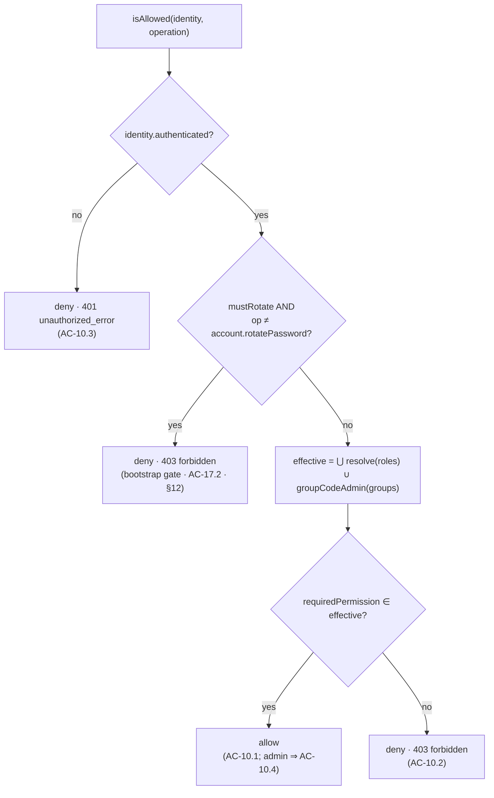

# Design Section 05 — RBAC & Authorization · `DES-RBAC`

> **Section role: DETAILED DESIGN.** This file details the `Role_Service` (role/permission
> management, REQ-9) and the `Authorization_Service` (authorization enforcement, REQ-10),
> plus the API-layer authorization middleware seam. Read [`../design.md`](../design.md) (the
> **master map**) first — it owns the layered architecture, the adapter seams, the Error
> Handling status/shape table, the Security Posture, the group-code↔RBAC reconciliation
> summary, and the module-boundary rules (D-003, AC-16.*). This section refines those
> decisions for REQ-9 and REQ-10 only; it does not restate or override them.
>
> **Covers:** REQ-9 (Role Management / RBAC, AC-9.1 … AC-9.5) and REQ-10 (Authorization
> Enforcement, AC-10.1 … AC-10.5).
> **Owns properties:** **P-006** (formalized in full in [§9](#9-correctness-properties)). It
> is also the **single owner of the admin-determination predicate** referenced by
> [`04-user-management.md`](./04-user-management.md) §6.5 (AC-8.5 last-admin) and
> [`12-admin-bootstrap.md`](./12-admin-bootstrap.md) (REQ-17 bootstrap). It *references*
> P-004 (Role round-trip, owned by [`06-persistence-and-serialization.md`](./06-persistence-and-serialization.md)),
> consumes `Token_Service.verify().claims` from [`02-token-and-session.md`](./02-token-and-session.md),
> and *notes* the cross-cutting candidate property **P-010** (jointly owned by §04 + §12,
> pending confirmation) without claiming it.
>
> **Grounding.** Every FUXA claim below was verified by reading the actual source:
> `server/api/jwt-helper.js`, `server/runtime/users/index.js`,
> `server/runtime/users/usrstorage.js`, and `server/api/users/index.js`. Exact function names
> are cited inline. Decisions/trade-offs/notes/deviations referenced as `D-***` / `TO-***` /
> `N-***` / `DV-***` and properties `P-***` live in [`../decisions/`](../decisions/) and
> [`../decisions/traceability.md`](../decisions/traceability.md).

---

## 1. Purpose & Scope

This section specifies **how roles and their permissions are managed, and how every protected
operation is authorized against an identity's roles.** It is the design of two Service-layer
components named in the master map's *Components and Interfaces* table — `Role_Service`
(`create/list/update/delete`, REQ-9) and `Authorization_Service` (`isAllowed(identity,
operation)`, REQ-10) — together with the **authorization middleware** that applies the decision
at the API seam.

Scope, precisely:

- **REQ-9 (Role Management).** Persist a new `Role` from an administrator's request (AC-9.1);
  list every stored `Role` with its name and permissions (AC-9.2); replace a role's permission
  set on update (AC-9.3); delete roles **and remove the deleted role identifiers from every
  `User_Record` that referenced them** (AC-9.4); reject a create whose role name already exists
  (AC-9.5).
- **REQ-10 (Authorization Enforcement).** Allow a protected operation when at least one of the
  identity's roles grants the required permission (AC-10.1); deny with **403** when no role
  grants it (AC-10.2); deny with **401** when the request is unauthenticated (AC-10.3); allow
  user-/role-management operations for an identity holding an administrator role (AC-10.4); and
  return the **same decision** for the same identity+operation when nothing about the identity's
  roles or those roles' permissions has changed (AC-10.5 → **P-006**).

What this section **delegates** and only references (see [§10.5](#105-collaborators--boundaries)):

- the `Role` write→read round-trip (P-004) and the FUXA store shape/serialization →
  [`06-persistence-and-serialization.md`](./06-persistence-and-serialization.md) and
  [`11-data-models.md`](./11-data-models.md) (REQ-13);
- token verification and claim exposure (`groups`, `roles`) → [`02-token-and-session.md`](./02-token-and-session.md) (REQ-2);
- the User CRUD outcomes and the *use* of the admin-determination predicate at delete-time →
  [`04-user-management.md`](./04-user-management.md) (REQ-8, AC-8.5);
- the seeding + forced-rotation mechanics of the bootstrap gate → [`12-admin-bootstrap.md`](./12-admin-bootstrap.md) (REQ-17, P-009);
- audit records for role changes and authorization denials → [`09-audit-logging.md`](./09-audit-logging.md) (REQ-14).

### 1.1 Where it sits in the layered architecture

Per the master map's four layers (AC-16.1, **D-001**), authorization enforcement flows **UI →
API → Service → Store**, with the decision logic held in the Service layer:

- **API layer** — `server/auth-management/api/authorization.middleware.js` is the enforcement
  **seam**. For each protected route it extracts the caller identity from the verified token
  (via `Token_Service.verify`, §02), asks the `Authorization_Service` for a decision, and either
  passes control to the route or short-circuits with **401**/**403**. It never touches the store
  directly (AC-16.3) and fails fast if the service is unavailable (AC-16.4). The route handlers
  for role CRUD live in `server/auth-management/api/roles.router.js`.
- **Service layer** — `server/auth-management/services/role.service.js` owns
  `create/list/update/delete` (REQ-9); `server/auth-management/services/authorization.service.js`
  owns `isAllowed(identity, operation)`, the role→permission resolution, the group-code
  reconciliation, the admin-determination predicate, and the bootstrap-gate check (REQ-10,
  REQ-17). This is the pure, PBT-testable layer that owns **P-006**.
- **Store layer** — `Role_Store` (the `FuxaRoleStoreAdapter`, **D-002**) is the only component
  that knows FUXA's roles-table shape and that role identifiers live in each user's `info.roles`
  (verified in `server/runtime/users/usrstorage.js`). The adapter surfaces `Role` as
  `{ id, name, permissions[] }` and hides the JSON-value row shape (AC-16.5).

> **Boundary note (D-003).** FUXA today authorizes user/role routes **inline** with an
> admin-only gate: `server/api/users/index.js` calls `checkGroupsFnc(req)` to obtain the
> caller's group code and then `authJwt.haveAdminPermission(permission)`; on failure it responds
> **401** `unauthorized_error` (verified — the same 401 is used for both "no token" and
> "authenticated but not admin"). This module **does not edit those handlers in place**; it
> replaces the coarse admin-only gate with a **permission-based** decision computed by
> `Authorization_Service` at the middleware seam, and it splits FUXA's single 401 into **401**
> for unauthenticated (AC-10.3) and **403** for authenticated-but-unpermitted (AC-10.2).

---

## 2. The RBAC Model

### 2.1 Entities

```
Permission = string            // an operation-gating capability id, e.g. 'user.create'

Role = {
  id:          string,         // stable identifier; the value stored in User_Record.info.roles
                               //   and the roles-table primary key (FUXA stores role.id in the
                               //   'name' PK column — see §3.1 grounding)
  name:        string,         // human-readable display label (AC-9.1/9.2)
  permissions: Permission[]    // the capabilities this role grants
}

// Resolved at authorization time (never persisted in the token — D-007):
EffectivePermissionSet = Set<Permission>   // union over the identity's roles + group-code compat
```

- A `Role` is a **named set of permissions** (glossary). Its `id` is the identifier that appears
  in a user's `info.roles` array and is therefore the join key between users and roles; its
  `name` is the display label the UI shows (REQ-12). See [§3.1](#31-role-identity-name-vs-id) for
  the precise name/id reconciliation with the FUXA store.
- A `Permission` is a single named capability that gates one operation (glossary, REQ-10). The
  token carries only role **identifiers** (`roles` claim, §02); the role→permission resolution is
  computed at decision time so a long-lived token never carries a stale permission snapshot
  (**D-007**).

### 2.2 Permission id scheme

Permissions are named `<resource>.<action>`, lower-case, dot-separated. This section fixes the
authorization-relevant identifiers; module features add their own under the same scheme.

| Permission id | Gates | Owning requirement |
|---------------|-------|--------------------|
| `user.create` | Create a user | REQ-5 (enforced here for REQ-10) |
| `user.read`   | List/view users | REQ-6 |
| `user.update` | Update a user | REQ-7 |
| `user.delete` | Delete a user | REQ-8 |
| `role.create` | Create a role | REQ-9 |
| `role.read`   | List/view roles | REQ-9 |
| `role.update` | Update a role | REQ-9 |
| `role.delete` | Delete role(s) | REQ-9 |
| `account.rotatePassword` | Rotate one's own password | REQ-17 (bootstrap gate exception) |

**Module (feature) permissions.** Any future module names its capabilities with the same
`<module>.<resource>.<action>` shape (e.g. `project.view`, `alarms.ack`). The
`Authorization_Service` treats every permission id opaquely — it performs **set membership**
only, so new permissions require no code change to the decision engine (AC-16.5 spirit).

**The administrator permission set.** The distinguished set that defines an administrator (used
by AC-10.4 and the admin-determination predicate, [§5.3](#53-admin-determination-predicate-single-owner)):

```
ADMIN_PERMISSION_SET = { user.create, user.read, user.update, user.delete,
                         role.create, role.read, role.update, role.delete }
```

An **administrator role** is any role whose `permissions` is a superset of
`ADMIN_PERMISSION_SET`. This is the RBAC-native definition of "administrator role" that AC-10.4
refers to.

### 2.3 How a user's roles resolve to an effective permission set

Given an identity with role identifiers `R = identity.roles` and legacy group code(s)
`G = identity.groups`, the effective permission set is:

```
resolve(role_id)  = Role_Store.get(role_id)?.permissions ?? ∅      // unknown id contributes nothing
effective(identity) = ( ⋃ over r in R of resolve(r) )              // RBAC source of truth
                    ∪ groupCodeAdmin(G)                            // legacy compat input (§5)
```

where `groupCodeAdmin(G)` contributes `ADMIN_PERMISSION_SET` **iff** a member of `G` is an admin
group code (`255` or admin-usage `-1`), and `∅` otherwise (see [§5](#5-group-code-11255--rbac-reconciliation)).
This union is the single quantity every REQ-10 decision is a function of; its purity is what
makes **P-006** hold ([§9](#9-correctness-properties)).

---

## 3. `Role_Service` Contract (REQ-9)

The master map lists the capability as `create(role)`, `list()`, `update(name, permissions)`,
`delete(names)` (AC-16.2). Each operation resolves to exactly one **outcome**, which the API
layer maps to HTTP ([§8](#8-error-handling--edge-cases)). Modeling results as a closed outcome
set — rather than throwing for control flow — keeps each decision deterministic and directly
testable (same discipline as §01/§02/§04).

### 3.1 Role identity: name vs id

**Grounded reconciliation.** FUXA's roles table is `roles (name TEXT PRIMARY KEY, value TEXT)`,
and `usrstorage.setRoles(roles)` runs `INSERT OR REPLACE INTO roles (name, value) VALUES(?, ?)`
with parameters **`[role.id, JSON.stringify(role)]`** (verified) — i.e. the primary-key column
literally named `name` **stores `role.id`**, and the whole role object (including its display
`name`) is serialized into `value`. User references live in `info.roles` as **role ids**
(verified in `usrstorage.removeRoles`, which filters `info.roles` by `role.id`). Therefore:

- the **uniqueness key** for a role is `role.id` (the PK); it is what AC-9.5's "role name that
  already exists" resolves to at the store, and it is the join key for AC-9.4;
- the display **`name`** is carried inside the serialized value and returned on list (AC-9.2).

This section treats `role.id` as the canonical identifier; where a request supplies only a
human name, the API layer maps it to the identifier before calling the service. The exact
JSON-value serialization and the `Role` round-trip (P-004) are owned by
[`06-persistence-and-serialization.md`](./06-persistence-and-serialization.md).

### 3.2 Operation outcome types

```
create(role: Role): CreateRoleOutcome
CreateRoleOutcome =
  | { kind: 'created',      role: Role }                                   // AC-9.1
  | { kind: 'duplicate',    error: 'duplicate_role', name: string }        // AC-9.5
  | { kind: 'invalid',      error: 'validation_error', detail: string }    // shape guard (edge)

list(): ListRolesOutcome
ListRolesOutcome =
  | { kind: 'ok',           roles: Role[] }                                // AC-9.2

update(name: string, permissions: Permission[]): UpdateRoleOutcome
UpdateRoleOutcome =
  | { kind: 'updated',      role: Role }                                   // AC-9.3
  | { kind: 'unknown_role', error: 'role_not_found', name: string }        // missing target (edge)
  | { kind: 'invalid',      error: 'validation_error', detail: string }    // AC-9.3 guard

delete(names: string[]): DeleteRolesOutcome
DeleteRolesOutcome =
  | { kind: 'deleted',      removed: string[], prunedUsers: string[] }      // AC-9.4
```

Every non-success outcome carries a **stable `error` identifier** so the UI (REQ-12) can branch
and audit entries are greppable (REQ-14); the HTTP status is derived from it ([§8.1](#81-outcome--http-response-mapping)).

### 3.3 Create (AC-9.1, AC-9.5)

`create(role)` executes in a fixed order so duplicate detection happens **before** any write:

1. **Validate shape.** `id`/`name` present and non-empty; `permissions` an array of permission
   ids. On failure return `{ kind:'invalid' }`, no store call.
2. **Duplicate detection (AC-9.5).** Look the role up via `Role_Store.get(role.id)`. If a role
   already exists under that identifier, return `{ kind:'duplicate', name }` and **make no write**
   — the existing role is left exactly as it was.
3. **Persist (AC-9.1).** Write via `Role_Store.create(role)` (adapter → `runtime.users.setRoles`).
4. **Audit + return.** Record the create via `Audit_Logger` (role name, time — AC-14.3) and
   return `{ kind:'created', role }`.

> **Divergence from FUXA (AC-9.5).** FUXA's `setRoles` is an unconditional
> `INSERT OR REPLACE` keyed by `role.id` (verified) — a create for an already-existing role would
> **silently overwrite** it. AC-9.5 forbids this: a duplicate create must be rejected with a
> stable `duplicate_role` identifier and the existing role left unmodified. The service therefore
> performs an explicit pre-write existence check, exactly mirroring the create/update split the
> module already applies to users in [`04-user-management.md`](./04-user-management.md) §3.2.

### 3.4 List (AC-9.2)

`list()` returns a `Role[]` containing **every** stored role with its `name` and `permissions`.
The adapter reads all rows via FUXA's `runtime.users.getRoles()`, which does
`SELECT value FROM roles` and `JSON.parse`s each `value` into a role object (verified in
`server/runtime/users/index.js` → `getRoles`). Equality of the returned `name`/`permission set`
with the stored values across this boundary is exactly the round-trip **P-004**, owned by
[`06-persistence-and-serialization.md`](./06-persistence-and-serialization.md) and *referenced*
here.

### 3.5 Update replaces the permission set (AC-9.3)

`update(name, permissions)` looks the role up; if absent, returns `{ kind:'unknown_role' }` with
no write. Otherwise it **replaces** the role's permission set wholesale with the submitted set —
this is a *replace*, not a merge: permissions absent from the submitted set are removed, and the
resulting `permissions` equals the submitted set exactly. It persists via `Role_Store.update`
(adapter → `setRoles`, whose `INSERT OR REPLACE` naturally overwrites the JSON value) and audits
the change. Because the submitted set becomes the stored set verbatim, a subsequent `list()`/
resolution observes only the new permissions — which is what keeps authorization decisions
consistent with the latest role definition (see the cache-invalidation rule, [§7](#7-permission-cache--invalidation)).

### 3.6 Delete roles and prune every referencing user (AC-9.4)

AC-9.4 has **two** obligations that must both hold atomically from the caller's view: (a) remove
the named roles from the `Role_Store`, and (b) remove those role identifiers from **every**
`User_Record` that referenced them. `delete(names)`:

1. Resolve the target role ids from `names`.
2. Delegate to `Role_Store.delete(ids)` (adapter → `runtime.users.removeRoles(roles)`), which —
   **verified** — performs the prune-then-delete in `server/runtime/users/usrstorage.js`
   `removeRoles`: it `SELECT`s all user rows, and for each user whose parsed `info.roles`
   contains a deleted id it writes back `UPDATE users SET info = ? WHERE username = ?` with the
   filtered array, **then** `DELETE FROM roles WHERE name = ?` for each deleted role id. This is
   the AC-9.4 store anchor.
3. The in-memory cache is pruned in lock-step: `server/runtime/users/index.js` `removeRoles`
   builds `roleIds = new Set(roles.map(r => r.id))` and, for every `[username, user]` in
   `usersMap`, rewrites `user.info.roles` to exclude those ids (verified) — the AC-9.4 **cache**
   anchor. See [§7](#7-permission-cache--invalidation).
4. Return `{ kind:'deleted', removed, prunedUsers }` and audit the deletion (AC-14.3).

The post-condition — **no surviving `User_Record` references any deleted role id, and no deleted
role remains in the store** — is a strong invariant amenable to property-based testing; it is
recorded as candidate property **P-011** in [§9.3](#93-candidate--cross-cutting-properties)
(pending traceability registration; not claimed as owned here).

> **Divergence from FUXA (none for the prune itself).** The prune-across-users behavior already
> exists in FUXA's `removeRoles` (verified, both store and cache). The module **reuses it
> verbatim** through the adapter rather than re-implementing it; the service layer adds only the
> outcome shaping and the audit record.

---

## 4. `Authorization_Service` Contract (REQ-10)

The master map lists the capability as `isAllowed(identity, operation)` (AC-16.2). This section
fixes the precise, testable shape and the enforcement semantics.

### 4.1 Inputs

```
Identity = {
  username:        string,
  authenticated:   boolean,                    // from Token_Service.verify() (§02)
  roles:           string[],                   // RBAC role ids (info.roles / token 'roles' claim)
  groups:          number | number[] | string[], // FUXA group code(s), compat input (§5)
  mustRotate:      boolean                      // bootstrap gate flag (REQ-17, §6)
}

Operation = {
  id:              string,                     // e.g. 'user.create'
  requiredPermission: Permission               // the permission that gates it
}
```

`Identity` is built by the middleware from `Token_Service.verify(token)`: an authenticated
result exposes `id`→`username`, `roles`, and `groups` (§02, AC-2.3); a missing/invalid/expired
token yields `authenticated:false` (guest — see [§8.2](#82-guest-and-unauthenticated-handling-ac-103)).

### 4.2 Decision

```
isAllowed(identity, operation): Decision
Decision =
  | { allow: true }                                              // AC-10.1, AC-10.4
  | { allow: false, status: 401, error: 'unauthorized_error' }   // AC-10.3 (unauthenticated)
  | { allow: false, status: 403, error: 'forbidden' }            // AC-10.2 (no grant / gated)
```

The decision procedure, evaluated in order (this ordering is fixed and total — every input maps
to exactly one branch, which is what [§9](#9-correctness-properties) quantifies over):

1. **Unauthenticated → 401 (AC-10.3).** If `identity.authenticated` is false (guest, missing,
   invalid, or expired token — §02/§5), deny with **401** `unauthorized_error`. No permission
   resolution occurs.
2. **Bootstrap gate → 403 unless password rotation (AC-17.2 / REQ-17).** If
   `identity.mustRotate` is true and `operation.requiredPermission !== 'account.rotatePassword'`,
   deny with **403**. The only operation a not-yet-rotated seeded admin may perform is its own
   password rotation ([§6](#6-bootstrap-gate-interaction-req-17)).
3. **Permission membership → allow/deny (AC-10.1, AC-10.2, AC-10.4).** Compute
   `effective(identity)` ([§2.3](#23-how-a-users-roles-resolve-to-an-effective-permission-set)).
   If `operation.requiredPermission ∈ effective(identity)`, **allow** (AC-10.1); an identity
   holding an administrator role has `ADMIN_PERMISSION_SET ⊆ effective`, so all `user.*`/`role.*`
   operations are allowed (AC-10.4). Otherwise **deny** with **403** `forbidden` (AC-10.2).

**Fail-closed default.** If `operation.requiredPermission` is unknown/undefined or the operation
maps to no permission, the decision is **deny (403)** — the engine never allows an operation it
cannot positively match to a granted permission ([§8.3](#83-edge-cases)).

### 4.3 Determinism (AC-10.5 → P-006)

`isAllowed` is a **pure function** of `(identity, effective(identity), operation)`. It reads no
clock, no random source, and no ambient/mutable state other than the role→permission resolution,
which is itself a pure function of the stored roles. Consequently, evaluating the same identity
against the same operation **twice with no change to the identity's roles or those roles'
permissions** yields the same decision — AC-10.5, formalized as **P-006**
([§9.1](#91-property-6-authorization-decisions-are-deterministic)). The cache-invalidation rule
([§7](#7-permission-cache--invalidation)) is what keeps this honest across role edits: a *change*
to roles/permissions is *allowed* to change the decision; determinism is guaranteed only for
**unchanged** inputs.

---

## 5. Group-Code (−1 / 255) ↔ RBAC Reconciliation

This section is the authoritative expansion of the master map's reconciliation summary and the
**replacement for FUXA's `haveAdminPermission`**.

### 5.1 Verified FUXA facts

- `server/api/jwt-helper.js` defines `const adminGroups = [-1, 255];` and
  `haveAdminPermission(permission)` returns `true` **iff** its argument is a member of
  `adminGroups` (`adminGroups.indexOf(permission) !== -1`), else `false` (and `false` for
  `null`/`undefined`) — verified. Despite the parameter name, it is a **group-code admin test**,
  not a capability check: `server/api/users/index.js` calls it as
  `authJwt.haveAdminPermission(checkGroupsFnc(req))`, passing the caller's **group code**
  (verified on all six user/role routes).
- The default administrator is seeded with **`groups = -1`** (integer) in
  `usrstorage.setDefault` (verified: `INSERT ... VALUES('admin', 'Administrator Account',
  bcrypt.hashSync('123456', 10), -1)`).
- A **guest** identity is the string `'guest'`, not numeric `-1`: `jwt-helper.getGuestToken`
  signs `{ id:'guest', groups:['guest'] }`, `verifyToken` sets `groups:['guest']` /
  `isAuthenticated:false` when a token is absent/invalid, and `isGuestUser(userId, userGroups)`
  returns true when `userId === 'guest'` or `userGroups` includes `'guest'` (verified).

> **Precision note (corrects a loose phrasing).** The master map summary refers to "−1 guest".
> The verified source shows numeric **`-1` is an admin group code** (the seeded admin's group),
> while **guest is the string `'guest'`** (or an absent token). This section uses the verified
> meanings: `-1` and `255` ⇒ administrator; `'guest'`/absent ⇒ unauthenticated. This distinction
> matters for AC-10.3 vs AC-10.4 and is called out again in [§8.2](#82-guest-and-unauthenticated-handling-ac-103).

### 5.2 Mapping table and precedence

| FUXA `groups` value | Meaning | RBAC contribution to `effective(identity)` |
|---------------------|---------|---------------------------------------------|
| `255` | Legacy full admin | `ADMIN_PERMISSION_SET` (compat input) |
| `-1` (integer) | Seeded/legacy admin usage | `ADMIN_PERMISSION_SET` (compat input) |
| `'guest'` (string) or **absent token** | Guest / unauthenticated | none — identity is `authenticated:false` ⇒ AC-10.3 (401) |
| any other numeric code | Standard user | none — permissions come **only** from RBAC roles |
| RBAC `roles` (from `info.roles`) | Module roles | union of each role's `permissions` (the source of truth) |

**Direction of authority (the single-decision-path rule).** RBAC permissions are the **source of
truth** for the module's protected operations. The legacy group code is a **compatibility input**
mapped *into* the effective set (it can only *add* the admin permission set for `255`/`-1`); it
is **never** consulted as an authority that overrides RBAC, and a non-admin group code contributes
**nothing**. There is exactly one decision path — permission set membership ([§4.2](#42-decision))
— so no second, divergent authority can make the decision non-deterministic (this is what keeps
**P-006** true).

### 5.3 Admin-determination predicate (single owner)

This is the **single definition** of "administrator" used by this section (AC-10.4), by
[`04-user-management.md`](./04-user-management.md) §6.5 (AC-8.5 last-admin), and by
[`12-admin-bootstrap.md`](./12-admin-bootstrap.md) (REQ-17). No other section defines it.

```
isAdministrator(subject): boolean
  // subject is a User_Record or a verified Identity; roleIds = subject.roles (info.roles)
  let perms = ( ⋃ over r in roleIds of (Role_Store.get(r)?.permissions ?? ∅) )
            ∪ groupCodeAdmin(subject.groups)
  return ADMIN_PERMISSION_SET ⊆ perms

groupCodeAdmin(groups): Set<Permission>
  return (any member of `groups` is in adminGroups[-1,255]) ? ADMIN_PERMISSION_SET : ∅
```

- **RBAC-first.** A subject is an administrator when its resolved permissions cover
  `ADMIN_PERMISSION_SET` — the RBAC-native criterion.
- **Group-code compatibility.** A subject whose `groups` includes `255` or `-1` is *also*
  classified as an administrator, because `groupCodeAdmin` injects `ADMIN_PERMISSION_SET` into
  `perms` (this is the same additive mapping as [§5.2](#52-mapping-table-and-precedence); it keeps
  FUXA's seeded `groups=-1` admin working during migration). This is a compatibility input, never
  an override.
- **Purity.** `isAdministrator` reads only stored roles/permissions and the subject's group code;
  it has no time/random dependence, so it is deterministic — the property §04's last-admin count
  (AC-8.5) and §12's bootstrap check both rely on.

**How AC-10.4 is satisfied.** An identity holding an administrator role (or a legacy admin group
code) has `ADMIN_PERMISSION_SET ⊆ effective(identity)`; therefore every `user.*` and `role.*`
operation's `requiredPermission` is a member of `effective`, and [§4.2](#42-decision) step 3
allows it. AC-10.4 is thus a direct corollary of the membership decision — no special-case admin
branch is needed, which avoids a second decision path.

**`haveAdminPermission` replacement.** The middleware seam ([§1.1](#11-where-it-sits-in-the-layered-architecture))
replaces `authJwt.haveAdminPermission(checkGroupsFnc(req))` with `isAllowed(identity, operation)`.
The legacy call is preserved only implicitly through `groupCodeAdmin` so existing FUXA tokens
carrying `groups: 255`/`-1` keep working; new deployments assign an administrator **role**
instead of relying on the group code.

---

## 6. Bootstrap-Gate Interaction (REQ-17)

REQ-17 (AC-17.2) requires that a **seeded default administrator that has not completed a password
rotation is denied every protected operation except the password-rotation operation**. The
`Authorization_Service` enforces this gate as **step 2** of the decision ([§4.2](#42-decision)):

- The identity carries a `mustRotate` flag (true for a seeded admin that has not rotated). Its
  source, seeding, and the rotation that clears it are the **bootstrap mechanics owned by**
  [`12-admin-bootstrap.md`](./12-admin-bootstrap.md) (REQ-17); this section only *consumes* the
  flag and enforces the gate.
- When `mustRotate` is true, `isAllowed` denies (**403**) every operation whose
  `requiredPermission` is not `account.rotatePassword`, **regardless** of the admin permissions
  the identity would otherwise have. Because the gate is evaluated **before** permission
  membership, a not-yet-rotated seeded admin cannot use its `ADMIN_PERMISSION_SET` to bypass it.
- After rotation, `mustRotate` is false and the account is authorized purely by permission
  membership ([§4.2](#42-decision) step 3), regaining its administrator permissions (AC-17.3).

This is the enforcement half of **P-009** (owned by §12); this section guarantees the
`Authorization_Service` honors the gate, and §12 guarantees the flag's lifecycle.

---

## 7. Permission Cache & Invalidation

**Verified cache.** FUXA maintains an in-memory permission cache named **`usersMap`** (a `Map`)
in `server/runtime/users/index.js`: populated by `_loadUsers()` and `setUsers()`
(`usersMap.set(username, { info, groups })`), read via `getUserCache(username)`
(`return usersMap.get(username)`), evicted on user delete (`removeUsers` →
`usersMap.delete(username)`), and — critically for RBAC — **pruned on role delete**:
`removeRoles(roles)` rewrites every cached `user.info.roles` to exclude the deleted role ids
(verified). The role→permission definitions themselves come from the `roles` table via
`getRoles()`.

**Invalidation rule (keeps AC-10.5 determinism honest).** The `Authorization_Service` computes
`effective(identity)` from (a) the identity's role ids and (b) each role's permission set. Both
inputs can change through `Role_Service`/`User_Service`; determinism (P-006) is promised only for
**unchanged** inputs, so every mutation MUST invalidate any cached resolution so that the *next*
evaluation reflects the change:

| Mutation | FUXA effect (verified) | Required invalidation |
|----------|------------------------|-----------------------|
| Role permission update (`update`, AC-9.3) | `setRoles` overwrites the role's JSON value | Drop any cached role→permission entry for that role id; next `effective()` re-resolves the new set |
| Role delete (`delete`, AC-9.4) | `removeRoles` prunes `info.roles` in `usersMap` **and** deletes role rows | Cached user role-lists are already pruned; drop the deleted role's resolution entry |
| User role assignment change (update, REQ-7) | `setUsers` rewrites `usersMap[username].info` | Cached identity role-list for that user is replaced |
| User delete (REQ-8) | `removeUsers` → `usersMap.delete(username)` | Cached identity entry removed |

Under this rule the decision is a pure function of the *current* stored roles/permissions:
between two evaluations with **no** intervening mutation, no cache entry changes, so both
evaluations resolve the identical `effective` set and return the identical decision (P-006). A
mutation *between* the two evaluations is outside P-006's "no change" precondition and is
permitted to change the decision.

> **Boundary note.** The `usersMap`/`roles`-table mechanics live behind the `User_Store` /
> `Role_Store` adapters (AC-16.5); the `Authorization_Service` sees only the interface
> (`getUserCache`-equivalent role lookup + `Role_Store.get`), never the FUXA `Map` directly
> (AC-16.3).

---

## 8. Error Handling & Edge Cases

### 8.1 Outcome → HTTP response mapping

These are the concrete REQ-9/REQ-10 instances of the master map's **Error Handling** table; they
must not diverge from it.

| Trigger | Outcome / decision | AC | HTTP | Body (stable id) |
|---------|--------------------|----|------|------------------|
| Role created | `created` | AC-9.1 | 200 | `{ status:'success', data: role }` |
| Roles listed | `ok` | AC-9.2 | 200 | `{ status:'success', data: roles }` |
| Role permissions replaced | `updated` | AC-9.3 | 200 | `{ status:'success', data: role }` |
| Roles deleted + users pruned | `deleted` | AC-9.4 | 200 | `{ status:'success', data:{ removed, prunedUsers } }` |
| Duplicate role name on create | `duplicate` | AC-9.5 | 400 | `{ error:'duplicate_role', message }` |
| Update/delete of unknown role | `unknown_role` | REQ-9 (edge) | 404 | `{ error:'role_not_found', message }` |
| Invalid role payload | `invalid` | REQ-9 (edge) | 400 | `{ error:'validation_error', message }` |
| Authorized operation | `allow:true` | AC-10.1, AC-10.4 | (route proceeds) | — |
| Authenticated, permission not granted | `allow:false / 403` | AC-10.2 | **403** | `{ error:'forbidden', message }` |
| Unauthenticated protected request | `allow:false / 401` | AC-10.3 | **401** | `{ error:'unauthorized_error', message }` |

> **Divergence from FUXA (401 vs 403 split).** FUXA's user/role routes return **401**
> `unauthorized_error` for *both* "no token" and "authenticated but not admin" (verified in
> `server/api/users/index.js`). The module keeps **401** only for the unauthenticated case
> (AC-10.3) and introduces **403** `forbidden` for the authenticated-but-unpermitted case
> (AC-10.2), matching the master-map error table. Duplicate-create maps to **400** with a stable
> `duplicate_role` identifier, consistent with the duplicate-user decision (TO-006).

### 8.2 Guest and unauthenticated handling (AC-10.3)

Per [§5.1](#51-verified-fuxa-facts), an absent/invalid/expired token yields an identity with
`authenticated:false` (FUXA's guest substitution: `groups:['guest']`, `isAuthenticated:false`).
[§4.2](#42-decision) step 1 denies such an identity with **401** for any protected operation —
the module never lets a guest reach permission resolution. Guest substitution itself is an
API/token-layer concern (§02 §5 "Guest handling boundary"); this section owns only the
*decision* that a non-authenticated identity is denied 401.

### 8.3 Edge cases

- **Unknown / unmapped permission (fail-closed).** An operation whose `requiredPermission` is not
  a member of any role's permission set — including a typo'd or not-yet-defined permission id — is
  **denied (403)**. The engine never allows on absence of a matching grant.
- **Unknown role id in `info.roles`.** `resolve(role_id)` for an id with no stored role
  contributes `∅` (it is silently ignored, not an error), so a dangling reference cannot
  accidentally grant permissions. This also makes the AC-9.4 prune's correctness non-critical for
  *safety* (a missed prune cannot grant anything) while still required for *hygiene*.
- **Role referenced by users on delete (AC-9.4).** Deleting a role that users still reference is
  the normal path, not an error: the prune ([§3.6](#36-delete-roles-and-prune-every-referencing-user-ac-94))
  removes the id from every `info.roles` before/with deleting the role row.
- **Duplicate ids within a single `delete(names)` batch.** De-duplicated via the `roleIds` set
  (verified in FUXA `removeRoles`); deleting the same id twice is idempotent.
- **Empty `permissions` on update (AC-9.3).** A submitted empty set is a valid *replace* — the
  role ends up granting nothing; this is a demotion, not a validation error.

### 8.4 Authorization decision (mermaid)



---

## 9. Correctness Properties

> *A property is a characteristic or behavior that should hold true across all valid
> executions of a system — a formal statement about what the system should do. Properties are
> the bridge between human-readable specifications and machine-verifiable correctness.*

This section is the **single owner** of **P-006** (per the master-map Table of Contents and
[`../decisions/traceability.md`](../decisions/traceability.md) §C). The prework consolidation
established that:

- AC-10.5 is the one universally-quantified property this section owns (**P-006**, determinism).
- AC-10.1 / AC-10.2 / AC-10.4 define the *decision truth table* that P-006 quantifies over; they
  are verified by example/edge tests ([§10](#10-testing-notes)), not by separate properties
  (formalizing each would be redundant with P-006 plus the truth-table tests).
- AC-9.1 / AC-9.2 / AC-9.3 field-preservation is subsumed by **P-004** (Role write→read
  round-trip), **owned by** [`06-persistence-and-serialization.md`](./06-persistence-and-serialization.md);
  no duplicate property is minted here.
- AC-9.4's prune invariant is genuinely property-amenable and is **not** covered by P-004 or
  P-006; it is recorded below as a **candidate** (P-011), pending traceability registration — not
  claimed as owned.

### 9.1 Property 6: Authorization decisions are deterministic

*For any* identity (any set of assigned role ids, any FUXA group code, and any permission set per
role) and *for any* protected operation, evaluating `Authorization_Service.isAllowed(identity,
operation)` twice — with **no change** to the identity's roles or to those roles' permissions
between the two evaluations — yields the **same decision** on the second evaluation as on the
first (identical `allow` flag, and identical `status`/`error` identifier when denied). The
guarantee holds across every decision branch: an allowed operation (AC-10.1/10.4), a
permission-denied operation (403, AC-10.2), an unauthenticated identity (401, AC-10.3), and a
bootstrap-gated seeded admin (403 except `account.rotatePassword`).

**Validates: Requirements 10.5** — (P-006; decision semantics AC-10.1/10.2/10.3/10.4 are the
branches quantified over)

### 9.2 Property 10 (cross-cutting) — referenced, not owned here

**P-010 (candidate):** *For any* sequence of user deletions applied to a store that starts with
at least one administrator, at least one administrator always remains (the system never reaches a
zero-administrator state) — the delete-path inverse of the REQ-17 bootstrap guarantee.

P-010 is **cross-cutting REQ-8 (AC-8.5) + REQ-17** and its decision depends on the
admin-determination predicate this section owns ([§5.3](#53-admin-determination-predicate-single-owner)).
Per [`../decisions/traceability.md`](../decisions/traceability.md) §C it is **jointly owned by
§04 (last-admin delete guard) and §12 (bootstrap re-seed guarantee)** and is **pending
confirmation**. This section **references** it only — it does **not** claim P-010 as DES-RBAC's
own. If/when P-010 is formalized, it must be marked jointly owned (§04 + §12) and validated by a
property test that composes §04's last-admin guard with §12's bootstrap, using this section's
`isAdministrator` predicate as the classifier.

### 9.3 Candidate / cross-cutting properties

**P-011 (candidate, pending traceability registration):** *For any* population of users with
arbitrary role assignments and *for any* subset of roles deleted, after `Role_Service.delete`
completes, **no surviving `User_Record` references any deleted role id and no deleted role remains
in the `Role_Store`** (AC-9.4). This is a strong invariant amenable to property-based testing and
is anchored to the verified FUXA `removeRoles` prune (store + `usersMap`, [§3.6](#36-delete-roles-and-prune-every-referencing-user-ac-94)).
It is **not** currently a registered property (§05 owns only P-006; P-004 covers the Role
round-trip, not the prune). It is recorded here as a candidate so it can be registered in
`traceability.md` §C before Tasks, rather than silently minted as owned. Until registered, AC-9.4
is covered by the property-style test described in [§10.2](#102-property-based-test-p-006) and the
integration test in [§10.3](#103-example--edge--integration-tests).

---

## 10. Testing Notes

Follows the master map's **dual testing approach** and PBT rules: `fast-check` for properties
(never a hand-rolled framework), **minimum 100 iterations**, tag
`Feature: auth-user-management, Property {n}: {property text}`, each property test referencing its
owning design property id. FUXA ships `mocha`/`chai`/`sinon` (verified), used for
example/edge/integration tests.

### 10.1 What is (and is not) property-tested

- **Property-tested:** AC-10.5 determinism (**P-006**, owned). Candidate prune invariant (P-011)
  is tested property-style now, pending formal registration.
- **Example/edge tested (decision truth table + role CRUD control flow):** AC-9.1, AC-9.2, AC-9.3,
  AC-9.5, AC-10.1, AC-10.2, AC-10.4, and the AC-10.3 unauthenticated status. These are concrete
  status/control-flow behaviors whose correctness does not vary usefully over 100 generated
  inputs.
- **Referenced (owned elsewhere):** AC-9.1/9.2/9.3 field round-trip → **P-004** (§06); bootstrap
  gate lifecycle → **P-009** (§12); last-admin retention → **P-010** (candidate, §04 + §12).

### 10.2 Property-based test (P-006)

- **Generators (fast-check):**
  - `identityArb`: record of `username` (non-empty string), `authenticated` (boolean),
    `roles` (array of role-id strings), `groups` (one of `255`, `-1`, `'guest'`, or an arbitrary
    other integer), and `mustRotate` (boolean).
  - `rolePermsArb`: a map from role id → array of permission ids drawn from a fixed pool that
    includes `ADMIN_PERMISSION_SET`, `account.rotatePassword`, and unrelated ids, so generated
    identities land in the allow, 403, 401, and bootstrap-gated branches.
  - `operationArb`: `{ id, requiredPermission }` with `requiredPermission` drawn from the same
    pool plus at least one unmapped id (fail-closed edge).
- **Strategy:** build an `Authorization_Service` over the generated (fixed) role→permission
  snapshot; call `isAllowed(identity, operation)` twice **with no mutation between calls**; assert
  `decision1` deeply equals `decision2` (allow flag and, when denied, status + error id). Because
  the generator spans all four branches, determinism is exercised across the whole decision
  surface.
- **Config:** `fc.assert(fc.property(...), { numRuns: 100 })` (≥100 iterations).
- **Tag:** `Feature: auth-user-management, Property 6: authorization decisions are deterministic for unchanged identity and operation`.
- **P-011 candidate test (same runner):** generate a user population + role assignments +
  a delete subset; run `Role_Service.delete`; assert no surviving `info.roles` contains a deleted
  id and the store no longer lists the deleted roles. Tag reserved as
  `Feature: auth-user-management, Property 11: role deletion prunes deleted ids from every user` —
  to be activated on traceability registration.

### 10.3 Example / edge / integration tests

- **AC-9.1 / AC-9.2 (create/list):** create a valid role → `created`; `list()` returns it
  (field equality delegated to P-004).
- **AC-9.3 (replace-not-merge):** role `{a,b}` → `update` to `{c}` ⇒ stored set is exactly `{c}`;
  empty submitted set demotes to no permissions.
- **AC-9.5 (duplicate):** second create of the same id ⇒ `duplicate` (`duplicate_role`), existing
  role unmodified (contrast FUXA's silent `INSERT OR REPLACE`).
- **AC-9.4 (prune, integration):** seed users referencing a role, delete the role, assert both the
  store row and every `info.roles` reference are gone (drives the verified `removeRoles` path,
  store + `usersMap`).
- **AC-10.1 / AC-10.4 (allow):** identity with a granting role ⇒ allow; admin-role identity and
  legacy `groups:255` / `groups:-1` identities ⇒ allowed on each `user.*`/`role.*` op; non-admin
  numeric group code grants nothing.
- **AC-10.2 (403) + fail-closed edge:** identity lacking the permission ⇒ 403 `forbidden`;
  unknown/unmapped `requiredPermission` ⇒ 403.
- **AC-10.3 (401):** `authenticated:false` / `groups:['guest']` / absent token ⇒ 401
  `unauthorized_error`, with no permission resolution; asserts guest (`'guest'`) is distinct from
  admin numeric `-1`.
- **Bootstrap gate (AC-17.2 enforcement):** `mustRotate:true` admin ⇒ 403 on every op except
  `account.rotatePassword`; after clearing the flag ⇒ admin ops allowed (lifecycle owned by §12).

### 10.4 Per-section traceability (AC → behavior → verified FUXA anchor → test type)

| AC | Behavior | Verified FUXA anchor | Test type |
|----|----------|----------------------|-----------|
| AC-9.1 | Create role, persist | `usrstorage.setRoles` (`INSERT OR REPLACE roles`), `runtime/users.setRoles` | Example (+ P-004 round-trip, §06) |
| AC-9.2 | List all roles w/ name+perms | `runtime/users.getRoles` → `usrstorage.getRoles` (`SELECT value FROM roles`, JSON.parse) | Example/Integration (+ P-004) |
| AC-9.3 | Update replaces permission set | `usrstorage.setRoles` `INSERT OR REPLACE` overwrites value | Example (replace-not-merge) |
| AC-9.4 | Delete roles + prune ids from every user | `usrstorage.removeRoles` (prune `info.roles`, then delete rows) + `runtime/users.removeRoles` (`usersMap` prune) | Integration + candidate property P-011 |
| AC-9.5 | Reject duplicate role name | divergence from `usrstorage.setRoles` silent `INSERT OR REPLACE` | Edge/Example |
| AC-10.1 | Grant ⇒ allow | replaces `haveAdminPermission` gate in `api/users/index.js` | Example |
| AC-10.2 | No grant ⇒ 403 | divergence from FUXA 401-for-all in `api/users/index.js` | Edge/Example |
| AC-10.3 | Unauthenticated ⇒ 401 | `jwt-helper.verifyToken` guest sub / `requireAuth` 401 `unauthorized_error`; `isGuestUser` | Edge/Example |
| AC-10.4 | Admin role ⇒ allow user/role mgmt | `jwt-helper.adminGroups=[-1,255]`, `haveAdminPermission`; `usrstorage.setDefault` admin `groups=-1` | Example (+ predicate) |
| AC-10.5 | Deterministic decision | pure decision over `usersMap`/`roles` snapshot (`getUserCache`, `getRoles`) | **Property P-006 (owned)** |

**Orphan check.** Every AC in REQ-9 (9.1–9.5) and REQ-10 (10.1–10.5) maps to at least one row
above with a verified anchor and a test type; every behavior traces back to an AC. No orphan
criteria. Referenced-but-not-owned properties (P-004 §06, P-009 §12, P-010 §04+§12 candidate) and
the candidate P-011 are called out explicitly rather than silently absorbed.

---

## 11. Summary of Divergences from FUXA (verified)

| # | FUXA behavior (verified) | Module behavior | AC |
|---|--------------------------|-----------------|----|
| 1 | `setRoles` unconditional `INSERT OR REPLACE` (silent overwrite) | Explicit duplicate check → `duplicate_role`, no overwrite | AC-9.5 |
| 2 | User/role routes return **401** for both no-token and not-admin | **401** unauthenticated only; **403** authenticated-but-unpermitted | AC-10.2, AC-10.3 |
| 3 | `haveAdminPermission(groupCode)` coarse admin-only gate over `[-1,255]` | Permission-based `isAllowed`; group code is additive compat input only | AC-10.1, AC-10.4 |
| 4 | No bootstrap gate on the seeded `groups=-1` admin | Seeded admin denied all protected ops except `account.rotatePassword` until rotation | AC-17.2 (enforced here) |
| 5 | `removeRoles` prune reused **verbatim** (no divergence) | Adapter reuses store + `usersMap` prune; service adds outcome + audit | AC-9.4 |

This section is complete and ready for review. If review reveals a requirements gap — for
example, confirming P-010 (system always retains ≥1 admin) or registering candidate P-011 (role
deletion prune invariant) in `traceability.md` §C — we can return to requirements clarification
before proceeding to the next section.
