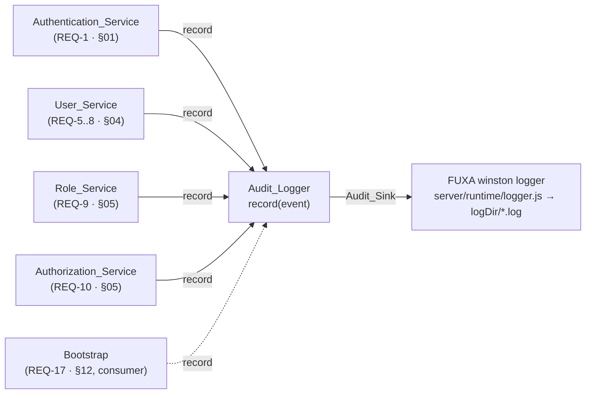

# Design Section 09 — Security Audit Logging · `DES-AUDIT`

> **Section role: DETAILED DESIGN.** This file details the `Audit_Logger` — the component
> that records security-relevant events (sign-in attempts, user changes, role changes, and
> authorization denials) for REQ-14. Read [`../design.md`](../design.md) (the **master map**)
> first — it owns the layered architecture, the adapter seams to FUXA, the Error Handling
> status/shape table, the Security Posture (including the "secrets sanitized by caller" rule,
> **D-004c**), and the module-boundary rules (**D-003**, AC-16.*). This section refines those
> decisions for REQ-14 only; it does not restate or override them.
>
> **Covers:** REQ-14 (Security Audit Logging), acceptance criteria AC-14.1 … AC-14.5.
> **Owns properties:** **none.** Per the master-map Table of Contents and
> [`../decisions/traceability.md`](../decisions/traceability.md) §C, **DES-AUDIT lists no
> owned correctness properties**; REQ-14's criteria are recording/sink behaviors best covered
> by **example / edge / integration tests** ([§10](#10-testing-notes-req-14)). One genuinely
> universal invariant ("secrets never appear in audit output") is **flagged as an unregistered
> candidate** in [§11](#11-candidate-property-flag--not-minted) — it is *not* minted with a
> property ID here.
>
> **Grounding.** Every FUXA claim below was verified by reading the actual source:
> `server/runtime/logger.js` (the winston logging facility), `server/settings.default.js`
> (`logDir`, `logs.retention`), and `server/runtime/jobs/cleaner.js` (`cleanupLogs` retention
> job). Files are cited inline. The *emission points* this section coordinates were verified in
> the neighboring detailed designs: [`01-authentication.md`](./01-authentication.md) (sign-in),
> [`04-user-management.md`](./04-user-management.md) (user CRUD), and
> [`05-rbac-authorization.md`](./05-rbac-authorization.md) (role CRUD + authorization denial).
> Decisions/notes referenced as `D-***` / `N-***` live in [`../decisions/`](../decisions/) and
> [`../decisions/traceability.md`](../decisions/traceability.md).

---

## 1. Purpose & Scope

This section specifies **how security-relevant events are recorded**, the **exact shape** of an
audit event, **which fields** each event category carries, **where** audit records are written,
and the two guarantees that make the audit trail trustworthy: it **never blocks** the domain
operation it describes, and it **never contains secrets**.

Scope, precisely — the `Audit_Logger` named in the master map's *Components and Interfaces*
table (`record(event)`, REQ-14) records:

- **AC-14.1 (sign-in).** When the `Authentication_Service` completes a sign-in attempt, record
  the **username**, the **outcome**, and the **time** of the attempt.
- **AC-14.2 (user CRUD).** When the `User_Service` creates, updates, or deletes a `User_Record`,
  record the **operation**, the **affected username**, and the **time**.
- **AC-14.3 (role CRUD).** When the `Role_Service` creates, updates, or deletes a `Role`, record
  the **operation**, the **affected role name**, and the **time**.
- **AC-14.4 (authorization denial).** When the `Authorization_Service` denies an operation,
  record the **identity**, the **requested operation**, and the **time**.
- **AC-14.5 (no-enrichment + caller sanitization).** The `Audit_Logger` records **only** the
  fields supplied by the calling service, and **each calling service** sanitizes plaintext
  passwords and password hashes out of the event **before** sending it.

What this section **delegates** and only references:

- The precise sign-in outcome set that becomes the `outcome` field → [`01-authentication.md`](./01-authentication.md) §2.2.
- The user CRUD outcomes and their emission points → [`04-user-management.md`](./04-user-management.md) §3–§6.
- The role CRUD outcomes and the authorization decision (`{allow:false, status, error}`) that
  triggers a denial record → [`05-rbac-authorization.md`](./05-rbac-authorization.md) §3–§4.
- The bootstrap-seeding event (**AC-17.5**) is *emitted through* `Audit_Logger` but **owned by**
  [`12-admin-bootstrap.md`](./12-admin-bootstrap.md); it appears in the emission map
  ([§9](#9-emission-points-across-services)) as a **consumer**, not as a REQ-14 obligation.

### 1.1 Where it sits in the layered architecture

Per the master map's four layers (AC-16.1, **D-001**), the `Audit_Logger` is a **Service-layer**
collaborator. It is *called by* the other Service-layer components (Authentication, User, Role,
Authorization services) and *writes down* to a logging **sink** ([§6](#6-storage--sink-decision-grounded-in-fuxa)).
It is not on the request/response path: the API layer never calls it directly, and it never
reads or writes the `User_Store`/`Role_Store` (AC-16.3). Its module home is
`server/auth-management/services/audit-logger.js` (see the master-map Physical Layout), and its
default sink adapts FUXA's existing logger through the composition root — **without editing FUXA
core** (**D-003**, [§6.2](#62-decision-reuse-fuxas-winston-logger-via-a-module-owned-sink)).



---

## 2. `Audit_Logger` Contract — `record(event)`

The master map lists the capability as `record(event)` (AC-16.2). This section fixes its
precise, testable shape.

### 2.1 Interface

```
interface Audit_Logger {
  // Records one security event. Fire-and-forget with respect to the caller's outcome:
  // it NEVER throws to the caller and NEVER returns a value the caller branches on
  // (see §7 non-blocking guarantee). Returns void.
  record(event: Audit_Event): void
}
```

`record` is intentionally **`void`-returning and total**: for *every* input — including a
malformed event or a sink that is down — it completes without throwing back into the calling
service ([§7](#7-non-blocking-guarantee)). This is what lets every emission point call it as a
side effect that cannot alter the operation's result.

### 2.2 The `Audit_Event` shape (secret-free by construction)

```
type AuditCategory =
  | 'auth.signin'      // AC-14.1
  | 'user.create' | 'user.update' | 'user.delete'   // AC-14.2
  | 'role.create' | 'role.update' | 'role.delete'   // AC-14.3
  | 'authz.denied'     // AC-14.4
  | 'bootstrap.seed'   // AC-17.5 (owned by §12; consumer)

Audit_Event = {
  category:   AuditCategory,   // stable, greppable discriminator
  subject:    string,          // WHO/WHAT the event is about — see per-category table (§4)
  operation?: string,          // the operation id where applicable (CRUD verb / requested op)
  outcome:    string,          // stable outcome identifier (mirrors the caller's outcome id)
  timestamp:  string,          // ISO-8601 instant, SUPPLIED BY THE CALLER (see §2.3)
  detail?:    string           // optional, pre-sanitized free-text (error id / reason). No PII beyond subject.
}
```

**There is no `password`, `passwordHash`, `token`, `secret`, or `credentials` field anywhere in
`Audit_Event`.** This is the *structural* half of AC-14.5: a secret cannot be recorded as a
first-class audit field because no such field exists ([§5](#5-ac-145-two-part-secret-exclusion-obligation)).
The only free-form channels (`subject`, `detail`) are governed by the caller-side sanitization
contract ([§5.2](#52-caller-side-sanitization-contract-ac-145b)).

### 2.3 Time is a caller-supplied field (reconciling AC-14.1–14.4 "time" with AC-14.5)

AC-14.1–14.4 each require the event to record **the time**; AC-14.5 requires the logger to record
**only fields supplied by the caller** (i.e. the logger must not *enrich* an event with data it
reaches for on its own). These are reconciled by making `timestamp` a **caller-supplied field**:
the calling service stamps the instant when it constructs the event (it is the component that
knows the moment of the attempt/operation) and passes it in. The `Audit_Logger` copies it through
and invents nothing. This keeps the logger a pure sink that adds no ambient data of its own —
precisely the AC-14.5(a) obligation — while still guaranteeing every record carries a time.

> The sink's own transport also stamps a line timestamp (FUXA's winston `format.timestamp()`,
> verified in `server/runtime/logger.js`), but the **authoritative** audit time is the event's
> `timestamp` field; the transport line-time is incidental and used only for human reading.

---

## 3. Recording Model

`record(event)` performs three steps, all internal and all non-throwing to the caller:

1. **Shape check (defensive).** Verify `category`, `subject`, `outcome`, and `timestamp` are
   present and are strings. A malformed event is **not** dropped silently into the void: the
   logger emits an *internal* error line (via the sink's error channel) and returns — it never
   raises into the calling service ([§7](#7-non-blocking-guarantee)).
2. **Serialize.** Render the event as a **single-line structured JSON** string prefixed with a
   stable marker `AUDIT ` (e.g. `AUDIT {"category":"auth.signin","subject":"alice",...}`) so
   entries are (a) machine-parseable and (b) greppable in a mixed log file
   ([§6.3](#63-record-format-structured-json-line)).
3. **Emit to the sink.** Hand the rendered line to the `Audit_Sink` at `info` level. The sink is
   the only component that knows *where* audit records physically land
   ([§6](#6-storage--sink-decision-grounded-in-fuxa)).

The logger **does not** read the clock, a random source, the store, or any request context; the
event it emits is a pure function of the event it was given (plus the fixed `AUDIT ` marker).

---

## 4. Event Catalogue (required fields per category)

Each row fixes the exact fields a calling service must supply so the AC's "record X, Y, and time"
obligation is met. `timestamp` (ISO-8601, caller-stamped, [§2.3](#23-time-is-a-caller-supplied-field-reconciling-ac-141-144-time-with-ac-145)) is required on **every** row and omitted from the table for brevity.

| AC | `category` | `subject` | `operation` | `outcome` (examples) | Emitting service (owner) |
|----|-----------|-----------|-------------|----------------------|--------------------------|
| **AC-14.1** | `auth.signin` | the submitted **username** | — | `success` / `unknown_user` / `bad_password` / `rate_limited` (from §01 §2.2) | `Authentication_Service` ([§01](./01-authentication.md)) |
| **AC-14.2** | `user.create` / `user.update` / `user.delete` | the **affected username** | `create` / `update` / `delete` | `created` / `updated` / `deleted` | `User_Service` ([§04](./04-user-management.md)) |
| **AC-14.3** | `role.create` / `role.update` / `role.delete` | the **affected role name** | `create` / `update` / `delete` | `created` / `updated` / `deleted` | `Role_Service` ([§05](./05-rbac-authorization.md)) |
| **AC-14.4** | `authz.denied` | the **identity** (username, or `guest` when unauthenticated) | the **requested operation** id (e.g. `user.delete`) | `denied` (with `detail` = `unauthorized_error` \| `forbidden`, i.e. the 401/403 reason from §05 §4.2) | `Authorization_Service` ([§05](./05-rbac-authorization.md)) |
| _AC-17.5_ | `bootstrap.seed` | the seeded **admin username** | `seed` | `seeded` | Bootstrap ([§12](./12-admin-bootstrap.md)) — **consumer, owned by §12** |

**Notes.**

- **Sign-in records every outcome, not only failures (AC-14.1).** §01's sequence calls
  `Audit_Logger.record(...)` on the `success`, `unknown_user`, `bad_password`, and `rate_limited`
  branches (verified in [`01-authentication.md`](./01-authentication.md) §3), so the trail shows
  successful logins as well as failed ones.
- **Authorization records denials only (AC-14.4).** REQ-14 requires recording *denials*; an
  *allow* decision is not an AC-14.4 event. The record's `subject` is the identity from
  §05 §4.1 (a `username`, or the literal `guest` for an unauthenticated caller), and `detail`
  carries the stable 401/403 reason so a reviewer can distinguish "no/invalid token" (`401
  unauthorized_error`) from "authenticated but unpermitted" (`403 forbidden`).
- **Outcome identifiers are the caller's, verbatim.** The `outcome`/`detail` strings are the same
  stable identifiers the emitting services already define for their outcome types, so audit
  entries and API error identifiers grep together.

---

## 5. AC-14.5: Two-Part Secret-Exclusion Obligation

AC-14.5 places **two distinct obligations** on the system. Both must hold; neither alone is
sufficient.

### 5.1 Logger records only caller-supplied fields — no enrichment (AC-14.5a)

The `Audit_Logger` is a **pure sink**: it copies the caller-supplied `Audit_Event` fields into the
record and **adds nothing of its own** — no ambient request body, no session object, no stored
record, no environment. In particular it never "helpfully" attaches the credentials that were
involved in the event, because it has no access path to them (it is handed an `Audit_Event`, not a
`SignInRequest` or a `User_Record`). This is enforced *structurally*, three ways:

1. **Typed event with no secret fields.** `Audit_Event` ([§2.2](#22-the-audit_event-shape-secret-free-by-construction))
   has no `password`/`passwordHash`/`token` field, so there is no slot into which a secret could
   be placed — not by the caller, not by the logger.
2. **No ambient reads.** `record` performs no store/context/global reads
   ([§3](#3-recording-model)); the emitted line is a pure function of the input event.
3. **Single narrow parameter.** `record(event)` accepts exactly one already-shaped event; it does
   not accept, and cannot reach, the raw credential-bearing objects that live in the calling
   service.

### 5.2 Caller-side sanitization contract (AC-14.5b)

Because the free-form channels (`subject`, `detail`) could in principle carry a secret if a
careless caller placed one there, **each calling service sanitizes before sending** — this is the
second, caller-side obligation, decided as **D-004 / D-004c** (caller-side sanitization) in the
master map's Security Posture. The contract, which lives with the **caller** (not the logger):

- **Never construct an `Audit_Event` from a raw request/record.** Callers build the event from
  already-safe scalars they control (the username string, the outcome id, the ISO timestamp) —
  they do **not** spread a `SignInRequest`, a `CreateUserRequest`, or a `User_Record` into the
  event.
- **Strip password material.** `Authentication_Service` and `User_Service` handle plaintext
  passwords and `Password_Hasher` output; before calling `record`, they include **only** the
  `username`/`outcome`/`time` (§01 §7 already states "secrets … are sanitized by this service
  before the event is handed to the logger"; §04 §3.1/§5.1/§6.1 record "operation, username, time
  … secrets sanitized, AC-14.5"). No hash and no plaintext is ever placed in `subject` or
  `detail`.
- **Sanitize `detail`.** Any free-text `detail` (error id / reason) is drawn from the fixed set of
  stable outcome/error identifiers, never from raw input echoes.

**Why both halves are needed.** The typed event (5.1) makes it *structurally impossible* for a
secret to ride in a dedicated field; the caller-side contract (5.2) closes the only remaining gap
— a secret smuggled into a free-text field — by making the producer responsible for cleanliness
at the source, where the distinction between "the username" and "the password" is unambiguous.
This division is exactly AC-14.5's wording: *"record only the fields supplied by the caller, and
each calling service shall sanitize … before sending."*

---

## 6. Storage / Sink Decision (grounded in FUXA)

### 6.1 Verified FUXA logging facility

`server/runtime/logger.js` is FUXA's single logging facility (verified):

- It is a **winston** logger (`winston` `3.7.2`, verified in `server/package.json`) created by
  `createLogger({ level, format, transports })`. Level is `info` in production, `debug` in
  development.
- Format is **plaintext printf**: `format.combine(format.timestamp(), format.printf(info =>
  `${info.timestamp} [${info.level}] ${info.message}`))` — note `json:false` on the transports,
  so each line is a single human-readable string. A non-string `message` is rendered via
  `processInput(param)` which does `JSON.stringify(param)` (verified).
- Two **File transports** under `logDir`: `${logDir}/fuxa.log` (`level:'info'`, `maxsize:
  1048576` = 1 MB, `maxFiles: 5`) and `${logDir}/fuxa-err.log` (`level:'error'`, same rotation).
- `logDir` comes from settings; **default `'_logs'`** (verified in `server/settings.default.js`).
  The module is exposed as `info/warn/error/debug/trace`, plus `logDir()`, `logFile()`,
  `errorFile()`, and is required as a **singleton** (`require('./runtime/logger')` in
  `server/main.js`) and injected into modules (e.g. `daqstorage`, `alarms`).
- **Retention** is file-based over `logDir`: `server/runtime/jobs/cleaner.js` `cleanupLogs(settings,
  logger)` reads `settings.logs.retention` (default **`'none'`** → no deletion, verified in
  `settings.default.js`); when set, it deletes files in `logDir` older than
  `utils.getRetentionLimit(logs.retention)` (supported windows: `day1`…`year5`, verified in
  `server/runtime/utils.js`).

### 6.2 Decision: reuse FUXA's winston logger via a module-owned `Audit_Sink`

**Decision.** The default audit sink **reuses FUXA's existing winston logger** rather than
introducing a new logging dependency. This follows the master map's reuse-primitives stance
(**D-002 / TO-001**) and the no-core-edits boundary (**D-003**): the module defines a thin
`Audit_Sink` interface and a default implementation that calls the FUXA logger's public
`info(...)` method (routing audit lines to `${logDir}/fuxa.log`). FUXA core (`logger.js`) is
**not edited**.

```
interface Audit_Sink { write(line: string): void }   // default: (line) => fuxaLogger.info(line, /*notConsoleLog*/ true)
```

**Justification and trade-off.**

- **Reuse over reinvention.** No new transport, dependency, or config surface; audit records
  inherit FUXA's existing `logDir`, rotation, and the `cleanupLogs` retention job for free — a
  deployment that sets `logs.retention` automatically ages audit lines too (verified path,
  §6.1).
- **Greppability.** The `AUDIT ` marker + JSON payload ([§6.3](#63-record-format-structured-json-line))
  makes audit lines trivially separable from ordinary `info` lines with a single `grep AUDIT`,
  even though they share `fuxa.log`.
- **Known limitation (flagged, N-audit-1).** Mixing audit lines into `fuxa.log` means they share
  the **1 MB × 5** rotation; under high log volume, audit history can rotate out faster than a
  compliance window may require. For deployments needing durable audit retention, the module
  **MAY** register an **additional, module-owned** winston `File` transport at
  `${logDir}/fuxa-audit.log` (or a DB-backed sink) *within the module's composition root* — this
  is an additive sink swap behind the `Audit_Sink` interface and still requires **no** edit to
  FUXA core. Because it lives under `logDir`, it remains covered by `cleanupLogs`. Choosing the
  durable sink is a deployment decision recorded for the Tasks phase; the default remains the
  shared logger.

### 6.3 Record format: structured JSON line

Each audit record is emitted as **one line**: the literal `AUDIT ` marker followed by a compact
JSON object of the `Audit_Event`. Rationale:

- **Structured** — downstream tooling parses the JSON after the marker; fields are stable and
  typed ([§2.2](#22-the-audit_event-shape-secret-free-by-construction)).
- **Compatible with FUXA's plaintext transport** — the logger stringifies and prefixes its own
  `${timestamp} [${level}]`; the audit line rides inside `message` as a single string, so no
  change to `logger.js`'s `json:false` printf format is needed.
- **Greppable and self-describing** — `grep '^.*AUDIT '` isolates the audit trail; the
  `category` discriminator further filters by event type.

---

## 7. Non-Blocking Guarantee

**Rule (from §01 and §04).** An `Audit_Logger` failure is **logged but never converts a
successful or failed domain operation into a different outcome.** Sign-in that succeeded still
returns `success`; a user delete that succeeded still returns `deleted`; a denied authorization
still returns its 401/403 — regardless of whether the audit write worked. (Stated in
[`01-authentication.md`](./01-authentication.md) §7: "Audit recording … is best-effort … an
`Audit_Logger` failure is itself logged but does not convert a successful authentication into an
error"; and honored at every `record(...)` emission point in [`04-user-management.md`](./04-user-management.md)
§3.4/§5/§6.)

**How it is enforced.**

1. **`record` never throws to the caller.** Its entire body runs inside a `try/catch` that
   **swallows** any sink error; on failure it writes an *internal* diagnostic to the FUXA
   **error** channel (`fuxaLogger.error(...)` → `${logDir}/fuxa-err.log`, verified) and returns
   normally. The failure is thus itself observable (in the error log) without propagating.
2. **Fire-and-forget at the call site.** Emission points call `record(event)` as a side-effecting
   statement whose result is ignored; they never `await` a value from it and never branch on it.
   The domain outcome is already decided before (or independently of) the audit call.
3. **`void` return.** Because `record` returns nothing a caller can test
   ([§2.1](#21-interface)), there is no path by which an audit result feeds back into the domain
   decision.

> **Ordering note.** Emitting the audit event *after* the domain outcome is decided (as the §01/§04
> sequences show) guarantees the recorded `outcome` matches what the caller returns, and ensures a
> slow/failed sink cannot delay or fail the response.

---

## 8. Security & Integrity Posture and Error Handling

- **No secrets, by construction + contract.** The secret-free typed event
  ([§5.1](#51-logger-records-only-caller-supplied-fields--no-enrichment-ac-145a)) plus caller-side
  sanitization ([§5.2](#52-caller-side-sanitization-contract-ac-145b)) satisfy AC-14.5; this is the
  audit-trail instance of the master map's "no plaintext passwords anywhere" posture.
- **PII minimization.** The only personal identifier recorded is the `subject` (a username or role
  name) plus the fixed outcome/operation identifiers — the minimum needed to satisfy AC-14.1–14.4.
  Free-text `detail` is restricted to stable identifiers, not raw input echoes, which also avoids
  reflecting attacker-controlled strings into the log.
- **Timestamps.** Every record carries a caller-stamped ISO-8601 `timestamp`
  ([§2.3](#23-time-is-a-caller-supplied-field-reconciling-ac-141-144-time-with-ac-145)); the sink
  additionally line-stamps via winston's `format.timestamp()` (verified).
- **Tamper-evidence considerations (non-blocking scope note).** REQ-14 requires *recording*
  events, not cryptographic tamper-proofing. The default file sink inherits filesystem-level
  protections only; strong tamper-evidence (append-only store, hash-chaining, or shipping to an
  external SIEM) is **out of scope for REQ-14** and, if required by a deployment, is realized as
  an alternate `Audit_Sink` implementation ([§6.2](#62-decision-reuse-fuxas-winston-logger-via-a-module-owned-sink),
  N-audit-1) — no change to the `record(event)` contract or the emission points.
- **Error handling.** The only failure mode internal to this component is a **sink write failure**
  (disk full, transport error). It is handled by the swallow-and-internally-log rule
  ([§7](#7-non-blocking-guarantee)) — never surfaced to the domain caller, always visible in
  `fuxa-err.log`. A **malformed event** (missing required field) is likewise internally logged and
  dropped, never thrown. There are no other error paths because `record` performs no I/O beyond the
  single sink write and no store/network access.
- **Network exposure.** The audit sink writes locally; it makes no outbound network request. Any
  future SIEM-shipping sink would be an explicit, deployment-opted alternate implementation.

---

## 9. Emission Points Across Services

The `Audit_Logger` owns the **contract and sink**; the *decision to emit* lives at each calling
service (verified in the neighboring sections). This table is the cross-service map of who calls
`record`, when, and which AC it satisfies.

| Emitting component | Trigger (verified in section) | AC | `category` | `subject` |
|--------------------|-------------------------------|----|-----------|-----------|
| `Authentication_Service` (§01 §3) | after each sign-in outcome is decided (`success` / `unknown_user` / `bad_password` / `rate_limited`) | AC-14.1 | `auth.signin` | username |
| `User_Service` (§04 §3.1) | after a successful `create` | AC-14.2 | `user.create` | affected username |
| `User_Service` (§04 §5.1) | after a successful `update` | AC-14.2 | `user.update` | affected username |
| `User_Service` (§04 §6.1) | after a successful `delete` | AC-14.2 | `user.delete` | affected username |
| `Role_Service` (§05 §3.3) | after a successful role `create` | AC-14.3 | `role.create` | affected role name |
| `Role_Service` (§05 §3.5) | after a successful role `update` | AC-14.3 | `role.update` | affected role name |
| `Role_Service` (§05 §3.6) | after a successful role `delete` | AC-14.3 | `role.delete` | affected role name |
| `Authorization_Service` (§05 §4.2) | when a decision is `{allow:false}` (401 or 403) | AC-14.4 | `authz.denied` | identity (username / `guest`) |
| Bootstrap (§12) — **consumer** | when a default admin is seeded | _AC-17.5_ | `bootstrap.seed` | seeded admin username |

```mermaid
sequenceDiagram
    autonumber
    participant SVC as Calling Service<br/>(AuthN / User / Role / AuthZ)
    participant AL as Audit_Logger
    participant SINK as Audit_Sink → FUXA logger
    Note over SVC: domain outcome already decided
    SVC->>SVC: build Audit_Event from safe scalars<br/>(sanitized, caller-supplied timestamp — §5.2)
    SVC->>AL: record(event)   %% fire-and-forget, void
    alt sink ok
        AL->>SINK: info("AUDIT " + JSON(event))
    else sink/shape failure
        AL->>SINK: error("audit write failed …")   %% fuxa-err.log; swallowed, never rethrown
    end
    AL-->>SVC: (returns void — outcome unaffected, §7)
```

---

## 10. Testing Notes (REQ-14)

**PBT applicability for this section: not applicable to REQ-14's own criteria.** REQ-14's
acceptance criteria are **recording behaviors and a sink/format decision** — verifying that a
call was made with the required fields, that secrets never appear, and that a failing sink does
not change the caller's outcome. These are best covered by **example / edge / integration tests**,
matching the master-map Table of Contents (DES-AUDIT owns no properties) and the pattern used by
[`01-authentication.md`](./01-authentication.md) §8 and [`04-user-management.md`](./04-user-management.md) §9.
This section therefore runs **no property prework** and defines **no correctness properties**
(one universal invariant is flagged, un-minted, in [§11](#11-candidate-property-flag--not-minted)).

Server-side tests use FUXA's existing `mocha` / `chai` / `sinon` runner (verified available in the
master-map Testing Strategy), with a **fake `Audit_Sink`** (a `sinon` spy) injected so the emitted
line is captured without touching the filesystem.

### 10.1 Example / edge tests (recording behavior)

1. **AC-14.1 — sign-in recorded, all outcomes.** For each sign-in outcome (`success`,
   `unknown_user`, `bad_password`, `rate_limited`), assert the service calls `record` once with
   `category:'auth.signin'`, `subject` = the submitted username, `outcome` = the matching id, and a
   non-empty ISO `timestamp`.
2. **AC-14.2 — user CRUD recorded.** After a successful create/update/delete, assert one
   `record` call with the matching `category`/`operation`, `subject` = affected username, and a
   `timestamp`.
3. **AC-14.3 — role CRUD recorded.** After a successful role create/update/delete, assert one
   `record` call with the matching `category`, `subject` = affected role name, and a `timestamp`.
4. **AC-14.4 — denial recorded.** When `Authorization_Service` returns `{allow:false}` (both the
   401 unauthenticated and the 403 unpermitted cases), assert one `record` call with
   `category:'authz.denied'`, `subject` = identity (`guest` for the unauthenticated case),
   `operation` = requested operation id, and `detail` = the 401/403 reason.
5. **AC-14.5(a) — logger adds nothing.** Given an `Audit_Event`, capture the sink line and assert
   the parsed JSON keys are exactly the caller-supplied keys — no field was injected by the logger.
6. **AC-14.5(b) — secrets never logged (edge).** Drive create/update/sign-in flows with a known
   plaintext password and a known hash present in the *inputs*, then assert the captured audit line
   contains **neither** the plaintext **nor** the hash substring (and that `Audit_Event` exposes no
   `password`/`passwordHash` field). This is the concrete counterpart of the flagged invariant
   ([§11](#11-candidate-property-flag--not-minted)).
7. **Format (edge).** Assert every emitted line starts with `AUDIT ` and the remainder is valid
   JSON that round-trips to the original event fields.
8. **Malformed event (edge).** Calling `record` with a missing `subject`/`timestamp` writes to the
   error channel and returns without throwing.

### 10.2 Non-blocking tests

- **Sink failure does not change outcome.** Inject a sink whose `write` throws; drive a successful
  sign-in and a successful user delete. Assert (a) the caller still returns `success`/`deleted`,
  and (b) an error line was written to the error channel. This directly exercises
  [§7](#7-non-blocking-guarantee).
- **`record` returns void / is not awaited.** Assert the emission points do not branch on any
  return value (the double injected as `Audit_Logger` records that its result was ignored).

### 10.3 Integration tests (1–3 representative examples)

End-to-end through the real default sink against FUXA's winston logger writing to a temporary
`logDir`:

- A real sign-in and a real user create produce two lines in `${logDir}/fuxa.log`, each beginning
  with `AUDIT ` and parseable to the expected `category`/`subject`/`outcome`/`timestamp`.
- A forced sink error (unwritable `logDir`) leaves the domain operation's HTTP result unchanged and
  produces an entry in `${logDir}/fuxa-err.log`.

These integration cases verify the **wiring** (service → `Audit_Logger` → FUXA logger → file);
they are intentionally few.

---

## 11. Candidate Property Flag — *not minted*

While REQ-14 is covered by example/integration tests, one genuinely **universal** invariant
emerged that is *not* tied to a single acceptance criterion and could later be promoted to a
property-based test:

> **Candidate (secrets-never-in-audit-output):** *For any* domain operation whose inputs contain a
> plaintext password and/or a password hash, the resulting audit output (the serialized
> `Audit_Event` line) contains **neither** the plaintext **nor** the hash — for all such inputs.

Per the task's instruction, this is **flagged, not minted**: it is **not** assigned a `P-***` ID
here and is **not** added to [`../decisions/traceability.md`](../decisions/traceability.md) §C by
this section. It is a cross-cutting invariant over the *callers'* sanitization behavior (§01/§04)
plus this section's structural guarantee ([§5](#5-ac-145-two-part-secret-exclusion-obligation)), so
if adopted it would be **jointly owned** and should be registered during review before the Tasks
phase. Until then, AC-14.5's secret exclusion is verified by the example/edge test in
[§10.1](#101-example--edge-tests-recording-behavior) item 6.

---

## 12. Traceability (this section)

| AC | Behavior | Verified FUXA anchor | Test type |
|----|----------|----------------------|-----------|
| AC-14.1 | sign-in attempt → record username, outcome, time | emission at each outcome branch in `01-authentication.md` §3; sink = `logger.info` in `server/runtime/logger.js` | example + integration |
| AC-14.2 | user create/update/delete → record operation, affected username, time | emission in `04-user-management.md` §3.1/§5/§6; sink = `logger.info` | example + integration |
| AC-14.3 | role create/update/delete → record operation, affected role name, time | emission in `05-rbac-authorization.md` §3.3/§3.5/§3.6; sink = `logger.info` | example |
| AC-14.4 | authorization denial → record identity, requested operation, time | denial decision in `05-rbac-authorization.md` §4.2; sink = `logger.info` | example |
| AC-14.5 | logger records only caller-supplied fields; callers sanitize passwords/hashes before sending | secret-free `Audit_Event` (§2.2/§5.1) + caller contract (§5.2, D-004/D-004c); sink format `json:false` printf in `server/runtime/logger.js` | example (no-enrichment) + edge (secrets-never-logged) |

No orphan criteria: AC-14.1 … AC-14.5 each map to at least one test above. This section maps back
to REQ-14 only, matching [`../decisions/traceability.md`](../decisions/traceability.md) §A/§B
(`DES-AUDIT → REQ-14`) and the master-map Table of Contents (DES-AUDIT owns no properties). The
storage/retention claims are grounded in `server/runtime/logger.js`, `server/settings.default.js`
(`logDir '_logs'`, `logs.retention 'none'`), and `server/runtime/jobs/cleaner.js` (`cleanupLogs`).
