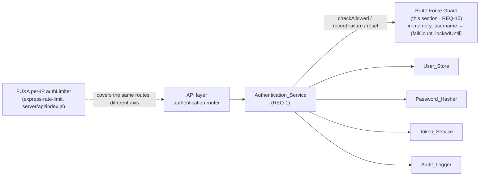
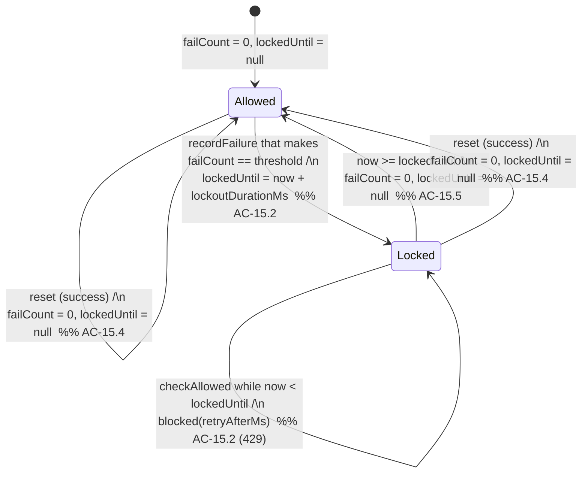

# Design Section 10 — Brute-Force Protection · `DES-BRUTE`

> **Section role: DETAILED DESIGN.** This file details the per-username brute-force guard
> (REQ-15) that the sign-in path consults at the three checkpoints defined in
> [`01-authentication.md`](./01-authentication.md) (`checkAllowed` / `recordFailure` /
> `reset`). Read [`../design.md`](../design.md) (the **master map**) first — it owns the
> layered architecture, the Error Handling status/shape table (the `429` row), the adapter
> seams, and the cross-cutting Security Posture (which already names brute-force throttling
> and the fail-closed threshold-zero edge). This section refines those decisions for REQ-15
> only; it does not restate or override them.
>
> **Covers:** REQ-15 (Brute-Force Protection), acceptance criteria AC-15.1 … AC-15.5.
> **Owns properties:** the master-map Table of Contents currently lists **none** for
> DES-BRUTE. This section assesses testability (see [§8](#8-correctness-property-assessment))
> and, finding a strong universal behavior, raises **one NEW candidate property `P-012`**,
> **flagged as pending registration** in [`../decisions/traceability.md`](../decisions/traceability.md)
> §C — it is **not** silently minted here.
>
> **Grounding.** Every FUXA claim below was verified by reading the actual source:
> `server/api/index.js` (the `express-rate-limit` wiring), `server/settings.default.js` and
> `server/_appdata/settings.js` (the rate-limit settings), `server/package.json` (the pinned
> dependency), and `server/api/auth/index.js` (the sign-in handler the guard fronts). Files
> are cited inline. Decisions/notes referenced as `D-***` / `N-***` / `DV-***` live in
> [`../decisions/`](../decisions/) and [`../decisions/traceability.md`](../decisions/traceability.md).

---

## 1. Purpose & Scope

This section specifies **how repeated failed sign-in attempts for a single username are
counted, and how a username is locked out once a configured threshold of consecutive
failures is reached** (REQ-15). Its job is to slow credential-guessing (password spraying /
brute force) against a known account by short-circuiting sign-in to HTTP `429` while a
username is locked.

Scope is deliberately narrow: the **per-username consecutive-failure lockout state machine**
and the contract the `Authentication_Service` uses to drive it. Everything the guard
collaborates with is designed elsewhere and only referenced here:

- the sign-in flow, its outcomes, and where the three checkpoints fire →
  [`01-authentication.md`](./01-authentication.md) (REQ-1);
- the `429` response body shape → the master map's Error Handling table
  ([`../design.md`](../design.md#error-handling));
- recording the `rate_limited` attempt → [`09-audit-logging.md`](./09-audit-logging.md) (REQ-14).

### Placement in the layered architecture

Per the master map's four layers (AC-16.1, **D-001**), the guard is a **Service-layer
component** — `server/auth-management/services/brute-force.js` (named in the master map's
Physical Layout). It is a **pure, in-memory state machine** with an injected clock: it holds
no HTTP knowledge and touches no store. The `Authentication_Service` owns it and calls it;
the API layer never calls it directly (AC-16.3). Modeling it as pure logic is what makes the
lockout lifecycle property-based-testable ([§8](#8-correctness-property-assessment)).



### Relationship to FUXA's existing per-IP `authRateLimit` (verified)

FUXA **already** has a rate limiter on the auth routes, and this section does **not** remove
or duplicate it. Verified in `server/api/index.js`:

```js
const rateLimit = require("express-rate-limit");             // pinned 5.5.1 (server/package.json)
const authLimiter = rateLimit({
    windowMs: runtime.settings.authRateLimitWindowMs || 5 * 60 * 1000,
    max: runtime.settings.authRateLimitMax || 100,
    skip: (req) => req.path !== '/api/signin' && req.path !== '/api/refresh'
});
apiApp.use(authLimiter);                                     // applied before route handlers
```

with defaults in `server/settings.default.js` (mirrored in `server/_appdata/settings.js`):

```js
authRateLimitWindowMs: 5 * 60 * 1000,   // 5 minutes
authRateLimitMax: 100,                  // 100 requests / window / IP, on /api/signin + /api/refresh
```

That limiter and REQ-15 are **different, complementary axes** — see the full reconciliation
in [§4](#4-reconciliation-with-fuxas-per-ip-rate-limiter). The one-line summary: the FUXA
limiter is a **per-IP, fixed-window request cap** (a coarse volumetric shield); REQ-15 is a
**per-username, consecutive-failure lockout** (targets guessing against a specific account,
regardless of source IP). Neither subsumes the other.

---

## 2. Guard Interface & Contract

The `Authentication_Service` depends on this capability interface (injected at
construction). All three operations are pure with respect to the guard's own state plus the
injected clock; none performs I/O.

```
BruteForceGuard = {
  checkAllowed(username: string, now?: number): GuardDecision
  recordFailure(username: string, now?: number): void
  reset(username: string): void
}

GuardDecision =
  | { allowed: true }
  | { allowed: false, retryAfterMs: number }   // retryAfterMs = max(0, lockedUntil - now)
```

- **`checkAllowed(username, now)`** — called by the service **before** any store lookup or
  password compare (the pre-check in [§3](#3-state-machine--acceptance-criteria)). Returns
  `allowed:false` with a positive `retryAfterMs` when the username is currently locked (or
  when the fail-closed threshold-zero rule applies); otherwise `allowed:true`.
- **`recordFailure(username, now)`** — called by the service after a **failed** sign-in
  outcome (`unknown_user` or `bad_password`, per [§01 §3](./01-authentication.md#3-sign-in-sequence)).
  Increments the consecutive-failure counter for that submitted username and, if it reaches
  the threshold, arms the lockout (`lockedUntil = now + lockoutDurationMs`).
- **`reset(username)`** — called by the service on a **successful** sign-in (AC-15.4). Clears
  the counter and any lockout for that username to zero.

### 2.1 State storage

An in-memory map keyed by the **submitted username** (see the enumeration edge case in
[§6](#6-edge-cases)):

```
state: Map<string, { failCount: number, lockedUntil: number | null }>
```

- `failCount` — count of **consecutive** failures since the last success/expiry (reset to 0
  on success or when a fresh attempt is processed after expiry).
- `lockedUntil` — epoch-ms timestamp at which the current lockout ends; `null` when not
  locked. `retryAfterMs` is derived as `max(0, lockedUntil − now)`.

The state is accessed through a **pluggable `BruteForceStore` seam** (**D-023 grouping / N-019**),
not a hard-wired process map. The default implementation is the in-memory `Map` above (consistent
with **D-002/TO-001** "reuse, minimal new surface", and with FUXA's own `authLimiter` keeping its
counters in-process via the default `express-rate-limit` `MemoryStore`); a deployment that scales
horizontally injects a **shared-store** implementation (e.g. Redis) behind the same seam so the
threshold is enforced globally rather than per-node (closes **N-019**; the requirement is **AC-15.6**).
The guard logic is identical for both implementations — only the storage backend changes:

```
interface BruteForceStore {
  read(username: string): { failCount: number, lockedUntil: number | null, throttleLevel: number } | undefined
  write(username: string, state): void        // atomic upsert (shared impls SHALL make read-modify-write atomic)
  delete(username: string): void
}
```

The multi-instance implication and the atomicity requirement for shared implementations are in
[§6](#6-edge-cases).

### 2.2 Configuration

```
BruteForceConfig = {
  threshold: number            // consecutive failures that trip throttling; 0 ⇒ fail-closed (AC-15.3)
  baseThrottleMs: number       // the first throttle interval once threshold is reached (AC-15.2)
  backoffFactor: number        // multiplier applied per additional failure beyond threshold (>=1; e.g. 2 ⇒ exponential)
  maxThrottleMs?: number       // optional hard cap on the adaptive interval (AC-15.2 "maximum interval")
  failureWindowMs?: number     // optional: only failures within this rolling window count as "consecutive"
}
```

**Adaptive throttle (DV-008).** Instead of a single fixed-duration hard lockout, the interval grows
with continued failures: at the Nth (threshold) failure the block interval is `baseThrottleMs`; each
additional consecutive failure raises it to `baseThrottleMs * backoffFactor^(k)` (where `k` is the
number of failures past the threshold), capped at `maxThrottleMs` when configured. `lockedUntil = now +
currentInterval`; `throttleLevel` (`= k`) is persisted so the interval is recomputed deterministically.
This bounds each individual block (finite, cap-limited) while still crushing sustained guessing —
resisting attacker-induced permanent lockout of a legitimate operator (AC-15.6, NIST SP 800-63B).

Defaults and rationale are in [§5](#5-configuration--defaults). `now` is supplied by an
**injected clock** (`() => number`, defaulting to `Date.now`) so the expiry behavior
(AC-15.5) is deterministically testable ([§9](#9-testing-notes)).

---

## 3. State Machine & Acceptance Criteria

The guard is a small state machine per username. "Below threshold" ⇒ **counting/allowed**;
the **Nth** consecutive failure ⇒ **locked**; a success ⇒ **reset to allowed**; the lockout
elapsing ⇒ **allowed again**.



Precise semantics for each acceptance criterion:

- **AC-15.1 — below threshold → normal.** While `failCount < threshold`,
  `checkAllowed` returns `allowed:true`; the service proceeds with the normal sign-in path.
  Each failed outcome advances `failCount` by exactly one.
- **AC-15.2 — reaches threshold → adaptive throttle, `429` (DV-008).** "Reaches the threshold"
  means the **Nth** consecutive failure, i.e. the `recordFailure` call **after which
  `failCount == threshold`** (threshold `N ≥ 1`). At that instant, and on each further consecutive
  failure, the guard computes an **adaptive** interval `currentInterval = min(maxThrottleMs ?? ∞,
  baseThrottleMs * backoffFactor^(failCount − threshold))` and sets `lockedUntil = now +
  currentInterval` (persisting `throttleLevel = failCount − threshold`). Every subsequent
  `checkAllowed(username)` with `now < lockedUntil` returns `allowed:false` with `retryAfterMs =
  lockedUntil − now`; the service short-circuits to the `rate_limited` outcome, which the API layer
  maps to **429** per the master-map Error Handling table and [§01 §4](./01-authentication.md#4-outcome--http-response-mapping).
  The throttle is **per username** — a throttled username A does not affect username B — and each
  individual interval is **finite** (cap-bounded when `maxThrottleMs` is set), so a party who knows a
  username cannot lock the legitimate operator out indefinitely (AC-15.6, targeted-DoS resistance).
- **AC-15.3 — threshold zero → always `429` (fail-closed edge).** When `threshold == 0`,
  `checkAllowed` returns `allowed:false` for **every** username on **every** call,
  irrespective of any prior failures (there is nothing to count). `retryAfterMs` in this
  degenerate mode is reported as `lockoutDurationMs` (a nominal positive hint). This is the
  **fail-closed** posture: a misconfiguration to zero denies all sign-ins rather than
  silently disabling protection. It is normatively required by the `WHERE` clause of AC-15.3
  and echoed in the master map's Security Posture ("the fail-closed edge where a threshold of
  zero rejects all attempts (AC-15.3)"). *(See [§5](#5-configuration--defaults) on why this
  edge is defined explicitly; there is no separate decision-ledger entry — AC-15.3 in
  `requirements.md` is the source of truth.)*
- **AC-15.4 — success resets count.** On a successful sign-in the service calls
  `reset(username)`, setting `failCount = 0`, `throttleLevel = 0`, and `lockedUntil = null`.
  Consequently a single later failure cannot immediately re-throttle a username that had accrued
  `N−1` failures before succeeding — it again takes a full `threshold` consecutive failures to trip,
  and the adaptive backoff restarts from `baseThrottleMs`.
- **AC-15.5 — throttle interval elapses → normal.** Once `now ≥ lockedUntil`, the next
  `checkAllowed` treats the username as `allowed:true` again **without** any explicit `reset` call,
  admitting the attempt. This is time-driven recovery via the injected clock. Note the adaptive
  semantics (DV-008): a *further* failure after the interval elapses continues escalating from the
  retained `throttleLevel` (it does not reset to `baseThrottleMs`) until a **success** resets the
  level (AC-15.4); this keeps sustained low-and-slow guessing throttled while still admitting the
  legitimate operator between intervals.

---

## 4. Reconciliation with FUXA's per-IP rate limiter

FUXA's `authLimiter` (verified in `server/api/index.js`, [§1](#1-purpose--scope)) and this
guard are **complementary layers**, not competitors. They differ on every meaningful axis:

| Aspect | FUXA `authLimiter` (existing, keep) | REQ-15 guard (this section) |
|--------|-------------------------------------|-----------------------------|
| Keyed by | client **IP** (default `express-rate-limit` key) | **username** submitted in the body |
| Counts | **all** requests to `/api/signin` + `/api/refresh` (success or fail) | **consecutive failed** sign-ins only |
| Algorithm | fixed **window** cap (`max` per `windowMs`) | **consecutive-failure threshold** → fixed-duration lockout |
| Trips on | volume from one IP (default 100 / 5 min) | `threshold` consecutive failures for one account |
| Resets on | window expiry | **success** (AC-15.4) or **lockout elapse** (AC-15.5) |
| Blind spot it leaves | distributed guessing (many IPs) against one account | high-volume floods from a single IP across many usernames |
| Layer | API middleware (Express) | Service layer (pure logic), pre-store checkpoint |
| Status on trip | `429` (library default) | `429` (master-map Error Handling row) |

Because the FUXA limiter caps *volume per IP* while the guard locks *a specific account after
consecutive failures*, each covers the other's blind spot: the IP window slows a single
noisy source; the per-username lockout slows a low-and-slow or distributed attack that stays
under the IP cap but hammers one account. **Both remain in force.**

**Integration rule (honors D-003).** This section does **not** edit `server/api/index.js` or
FUXA's limiter. The per-username guard lives entirely inside the module's
`Authentication_Service` and fires at the [§01](./01-authentication.md) checkpoints. The only
FUXA touch relevant here is *reuse*: the guard's config keys follow FUXA's existing
`*RateLimit*` settings convention (see [§5](#5-configuration--defaults)) so operators
configure one consistent surface. Both limiters returning `429` keeps a single client-facing
"slow down" contract.

---

## 5. Configuration & Defaults

| Setting | Meaning | Proposed default | Reasoning |
|---------|---------|------------------|-----------|
| `authLockoutThreshold` | consecutive failures that trip throttling (`threshold`) | **5** | Comfortably above legitimate mistyping (typo/caps-lock) yet low enough to blunt guessing. |
| `authLockoutBaseMs` | first adaptive throttle interval at the threshold (`baseThrottleMs`) | **30 * 1000** (30 s) | Small initial delay barely noticed by a genuine mistyping operator, yet already collapses guess throughput; grows via backoff on continued failures (DV-008). |
| `authLockoutBackoffFactor` | multiplier per additional consecutive failure (`backoffFactor`) | **2** (exponential) | Exponential backoff quickly makes sustained guessing infeasible while each individual block stays finite (AC-15.6). |
| `authLockoutMaxMs` | optional cap on the adaptive interval (`maxThrottleMs`) | **15 * 60 * 1000** (15 min) | Bounds the worst-case block so a known username cannot be locked out for a whole shift — important for an HMI/SCADA operator console (targeted-DoS resistance, AC-15.6). |
| `authLockoutWindowMs` | optional rolling window for "consecutive" (`failureWindowMs`) | **5 * 60 * 1000** (5 min) | Aligns with FUXA's existing `authRateLimitWindowMs = 5*60*1000`; bounds how long stale failures linger and aids eviction ([§6](#6-edge-cases)). |
| `authLockoutStore` | brute-force state backend (`BruteForceStore`, [§2.1](#21-state-storage)) | **in-memory** (default); **shared** (e.g. Redis) when scaled | Per-process is correct for FUXA's default single-process deployment (N-002); a shared store enforces a global threshold under horizontal scaling (N-019, AC-15.6). |

*(DV-008 supersedes the earlier single `authLockoutDurationMs` fixed-duration key with the
adaptive `authLockoutBaseMs` / `authLockoutBackoffFactor` / `authLockoutMaxMs` set.)*

**Where configured.** These are read from `runtime.settings` alongside FUXA's existing
`authRateLimitWindowMs` / `authRateLimitMax` (verified present in `server/settings.default.js`
and copied through in `server/api/index.js`'s settings-merge block). New keys are **added**
to the module's settings surface — not by editing FUXA core beyond the module's own wiring —
following the same `runtime.settings.<key> || <default>` fallback pattern the existing
limiter uses. This keeps the fail-open-vs-fail-closed decision explicit rather than implicit.

**Fail-closed `threshold = 0` semantics.** A threshold of `0` is **not** treated as "disabled";
per AC-15.3 it means **lock everyone, always** ([§3](#3-state-machine--acceptance-criteria)).
This is a deliberate fail-closed choice: a mistaken zero denies access (loud, safe) rather
than silently removing brute-force protection (quiet, dangerous). Operators who genuinely
want the guard disabled must do so via an explicit disable flag at the composition root, not
by setting the threshold to zero.

---

## 6. Edge Cases

- **Unknown-username failures are counted (per submitted username).** Section 01's sequence
  calls `recordFailure(username)` on the `unknown_user` outcome as well as `bad_password`
  (verified in [§01 §3](./01-authentication.md#3-sign-in-sequence)). The guard therefore keys
  on the **submitted** username string, whether or not a `User_Record` exists. This is
  intentional: it throttles username-enumeration + guessing without the guard needing to know
  which usernames are real (and without leaking existence — see [§7](#7-security-posture--error-handling)).
  Consequence: an attacker can create counter entries for arbitrary strings, which is the
  memory-growth concern handled by eviction below.
- **Missing-field requests are NOT counted.** Per [§01 §7](./01-authentication.md#7-error-handling--edge-cases-specific-to-sign-in),
  a request missing `username`/`password` is rejected `400` **before** the guard is
  consulted — a malformed request is not a credential guess and must not advance any counter
  (and often has no username to key on).
- **Counter concurrency.** Node's single-threaded event loop makes each synchronous
  `recordFailure`/`checkAllowed`/`reset` atomic with respect to other guard calls; there is
  no in-process data race on `failCount`. Two near-simultaneous failed sign-ins for the same
  username are serialized by the loop, so the Nth failure deterministically trips the lock.
  (Cross-process races are the multi-instance note below, not an in-process concern.)
- **Clock source and drift policy (N-019).** All time comparisons use the **injected clock**
  (`now`). To make expiry robust against wall-clock/NTP adjustments, the default clock SHALL be a
  **monotonic** source (`performance.now()`-based / `process.hrtime`), not `Date.now()`, so a
  forward wall-clock jump cannot end a throttle interval early and a backward jump cannot lengthen
  it unexpectedly. `lockedUntil` and `retryAfterMs` are computed from that single monotonic source;
  `retryAfterMs` is `max(0, lockedUntil − now)`. Only the human-facing `Retry-After` header is
  translated to wall-clock seconds for the client. Tests inject a fake clock to exercise AC-15.5
  deterministically ([§9](#9-testing-notes)). *(Prior design used `Date.now()`, whose forward jump
  could end a lockout early — N-019; monotonic clock closes that edge.)*
- **Memory growth / eviction of stale entries.** Because arbitrary submitted usernames create
  entries, the map is bounded by lazy eviction: an entry is removed when a `checkAllowed`
  finds it both **not locked** (`lockedUntil` null or elapsed) **and** with `failCount == 0`
  (or with its last failure older than `failureWindowMs`). This prevents unbounded growth
  from enumeration attempts while preserving all active counters/locks. Eviction is a pure
  side effect of servicing calls (no timer thread required), matching the in-memory posture.
- **Multi-instance / horizontal scaling (resolved via the store seam — N-019, AC-15.6).** The
  default store is **per-process** (like FUXA's default `express-rate-limit` `MemoryStore`), which is
  correct for FUXA's default single-process, localhost-bound deployment (**N-002**). For horizontal
  scaling the guard's `BruteForceStore` seam ([§2.1](#21-state-storage)) is injected with a
  **shared-store** implementation (e.g. Redis) so all instances share one counter and the effective
  threshold is **not** multiplied by the node count (**AC-15.6**). A shared implementation SHALL make
  its read-modify-write **atomic** (e.g. a Lua script or `WATCH/MULTI`) so concurrent failures across
  nodes do not lose increments. The guard logic is unchanged; only the backend differs. FUXA's own IP
  limiter would need the analogous shared store for a fully global cap — flagged for the deployment/
  ops phase, out of this module's boundary (**D-003**). No shared-store dependency is added to the
  default build (avoids new infra surface, **TO-001**); the seam makes it opt-in.

---

## 7. Security Posture & Error Handling

- **Uniform failure contract preserved.** The guard's block is surfaced as the
  `rate_limited` outcome → **429** with the master-map body
  `{ error: 'too_many_attempts', message }`. Crucially, the pre-check
  (`checkAllowed` **before** store lookup) means a locked username returns `429`
  **identically whether or not the account exists** — the guard never consults the store,
  so it cannot leak account existence. This is consistent with [§01](./01-authentication.md)'s
  uniform-failure stance.
- **Does `429` leak that an account exists?** No more than the attacker already knows: a `429`
  says "this username string has recently accumulated failures / the system is throttling," a
  fact the attacker themselves manufactured by submitting those failures. Because unknown
  usernames are also counted and also lock ([§6](#6-edge-cases)), a `429` does **not**
  distinguish a real account from a fabricated one. The account-existence signal that *does*
  exist at sign-in (the `404` vs `401` distinction) is mandated by AC-1.2/AC-1.3 and owned by
  [§01](./01-authentication.md), unchanged here.
- **Timing.** The pre-check short-circuits **before** the (deliberately costly) bcrypt
  comparison. A locked username therefore returns faster than a normal failure. This is an
  intentional DoS-mitigation (locked accounts stop consuming hashing CPU) and does not aid
  enumeration, since the lock state is attacker-induced and identical for real and fake
  usernames. It does not affect the `404`/`401` timing profile of *un-locked* attempts, which
  is [§01](./01-authentication.md)'s concern.
- **Audit.** A `rate_limited` outcome is recorded via `Audit_Logger` (username, outcome,
  time) exactly like other sign-in outcomes ([§01 §3](./01-authentication.md#3-sign-in-sequence),
  REQ-14). No secrets are involved in the guard's data (it stores only counters/timestamps).
- **Error handling.** The guard is pure and total: every `username` string yields a defined
  `GuardDecision`; there are no throwing paths for control flow. If the guard component itself
  is unavailable at composition, the API's fail-fast rule (AC-16.4) applies at the service
  boundary — the guard does not silently fail open.

---

## 8. Correctness Property Assessment

*A property is a characteristic or behavior that should hold true across all valid executions
of a system — a formal statement about what the system should do. Properties are the bridge
between human-readable specifications and machine-verifiable correctness.*

**Is PBT warranted for REQ-15?** **Yes — one property.** The guard is a pure, in-memory state
machine over a large input space (sequences of attempts, thresholds, durations, timestamps),
with an injected clock; iterating 100+ generated scenarios is cheap and reveals boundary bugs
(off-by-one on the Nth failure, premature/late expiry, cross-username bleed, reset that
under- or over-clears). This is precisely where PBT out-performs a handful of examples.

**Prework-driven consolidation (redundancy eliminated).** AC-15.1, AC-15.2, AC-15.4, and
AC-15.5 are four arms of the **same** lockout state machine: below-threshold-allowed (15.1)
is the pre-state of at-threshold-locked (15.2), and success-reset (15.4) and duration-elapse
(15.5) are its two exit transitions. Writing four separate properties would be logically
redundant; they collapse into **one comprehensive model-based lifecycle property**. AC-15.3
(threshold = 0) is a **degenerate edge** folded into that property's generator domain
(`threshold ≥ 0`) plus one explicit example — it is not its own property.

### NEW candidate property — `P-012` (flagged, pending registration)

> **Governance note.** The master-map Table of Contents and
> [`../decisions/traceability.md`](../decisions/traceability.md) §C currently list **no**
> property for `DES-BRUTE`. The property below is therefore raised as a **NEW candidate**,
> suggested id **`P-012`**, and is **flagged pending confirmation** — to be registered in
> traceability §C (anchored to AC-15.1–15.5, owned by §10) and confirmed at the Tasks phase,
> mirroring how `P-011` was handled. This section does **not** silently mint the id or edit
> the traceability matrix; that registration is a separate, tracked step.

#### Candidate Property P-012: Lockout lifecycle matches the reference state machine

*For any* threshold `N ≥ 0`, base interval `baseThrottleMs > 0`, `backoffFactor ≥ 1`, optional
`maxThrottleMs`, username `u`, and any finite sequence of interleaved attempts (each a failure or a
success) with non-decreasing timestamps, `checkAllowed(u, now)` returns **blocked** *if and only if*
the reference **adaptive-throttle** state machine is in its throttled state at `now` — that is, iff
either `N = 0` (fail-closed), or the count of consecutive failures for `u` (since the last success,
and within `failureWindowMs` when configured) has reached `N` and `now < lockedUntil`, where
`lockedUntil` was last set to `armAt + min(maxThrottleMs ?? ∞, baseThrottleMs · backoffFactor^(k))`
and `k = failCount − N` is the throttle level at the arming failure; and when blocked, `retryAfterMs`
equals `max(0, lockedUntil − now)`. A **success** `reset` (which zeroes `failCount` and the throttle
level `k`) and the **elapse** of the current interval are the only transitions out of the throttled
state; each individual interval is **finite** (cap-bounded when `maxThrottleMs` is set); and
throttling `u` never changes the decision for any other username `u′ ≠ u`.

**Validates: Requirements 15.1, 15.2, 15.3, 15.4, 15.5, 15.6** — (candidate P-012, refined by DV-008; pending registration)

This single property, tested against a straightforward reference model with a controllable
clock (a **model-based** property), covers all five acceptance criteria: below-threshold
(15.1), the Nth-failure lock and `429`/`retryAfterMs` (15.2), the `N = 0` fail-closed branch
(15.3, via the generator domain), success-reset (15.4), and time-elapse recovery (15.5), plus
per-username isolation.

---

## 9. Testing Notes

**Runner & library.** Server-side tests use FUXA's shipped `mocha`/`chai`/`sinon` (verified
in the master map's Testing Strategy); property tests use **`fast-check`** (the master map's
chosen PBT library for JS/TS). The guard is constructed with an **injected fake clock** so all
time-based behavior is deterministic — no real timers, no `setTimeout` waits.

### 9.1 Property test (candidate P-012)

- **One** property test implements P-012 as a **model-based** test: generate `N` (including
  `0`), `baseThrottleMs > 0`, `backoffFactor ≥ 1`, an optional `maxThrottleMs`, an optional
  `failureWindowMs`, one or more usernames, and a random sequence of `{ kind: 'fail' | 'success' |
  'check', username, dtMs }` steps with non-decreasing time. Drive both the guard and a tiny
  reference model that computes the adaptive interval `min(maxThrottleMs ?? ∞, baseThrottleMs ·
  backoffFactor^k)`; after every `check`, assert the guard's `allowed`/`retryAfterMs` equals the
  model's, and assert every armed interval is finite and ≤ `maxThrottleMs` when set (AC-15.6).
- **Minimum 100 iterations.**
- Tag: `Feature: auth-user-management, Property 12: Lockout lifecycle matches the reference state machine`.
- The generator domain **includes `threshold = 0`** so the fail-closed edge (AC-15.3) is
  exercised inside the property, and **includes multiple usernames** so per-username isolation
  is exercised.

### 9.2 Example / edge tests (complement the property)

Using `sinon` fake timers / an injected clock, with the guard in isolation:

1. **AC-15.1 — below threshold allowed.** With `N = 5`, after 4 failures `checkAllowed`
   returns `allowed:true`.
2. **AC-15.2 — Nth failure locks, `429`.** With `N = 5`, the 5th consecutive failure flips
   `checkAllowed` to `allowed:false` with `retryAfterMs ∈ (0, D]`; a 6th attempt within `D` is
   still blocked. End-to-end through [§01](./01-authentication.md), the API returns **429**
   `{ error: 'too_many_attempts' }`.
3. **AC-15.3 — threshold zero, fail-closed.** With `N = 0`, two **distinct** usernames with
   **zero** prior failures are **both** blocked with `429` on the very first `checkAllowed`.
4. **AC-15.4 — success resets.** After `N − 1` failures, a `reset` (success) returns the user
   to allowed and it then takes a full `N` further failures (not 1) to re-lock.
5. **AC-15.5 — lockout elapses.** After locking, advance the fake clock to `lockedUntil` (and
   beyond): `checkAllowed` returns `allowed:true` again with no explicit `reset`; just before
   `lockedUntil` it is still blocked.
6. **Per-username isolation (example).** Locking username A leaves username B `allowed`.
7. **Eviction (example).** After a success/expiry that zeroes a counter, a subsequent
   `checkAllowed` drops the stale entry (assert map size shrinks), bounding memory
   ([§6](#6-edge-cases)).

### 9.3 Integration test (1–2 representative examples)

Through the real `Authentication_Service` + router (guard not mocked): drive `N` failed
sign-ins for a seeded username and assert the next request returns **429** with the
master-map body; then, with the injected clock advanced past `D`, assert the same username
signs in successfully (`200`) and its counter is cleared. This confirms the wiring of the
three checkpoints in [§01](./01-authentication.md), not the guard's internal logic (which the
property covers).

---

## 10. Traceability (this section)

| AC | Behavior | Verified FUXA anchor | Test type |
|----|----------|----------------------|-----------|
| AC-15.1 | below threshold → process normally (`checkAllowed` allowed) | guard fronts sign-in in `server/api/auth/index.js`; complements per-IP `authLimiter` in `server/api/index.js` | property (P-012) + example |
| AC-15.2 | Nth consecutive failure → lock for `D`, subsequent attempts `429` | `429` reuses the surface of FUXA's `express-rate-limit` (`server/api/index.js`); master-map Error Handling `429` row | property (P-012) + example + integration |
| AC-15.3 | threshold `0` → every attempt for every username `429` (fail-closed) | `requirements.md` AC-15.3 (`WHERE` clause); master-map Security Posture fail-closed note | edge (in P-012 generator domain) + example |
| AC-15.4 | success → reset consecutive-failure count to zero | `reset(username)` checkpoint on success in [§01 §3](./01-authentication.md#3-sign-in-sequence) | property (P-012) + example |
| AC-15.5 | adaptive-throttle interval elapses → process normally again | monotonic injected-clock recovery (N-019); aligns with FUXA `authRateLimitWindowMs` window convention (`server/settings.default.js`) | property (P-012) + example + integration |
| AC-15.6 | multi-instance threshold via shared `BruteForceStore`; adaptive interval bounded (targeted-DoS resistance) | FUXA `express-rate-limit` default `MemoryStore` is per-process (`server/api/index.js`) — shared store injected behind the seam | property (P-012, cap assertion) + multi-instance integration |

No orphan criteria: AC-15.1 … AC-15.6 each map to at least one test above (all consolidated into
candidate P-012, with AC-15.6's cap/shared-store checks). This section maps back to **REQ-15 only**, matching
[`../decisions/traceability.md`](../decisions/traceability.md) §A/§B (`DES-BRUTE → REQ-15`).

**Traceability action required (not performed by this file):** register candidate **`P-012`**
in [`../decisions/traceability.md`](../decisions/traceability.md) §C — informal text "lockout
lifecycle matches the reference state machine," anchored to AC-15.1–15.5, owned by §10,
status *candidate — confirm at Tasks* — and update the master-map Table of Contents row for
`DES-BRUTE` from "—" to "P-012 (candidate)". Flagged here; left for the traceability owner.
