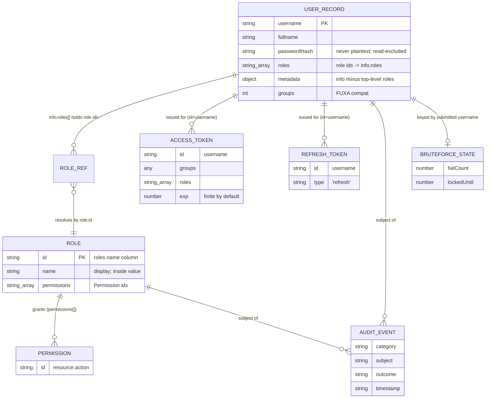

# Design Section 11 — Data Models · `DES-DATA`

> **Section role: CONSOLIDATED CATALOGUE (cross-cutting).** This file is the single,
> module-wide **entity catalogue** for the Authentication & User Management module. For every
> entity the module reads, writes, signs, or logs, it fixes the fields, their types, which are
> required/optional, the invariants that constrain them, the requirement(s) the entity serves,
> and how the entity maps to the FUXA stored shape. Read [`../design.md`](../design.md) (the
> **master map**) first — it owns the layered architecture, the adapter seams, and the
> Data-Models *summary* table this section expands.
>
> **Covers:** REQ-13 (User and Role Serialization Round-Trip) as its home requirement, plus the
> **cross-cutting** entity definitions referenced by every other section. This section is a
> **reference and reconciliation point**, not a mechanism owner.
>
> **Owns properties: none.** The serialization round-trips **P-003** (User_Record), **P-004**
> (Role), and **P-005** (metadata identity) are **owned by
> [`06-persistence-and-serialization.md`](./06-persistence-and-serialization.md)** and are only
> *referenced* here. This section does **not** re-own §06's serialization mechanics (the
> `info` ↔ `{roles, metadata}` split, the resilient parse, the double-hash-hazard resolution)
> and does **not** invent new properties. Where a field, invariant, or mapping needs a
> mechanism, this catalogue cites the owning section rather than restating it.
>
> **Grounding.** Every FUXA claim below was verified by reading the actual source:
> `server/runtime/users/usrstorage.js` (the `users` and `roles` tables, their columns, and the
> `setUser` / `setRoles` / `removeRoles` / `setDefault` statements) and, for the derived views,
> the sibling detailed sections cited inline (§01, §02, §04, §05, §06, §09, §10, §12). Decisions,
> trade-offs, notes, and deviations referenced as `D-***` / `TO-***` / `N-***` / `DV-***` and
> properties `P-***` live in [`../decisions/`](../decisions/) and
> [`../decisions/traceability.md`](../decisions/traceability.md).

---

## 1. Purpose & Scope

This section is the **one place** a reader consults to answer "what fields does entity X have,
what constrains them, and where do they physically live?" The other design sections define the
*behavior* over these entities; this catalogue defines the *entities themselves* so those
sections can reference a single authoritative shape rather than each redefining it (the
anti-drift goal of REQ-13's cross-cutting role in [`../decisions/traceability.md`](../decisions/traceability.md) §A).

Scope, precisely:

- **Primary entities** persisted or exchanged by the module: `User_Record`, `Role`,
  `Permission`, `Access_Token`, `Refresh_Token`, `Audit_Event`, and `BruteForceState`.
- **Derived views / DTOs** computed from the primary entities at a layer boundary: `UserView`
  (read projection), `SignInSession` (sign-in success payload), `Identity` (authorization
  input), `GuardDecision` (brute-force output), and the request payloads `CreateUserRequest` /
  `UpdateUserRequest` / `UserPatch`.
- For each: **fields + types + required/optional**, **invariants/constraints**, **requirement(s)
  served**, and the **FUXA stored-shape mapping** (by reference to §05/§06 for mechanics).

Relationship to the two neighboring documents:

- The **master map** ([`../design.md`](../design.md) → *Data Models*) carries a five-row summary
  table. **This section is the authoritative expansion of that table** and MUST stay consistent
  with it ([§8](#8-consistency-check-reconciliation) is the reconciliation record).
- **[`06-persistence-and-serialization.md`](./06-persistence-and-serialization.md)** owns the
  *serialization mechanics* and the round-trip properties (P-003/P-004/P-005). This catalogue
  owns the *field inventory*; where the two meet (the `info` ↔ `{roles, metadata}` split, the
  role JSON-value shape, the verbatim-hash write), this section points to §06.

The **glossary** in [`../requirements.md`](../requirements.md) defines each term in prose; this
section is the formal, typed counterpart of that glossary.

---

## 2. Verified FUXA Stored Shapes (the persistence anchor)

Two SQLite tables in `server/runtime/users/usrstorage.js` back every persisted entity (verified
in `_bind()`):

```sql
CREATE TABLE if not exists users (username TEXT PRIMARY KEY, fullname TEXT, password TEXT, groups INTEGER, info TEXT);
CREATE TABLE if not exists roles (name TEXT PRIMARY KEY, value TEXT);
```

| Table | Column | Type | Holds | Verified at |
|-------|--------|------|-------|-------------|
| `users` | `username` | TEXT **PK** | unique account id | `_bind`, `getUsers`, `setUser` |
| `users` | `fullname` | TEXT | display name | `setUser` (added via `_checkUpdate`) |
| `users` | `password` | TEXT | **bcrypt hash only** (never plaintext) | `setUser` (`bcrypt.hashSync`), `setDefault` |
| `users` | `groups` | INTEGER | FUXA legacy group code | `setUser`, `setDefault` (`-1`) |
| `users` | `info` | TEXT | **JSON string**; holds `roles[]` + metadata | `removeRoles` (`JSON.parse(user.info)`), `_checkUpdate` |
| `roles` | `name` | TEXT **PK** | **`role.id`** (not the display name) | `setRoles` (`[role.id, …]`) |
| `roles` | `value` | TEXT | **JSON string** of the whole `Role` object | `setRoles` (`JSON.stringify(role)`) |

Two facts drive the whole catalogue and are easy to get wrong, so they are stated up front
(both verified, both owned in detail by §05/§06):

1. **The `roles` primary-key column literally named `name` stores `role.id`**, while the
   human-readable display `name` is carried *inside* the serialized `value`
   (`setRoles([role.id, JSON.stringify(role)])`, verified). Role **identity/uniqueness is
   `role.id`** ([§05 §3.1](./05-rbac-authorization.md); mechanics in [§06 §3.4](./06-persistence-and-serialization.md)).
2. **A user's assigned roles live inside `info` as `info.roles` (an array of role ids)**, not in
   a column of their own (verified: `removeRoles` filters `JSON.parse(user.info).roles`). The
   top-level `roles` key of `info` is therefore **reserved** ([§06 §3.2](./06-persistence-and-serialization.md);
   restated as an invariant in [§6](#6-reserved-key--hash-exclusion-invariants)).

---

## 3. Entity Catalogue — Primary Entities

Each entity below gives: **field · type · req/opt · notes/invariant**, then the requirement(s)
served and the FUXA stored-shape mapping. Type notation is TypeScript-ish (`?` = optional).

### 3.1 `User_Record`

The domain account. Glossary: "a unique username, a display full name, a password hash, a set of
assigned roles, and an optional metadata object."

| Field | Type | Req? | Invariant / notes |
|-------|------|------|-------------------|
| `username` | `string` | **required** | **primary key**, unique; trimmed by the Service layer before it reaches the store (normalization owned by [§04](./04-user-management.md)); non-empty (AC-5.3) |
| `fullname` | `string` | **required** | display name; stored verbatim (no trim/normalization at the store, [§06 §6.4](./06-persistence-and-serialization.md)) |
| `passwordHash` | `string` | **required** | an **already-hashed bcrypt string** — **never** plaintext (AC-4.2); written verbatim via the adapter's dedicated password write, bypassing FUXA `setUser`'s re-hash path ([§06 §5](./06-persistence-and-serialization.md)); **excluded from every read projection** (AC-6.2 — surfaces only where sign-in needs a compare, §01) |
| `roles` | `string[]` | **required** (may be empty `[]`) | set of **role ids** referencing `Role.id`; surfaced from `info.roles`; treated as a **set** (order-/duplicate-insensitive, [§06 §6.3](./06-persistence-and-serialization.md)) |
| `metadata` | `object` | optional (defaults `{}`) | the non-role remainder of `info`; must be **JSON-safe**, must **not** carry a top-level `roles` key, and must **not** carry a `__proto__` key (**D-026**, stripped on read); may carry the reserved keys `mustRotate` and `tokenVersion` ([§6](#6-reserved-key--hash-exclusion-invariants)) |
| `metadata.tokenVersion` | `number` | optional (defaults **`0`**) | **active-revocation counter (D-015/D-027).** A non-negative integer; **absent ⇒ treated as `0`**. Stamped into the `Access_Token`/`Refresh_Token` at issuance (§02 §3) and compared live per request (§05 §4.1, coercing both sides to `0` when absent so a legacy token is revoked once the account reaches ≥1). Bumped on password rotation (§12 §4) and other force-logout/disable events |
| `metadata.mustRotate` | `boolean` | optional (defaults `false`) | bootstrap forced-rotation gate (REQ-17); lifecycle owned by [§12](./12-admin-bootstrap.md) |
| `groups` | `number \| number[]` | optional | FUXA legacy compat code; preserved verbatim but **outside** the AC-13.1 round-trip assertion ([§06 §6.1](./06-persistence-and-serialization.md)); `-1`/`255` ⇒ admin ([§05 §5](./05-rbac-authorization.md)) |

- **Serves:** REQ-5…REQ-8 (CRUD), REQ-1 (sign-in lookup), REQ-13 (round-trip, AC-13.1),
  REQ-10/REQ-17 (roles/groups feed authorization).
- **FUXA mapping:** row `{ username, fullname, password, groups, info }`, where
  `info = serialize(Object.assign({}, metadata, { roles }))` and `passwordHash → users.password`.
  Field-by-field mapping and the split/compose rule are owned by
  [§06 §3](./06-persistence-and-serialization.md); this catalogue does not restate the mechanics.

### 3.2 `Role`

Glossary: "a named collection of permissions that can be assigned to users." Entity definition
owned by [§05 §2.1](./05-rbac-authorization.md); reproduced here as the catalogue reference.

| Field | Type | Req? | Invariant / notes |
|-------|------|------|-------------------|
| `id` | `string` | **required** | **canonical identity / uniqueness key**; the value stored in the `roles` PK column `name` and the value that appears in `User_Record.roles` / `info.roles` (the join key); duplicate `id` on create is rejected (AC-9.5, [§05 §3.3](./05-rbac-authorization.md)) |
| `name` | `string` | **required** | human-readable display label (AC-9.1/9.2); carried inside the serialized `value`, **not** the PK column |
| `permissions` | `string[]` (`Permission` ids) | **required** (may be empty `[]`) | the capabilities the role grants; replaced wholesale on update (AC-9.3); compared as a **set** for the round-trip (AC-13.2, [§06 §6.3](./06-persistence-and-serialization.md)) |

- **Serves:** REQ-9 (role management), REQ-10 (role→permission resolution), REQ-13 (round-trip,
  AC-13.2).
- **FUXA mapping:** `roles` row `{ name: role.id, value: serialize(role) }` — the **whole** object
  (`id`, `name`, `permissions`) is JSON-encoded into `value` (verified `setRoles`); mechanics in
  [§06 §3.4](./06-persistence-and-serialization.md).

### 3.3 `Permission`

Glossary: "a named capability (for example, `user.create`) that gates a specific operation."
Scheme owned by [§05 §2.2](./05-rbac-authorization.md).

| Field | Type | Req? | Invariant / notes |
|-------|------|------|-------------------|
| (value) | `string` | **required** | a single capability id, **`<resource>.<action>`**, lower-case, dot-separated (e.g. `user.create`, `role.delete`); treated **opaquely** by the `Authorization_Service` (set membership only) |

- **Not independently persisted.** A `Permission` exists only as a member of a `Role.permissions`
  array; it has no table of its own.
- **Distinguished set:** `ADMIN_PERMISSION_SET = { user.create, user.read, user.update,
  user.delete, role.create, role.read, role.update, role.delete }` defines an administrator role
  (owned by [§05 §2.2](./05-rbac-authorization.md); consumed by AC-10.4, AC-8.5, REQ-17).
- **Serves:** REQ-9, REQ-10.

### 3.4 `Access_Token`

Glossary: "a short-lived signed token that authenticates API requests." A signed JWT; claim set
owned by [§02 §3](./02-token-and-session.md).

| Claim | Type | Req? | Invariant / notes |
|-------|------|------|-------------------|
| `id` | `string` | **required** | the subject **username** (FUXA-compatible; FUXA signs `{ id: username, … }`) |
| `groups` | `number \| number[] \| string[]` | **required** | FUXA legacy compat claim; `-1`/`255` ⇒ admin; `'guest'`/absent ⇒ unauthenticated ([§05 §5](./05-rbac-authorization.md)) |
| `roles` | `string[]` | **required** | RBAC role **ids** the session carries (D-007); role→permission resolution is **not** encoded (computed at authorization time, [§05 §2.3](./05-rbac-authorization.md)) |
| `tokenVersion` | `number` | **required** (default `0`) | active-revocation counter (**D-015/D-027**); stamped from the live account and compared per request (§05 §4.1) |
| `type` | `'access'` | **required** | token-type discriminator (**D-028**): access tokens carry `type:'access'`, refresh tokens `type:'refresh'`; `verify` rejects a mismatched type ([§02 §5](./02-token-and-session.md)). A single `type` claim is used (not a separate `typ`) to avoid colliding with the JWT header `typ` |
| `iss` / `aud` / `sub` / `jti` / `kid` | per [§02 §3](./02-token-and-session.md) | optional/hardening | D-021 registered-claim + key-id hardening; `iss`/`aud` validated only when configured (**D-029**); `kid` is forward-compat for future key rotation (**TO-012**, single active key today) |
| `iat` | `number` | **required** | issued-at (set automatically by `jsonwebtoken`) |
| `exp` | `number` | optional | expiry instant; **present by default** (finite 1-hour default when unconfigured, AC-2.7/P-008); **absent only** in explicit dev-only non-expiring mode (AC-2.8) — expiry policy owned by [§02 §4](./02-token-and-session.md) |

- **Invariant (secret-free):** the payload carries **no** password, hash, or signing secret
  ([§02 §7](./02-token-and-session.md)).
- **Serves:** REQ-2 (issuance/validation), REQ-1 (returned on sign-in), REQ-10 (claims → `Identity`).
- **FUXA mapping:** signed via the FUXA JWT seam (`jwt.sign` under `secretCode`); not stored in
  the users/roles tables.

### 3.5 `Refresh_Token`

Glossary: "a longer-lived signed token used to obtain a new Access_Token without re-entering
credentials." Shape owned by [§02 §6.1](./02-token-and-session.md), matching FUXA
`buildRefreshToken`.

| Claim | Type | Req? | Invariant / notes |
|-------|------|------|-------------------|
| `id` | `string` | **required** | subject username |
| `type` | `'refresh'` | **required** | literal discriminator; a refresh flow rejects a token whose `type !== 'refresh'` (AC-3.3, [§02 §6.2](./02-token-and-session.md)) |
| `jti` / `family_id` | `string` | **required** | D-019 rotation/reuse-detection ids; the server-side `Refresh_Token_Store` keys on `jti` within a `family_id` ([§02 §6](./02-token-and-session.md)) |
| `tokenVersion` | `number` | **required** (default `0`) | D-015/D-027 counter carried so a rotation checks it (§02 §6.2 step 5) |
| `exp` | `number` | **required** | finite refresh TTL (FUXA default `'7d'`, verified) |

- **Transport invariant:** delivered/held **only** in the `fuxa_refresh` **HttpOnly** cookie
  (`sameSite:'lax'`, `path:'/api/refresh'`, `secure` when TLS) — never in a response body
  ([§02 §6.1](./02-token-and-session.md)).
- **Serves:** REQ-3 (refresh/sign-out).
- **FUXA mapping:** signed via the FUXA JWT seam; not table-persisted.

### 3.6 `Audit_Event`

Glossary term realized by [§09 §2.2](./09-audit-logging.md). Secret-free **by construction**.

| Field | Type | Req? | Invariant / notes |
|-------|------|------|-------------------|
| `category` | `AuditCategory` (enum) | **required** | stable, greppable discriminator: `auth.signin` \| `user.create` \| `user.update` \| `user.delete` \| `role.create` \| `role.update` \| `role.delete` \| `authz.denied` \| `bootstrap.seed` |
| `subject` | `string` | **required** | who/what the event is about (username, role name, or `guest`); a **pre-sanitized scalar** |
| `operation` | `string` | optional | operation id where applicable (CRUD verb / requested op) |
| `outcome` | `string` | **required** | stable outcome id mirroring the caller's outcome (e.g. `success`, `unknown_user`, `denied`) |
| `timestamp` | `string` (ISO-8601) | **required** | **caller-supplied** (reconciles "record the time" with the no-enrichment rule AC-14.5a, [§09 §2.3](./09-audit-logging.md)) |
| `detail` | `string` | optional | pre-sanitized free text (error id / reason); no raw input echoes |

- **Invariant (no secret field exists):** there is **no** `password`, `passwordHash`, `token`,
  `secret`, or `credentials` field anywhere in `Audit_Event` — the structural half of AC-14.5,
  complemented by caller-side sanitization ([§09 §5](./09-audit-logging.md)).
- **Serves:** REQ-14 (and AC-17.5 as a consumer, owned by §12).
- **FUXA mapping:** not table-persisted; emitted as a `AUDIT `-marked JSON line through the FUXA
  winston logger sink ([§09 §6](./09-audit-logging.md)).

### 3.7 `BruteForceState`

The per-username lockout counter held by the brute-force guard. Shape owned by
[§10 §2.1](./10-brute-force-protection.md).

| Field | Type | Req? | Invariant / notes |
|-------|------|------|-------------------|
| `failCount` | `number` (≥ 0) | **required** | consecutive failures since the last success/expiry; reset to `0` on success (AC-15.4) or after lockout elapse (AC-15.5) |
| `lockedUntil` | `number \| null` | **required** | epoch-ms at which the lockout ends; `null` when not locked; armed to `now + lockoutDurationMs` on the Nth failure (AC-15.2); `retryAfterMs = max(0, lockedUntil − now)` |

- **Storage:** an in-memory `Map<string, BruteForceState>` keyed by the **submitted username**
  (per-process, not persisted); memory bounded by lazy eviction ([§10 §6](./10-brute-force-protection.md)).
- **Serves:** REQ-15 (candidate property P-012, owned by §10 — not owned here).
- **FUXA mapping:** none (transient runtime state; complements FUXA's per-IP `authLimiter`).

---

## 4. Entity Catalogue — Derived Views & Request DTOs

These are **not** stored; they are projections/inputs computed at a layer boundary. They are
catalogued here so their fields stay consistent with the primary entities they derive from.

### 4.1 `UserView` (read projection — owned by [§04 §2.1](./04-user-management.md))

| Field | Type | Req? | Invariant / notes |
|-------|------|------|-------------------|
| `username` | `string` | **required** | verbatim from `User_Record` |
| `fullname` | `string` | **required** | verbatim |
| `roles` | `string[]` | **required** | role ids (set) |
| `metadata` | `object` | **required** (may be `{}`) | non-role remainder of `info` |

- **Defining invariant:** `UserView` has **no** `password`/`passwordHash` field — the read-path
  enforcement of AC-6.2. It is the *only* record shape services return to callers.
- **Derived from:** `User_Record` (drops `passwordHash` and `groups`).

### 4.2 `SignInSession` (sign-in success payload — owned by [§01 §2.2](./01-authentication.md))

| Field | Type | Req? | Invariant / notes |
|-------|------|------|-------------------|
| `token` | `string` | **required** | the issued `Access_Token` (REQ-2) |
| `username` | `string` | **required** | authenticated subject |
| `fullname` | `string` | **required** | display name |
| `roles` | `string[]` | **required** | assigned role ids (AC-1.1) |

- **Invariant:** carries **no** hash and **no** top-level `groups` (groups ride inside the token
  claim for FUXA compat, [§01 §2.3](./01-authentication.md)).

### 4.3 `Identity` (authorization input — owned by [§05 §4.1](./05-rbac-authorization.md))

| Field | Type | Req? | Invariant / notes |
|-------|------|------|-------------------|
| `username` | `string` | **required** | from the verified token `id` |
| `authenticated` | `boolean` | **required** | `false` for guest/missing/invalid/expired (⇒ AC-10.3 401) |
| `roles` | `string[]` | **required** | RBAC role ids (token `roles` / `info.roles`) |
| `groups` | `number \| number[] \| string[]` | **required** | FUXA compat input to `groupCodeAdmin` ([§05 §5](./05-rbac-authorization.md)) |
| `mustRotate` | `boolean` | **required** | bootstrap gate flag (REQ-17); source/lifecycle owned by [§12](./12-admin-bootstrap.md) |
| `tokenVersion` | `number` | **required** (default `0`) | active-revocation counter (**D-015/D-027**); at issuance sourced from the live `metadata.tokenVersion` (default `0`); the Token_Service `Identity` (§02 §2.1) carries it end-to-end |

- **Derived from:** verified `Access_Token` claims (§3.4) plus the bootstrap flag.

### 4.4 Request DTOs & `UserPatch`

`CreateUserRequest` / `UpdateUserRequest` are owned by [§04 §2.1](./04-user-management.md);
`UserPatch` is the store-layer partial owned by [§06 §2.1](./06-persistence-and-serialization.md).

| DTO | Fields | Notes |
|-----|--------|-------|
| `CreateUserRequest` | `username: string` (req), `fullname: string`, `password: string` (plaintext, req), `roles: string[]`, `metadata?: object` | `password` is the only place plaintext appears; hashed before the store (AC-5.4). Extra body fields ignored (D-006). |
| `UpdateUserRequest` | `fullname?`, `roles?`, `metadata?`, `password?` (all optional) | present `password` ⇒ re-hash (AC-7.2); omitted ⇒ retain hash (AC-7.3). |
| `UserPatch` | `fullname?`, `roles?`, `metadata?`, `passwordHash?` | store-layer shape; `passwordHash` already hashed; omitted ⇒ password column untouched ([§06 §5](./06-persistence-and-serialization.md)). |

### 4.5 `GuardDecision` (brute-force output — owned by [§10 §2](./10-brute-force-protection.md))

| Variant | Fields | Notes |
|---------|--------|-------|
| allowed | `{ allowed: true }` | sign-in proceeds |
| blocked | `{ allowed: false, retryAfterMs: number }` | `retryAfterMs = max(0, lockedUntil − now)`; maps to HTTP 429 |

---

## 5. Entity-Relationship Overview



**Relationship summary (prose).**

- **User ↔ Role (many-to-many).** A user references roles by **id** in `info.roles`; a role may
  be assigned to many users. There is no join table — the association lives in each user's `info`
  (verified). Deleting a role prunes those ids from every referencing user (AC-9.4, §05/§06).
- **Role ↔ Permission (one-to-many, embedded).** A role owns a `permissions[]` array of
  `Permission` ids; permissions are not stored independently.
- **Token ↔ identity.** Both token kinds carry `id = username`, binding the signed credential to
  a `User_Record`; roles/groups in the access token derive from that user's record.
- **Audit ↔ subject.** An `Audit_Event.subject` names the user, role, or `guest` the event is
  about; the relationship is by name/id string, not a foreign key.
- **User ↔ BruteForceState.** Keyed by the **submitted** username string (which may not
  correspond to a real `User_Record` — enumeration attempts create entries too, [§10 §6](./10-brute-force-protection.md)).

---

## 6. Reserved-Key & Hash-Exclusion Invariants

These two cross-cutting data-model invariants are restated here as a single reference table. Each
is **owned** (mechanism + tests) by the section cited; this catalogue only fixes the rule.

| # | Invariant | Statement | Owning section |
|---|-----------|-----------|----------------|
| INV-1 | **Reserved `roles` key** | The **top-level** `roles` key of a user's `info` object is reserved for the role-id list. `metadata` is defined as `info` **without** its top-level `roles` key, and on write `roles` is re-attached authoritatively (`Object.assign({}, metadata, { roles })`). A `metadata` object therefore MUST NOT carry a top-level `roles` key (a nested `roles` at any deeper level is allowed). | [§06 §3.2](./06-persistence-and-serialization.md) |
| INV-2 | **JSON-safe metadata domain** | `metadata` is JSON-safe by construction: strings (arbitrary Unicode), finite numbers, booleans, `null`, arrays, nested plain objects. Excluded (generator + contract): `undefined`, functions, `NaN`/`±Infinity`, `-0`, `Date`. Equality is **deep structural** (key order insignificant). | [§06 §4.2](./06-persistence-and-serialization.md) |
| INV-3 | **Password stored only as hash** | `users.password` holds a bcrypt **hash** only; plaintext is never persisted (AC-4.2). The module hashes in the Service layer and the adapter writes the hash **verbatim**, bypassing FUXA `setUser`'s re-hash to avoid a double hash. | [§03](./03-password-security.md) (contract) + [§06 §5](./06-persistence-and-serialization.md) (write) |
| INV-4 | **Hash excluded on read** | No read projection carries the hash: `UserView` has no `password`/`passwordHash` field (AC-6.2); `SignInSession` carries none; `Audit_Event` has no secret field (AC-14.5). | [§04 §4.2](./04-user-management.md) / [§09 §5](./09-audit-logging.md) |
| INV-5 | **Username is PK, unique** | `username` is the `users` primary key; create rejects a duplicate without mutating the existing record (AC-5.2); Service-layer trims before store. | [§04 §3](./04-user-management.md) |
| INV-6 | **Role id is PK, unique** | `role.id` is the canonical uniqueness key (the `roles.name` PK column); create rejects a duplicate id (AC-9.5) and it is the join key for `info.roles`. | [§05 §3.1](./05-rbac-authorization.md) |
| INV-7 | **Permission id scheme** | Every `Permission` id is `<resource>.<action>`, lower-case, dot-separated; treated opaquely (set membership). | [§05 §2.2](./05-rbac-authorization.md) |
| INV-8 | **Token claim constraints** | An `Access_Token` carries `{ id, groups, roles, iat, exp }` with a **finite `exp` by default** (AC-2.7); `exp` is absent only in explicit dev-only mode (AC-2.8). A `Refresh_Token` carries `type:'refresh'`. Neither carries a secret. | [§02 §3–§4](./02-token-and-session.md) |

---

## 7. Data Lifecycle Notes

Lifecycle *mechanics* are owned by the cited sections; this is the cross-entity map so a reader
sees how a change to one entity cascades to others.

- **Creation.**
  - *User:* `CreateUserRequest` → hash plaintext (§03) → `User_Record` `{ username, fullname,
    passwordHash, roles, metadata }` → `info` composed and persisted (§06); audited (AC-14.2).
  - *Role:* `Role{ id, name, permissions }` → duplicate-id check (AC-9.5) → whole-object JSON into
    `roles.value` (§05/§06); audited (AC-14.3).
  - *Bootstrap admin:* on first run with no admin, exactly one default admin is seeded with
    `groups=-1` and `mustRotate=true` (REQ-17, §12; AC-17.5 audited). FUXA's `setDefault` seeds
    `('admin','Administrator Account', bcrypt hash of '123456', -1)` (verified).
- **Update.**
  - *User:* `UpdateUserRequest` → `UserPatch`; present `password` ⇒ re-hash (AC-7.2), omitted ⇒
    `passwordHash` untouched so the existing hash is retained (AC-7.3, §06 §5). `fullname`/`roles`/
    `metadata` applied when present (AC-7.1).
  - *Role:* update **replaces** the `permissions` set wholesale (AC-9.3); a later resolution/list
    sees only the new set.
- **Deletion & cascade.**
  - *User delete* removes the `users` row **and evicts the in-memory permission cache** entry
    (`usersMap.delete(username)`, AC-8.2, verified) so a deleted user cannot be authorized from a
    stale cache; subsequent sign-in returns 404 (AC-8.4). The **last-admin** delete is refused
    (AC-8.5, admin predicate owned by [§05 §5.3](./05-rbac-authorization.md)).
  - *Role delete* removes the `roles` row(s) **and prunes the deleted ids from every
    `User_Record.info.roles`** (AC-9.4, verified `removeRoles` in both store and cache). The
    post-condition — no surviving user references a deleted role id and no deleted role remains —
    is candidate property **P-011** (owned by §05, pending registration; not owned here).
- **Token lifecycle.** Access tokens expire per the §02 policy (finite by default); refresh
  rotates **both** tokens and clears the cookie on any failure (AC-3.2/3.3). Sign-out clears the
  cookie (AC-3.4). Tokens are never persisted in the users/roles tables.
- **Audit/guard lifecycle.** `Audit_Event`s are append-only log lines (retention via FUXA
  `cleanupLogs`, §09 §6). `BruteForceState` entries are created on failure, cleared on success
  (AC-15.4) or lockout elapse (AC-15.5), and lazily evicted when stale (§10 §6).

---

## 8. Consistency Check (reconciliation)

This section is the **anti-drift reconciliation point**: it confirms each entity's fields here
match what the owning section and the master-map summary state. Any mismatch found in future
edits MUST be resolved here before advancing a phase.

| Entity | Master-map summary says | This catalogue + owning section says | Consistent? |
|--------|-------------------------|--------------------------------------|-------------|
| `User_Record` | `username` (unique), `fullname`, `passwordHash`, `roles[]`, `groups`, `info` (metadata); roles in `info.roles`; hash-only (AC-4.2) | §3.1 identical; `metadata` = `info` minus reserved top-level `roles` (§06 §3.2); hash verbatim-written, read-excluded | ✅ |
| `Role` | `name` (unique), `permissions[]`; JSON value rows | §3.2 adds the verified detail that **`id`** (not display `name`) is the PK/uniqueness key (`roles.name` column stores `role.id`, §05 §3.1) — an expansion, not a conflict | ✅ (expanded) |
| `Permission` | `id` (e.g. `user.create`); gates one operation | §3.3 identical; adds scheme `<resource>.<action>` and `ADMIN_PERMISSION_SET` (§05 §2.2) | ✅ |
| `Access_Token` | signed claims `{ id, groups, … }`; roles carried | §3.4 fixes exact claims `{ id, groups, roles, iat, exp }` with finite-`exp`-by-default (§02) — expansion | ✅ (expanded) |
| `Refresh_Token` | `{ id, type: 'refresh' }` | §3.5 identical; adds HttpOnly-cookie transport invariant (§02 §6.1) | ✅ |
| `Audit_Event` | `operation`, `subject`, `outcome`, `timestamp`; secrets sanitized by caller | §3.6 adds `category` discriminator + optional `detail`, and the caller-supplied-`timestamp` reconciliation (§09) — expansion, no secret field | ✅ (expanded) |
| `UserView` | (implied read shape, no hash) | §4.1 fixes `{ username, fullname, roles, metadata }`, **no** hash (AC-6.2, §04 §4.2) | ✅ |
| `D-007` roles-in-token | roles carried in token, groups kept for compat | §3.4 `roles` claim = role **ids**, resolution deferred to authorization time (§05 §2.3) | ✅ |

**Result:** no drift. The only differences from the master-map summary are **expansions**
(adding verified detail the summary intentionally omitted); none contradicts an owning section.

---

## 9. Testing Notes & Traceability

### 9.1 Testing notes (this section owns no tests of its own)

This is a **catalogue**, not a mechanism, so it introduces **no new properties and no new test
suites**. The correctness of the field inventory is exercised by the tests owned elsewhere:

- **Round-trip properties (owned by [§06 §8](./06-persistence-and-serialization.md)):**
  **P-003** (User_Record write→read preserves `username`/`fullname`/`roles`/`metadata`, AC-13.1),
  **P-004** (Role write→read preserves `name`/permission set, AC-13.2), and **P-005** (metadata
  `deserialize(serialize(m)) = m`, AC-13.3). This catalogue's INV-1/INV-2 are exactly the
  generator constraints those properties rely on (JSON-safe domain; no top-level `roles` in
  `metadata`).
- **Data-model invariant example checks** (owned by the respective sections, referenced here so
  no invariant is orphaned):
  - INV-3/INV-4 (hash stored-only / read-excluded) — §04 §9 example tests (list/get carry no
    `password`/`passwordHash` key) and §06 §5 (verbatim write, no double hash).
  - INV-5/INV-6 (username/role-id uniqueness) — §04 duplicate-username and §05 duplicate-role
    example tests.
  - INV-8 (token claims / finite exp) — §02 P-007/P-008 and its example/edge tests.
  - `Audit_Event` secret-free — §09 §10 example/edge tests (AC-14.5).

If the module later adds a standalone data-model validator (e.g. a runtime guard that a
`metadata` object is JSON-safe and carries no top-level `roles`), it would be an **example-based**
schema check, not a new property — PBT for those invariants is already provided transitively by
P-003/P-005.

### 9.2 Traceability (this section)

REQ-13 is this section's home requirement; the cross-cutting entities map back to the
requirements they serve. No orphan entities, no orphan criteria.

| Item | Entity/Invariant | Requirement / AC | Owned/verified by | Test type |
|------|------------------|------------------|-------------------|-----------|
| User_Record round-trip | §3.1 + INV-1/INV-2 | REQ-13 / AC-13.1 | §06 (P-003) | property (P-003, §06) |
| Role round-trip | §3.2 | REQ-13 / AC-13.2 | §06 (P-004) | property (P-004, §06) |
| Metadata identity | §3.1 `metadata` + INV-2 | REQ-13 / AC-13.3 | §06 (P-005) | property (P-005, §06) |
| Resilient parse (bad metadata isolated) | §3.1/§3.2 (`ReadAllResult`) | REQ-13 / AC-13.4 | §06 §4.3 | example/edge (§06) |
| Hash stored-only / read-excluded | INV-3 / INV-4 | AC-4.2 / AC-6.2 | §03 / §04 / §06 §5 | example (§04/§06) |
| Username PK/unique | INV-5 | AC-5.2 | §04 | example (§04) |
| Role id PK/unique | INV-6 | AC-9.5 | §05 | example (§05) |
| Permission id scheme | INV-7 | REQ-10 | §05 §2.2 | example (§05) |
| Token claim constraints | §3.4 / §3.5 / INV-8 | AC-2.1, AC-2.7, AC-2.8, AC-3.3 | §02 | property (P-007/P-008) + example (§02) |
| Audit_Event shape (secret-free) | §3.6 | AC-14.5 | §09 | example/edge (§09) |
| BruteForceState shape | §3.7 | REQ-15 | §10 | property (candidate P-012, §10) |
| User delete cache eviction | §7 lifecycle | AC-8.2 | §04 | example (§04) |
| Role delete prune cascade | §7 lifecycle | AC-9.4 | §05/§06 | candidate P-011 (§05) + example |

**Orphan check.** Every catalogued entity maps to at least one requirement above; every REQ-13
acceptance criterion (AC-13.1…AC-13.4) maps to an owning test. This section maps back to
**REQ-13 + cross-cutting**, matching [`../decisions/traceability.md`](../decisions/traceability.md)
§A (`DES-DATA → REQ-13, cross-cutting`). It **mints no property IDs** and **edits no other file**.
