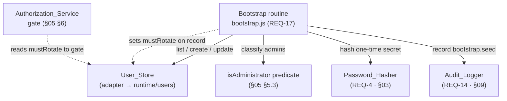
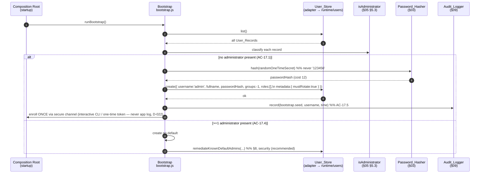

# Design Section 12 — Administrator Bootstrap (First-Run Seeding) · `DES-BOOT`

> **Section role: DETAILED DESIGN.** This file details the **bootstrap routine** — the
> startup-time seeding of a default administrator and the mandatory password-rotation gate
> that eliminates FUXA's known-default-credential weakness (REQ-17). Read
> [`../design.md`](../design.md) (the **master map**) first — it owns the layered
> architecture, the adapter seams to FUXA, the Error Handling status/shape table, the
> Security Posture (including the *bootstrap safety* bullet and the `mustRotate` gate), and
> the module-boundary rules (**D-003**, AC-16.*). This section refines those decisions for
> REQ-17 only; it does not restate or override them.
>
> **Covers:** REQ-17 (Administrator Bootstrap / First-Run Seeding), acceptance criteria
> AC-17.1 … AC-17.5.
> **Owns properties:** **P-009** (formalized in full in [§9](#9-correctness-properties)). It
> **jointly owns** the cross-cutting candidate property **P-010** together with
> [`04-user-management.md`](./04-user-management.md) §6.5 (pending confirmation at Tasks);
> P-010 is formalized here as jointly owned and is **not** re-minted as solely this section's.
> It *consumes* the admin-determination predicate and the authorization gate from
> [`05-rbac-authorization.md`](./05-rbac-authorization.md) §5.3/§6, the hashing contract from
> [`03-password-security.md`](./03-password-security.md), the last-admin guard from
> [`04-user-management.md`](./04-user-management.md) §6.5, and the `bootstrap.seed` audit event
> from [`09-audit-logging.md`](./09-audit-logging.md) §4/§9.
>
> **Grounding.** Every FUXA claim below was verified by reading the actual source:
> `server/runtime/users/usrstorage.js` (`setDefault`, `setUser`) and
> `server/runtime/users/index.js` (the `init` seeding trigger, `usersMap` cache). Exact calls
> are cited inline. Decisions/trade-offs/notes/deviations referenced as `D-***` / `TO-***` /
> `N-***` / `DV-***` and properties `P-***` live in [`../decisions/`](../decisions/) and
> [`../decisions/traceability.md`](../decisions/traceability.md).

---

## 1. Purpose & Scope

This section specifies **how a first administrator comes to exist safely on first run, and how
that seeded account is prevented from doing anything except rotating its password until it has
done so** — the design of the module's **bootstrap routine** and the `mustRotate` flag it sets.

Scope, precisely:

- **AC-17.1** — at startup, when the `User_Store` contains **no administrator**, create
  **exactly one** default `Administrator` account.
- **AC-17.2** — **while** a seeded default administrator has **not** completed a password
  rotation, the `Authorization_Service` denies that account **every** protected operation
  **except** the password-rotation operation (⇒ pre-rotation half of **P-009**).
- **AC-17.3** — **when** the seeded default administrator completes a password rotation, the
  system grants that account its administrator permissions (⇒ post-rotation half of **P-009**).
- **AC-17.4** — **where** the store already contains at least one administrator at startup,
  retain the existing administrator(s) and create **no** default (idempotent bootstrap; also the
  migration case).
- **AC-17.5** — **when** a default administrator is created, the `Audit_Logger` records the
  seeding event, the affected username, and the time (`bootstrap.seed`, owned by §09).

### 1.1 Where it sits in the layered architecture

Per the master map's four layers (AC-16.1, **D-001**), bootstrap is a **Service-layer routine run
at the composition root**, not a request-path component:

- **Service layer / composition root** — `server/auth-management/services/bootstrap.js` exposes a
  single entry point (proposed `runBootstrap(deps)`) invoked **once at module startup** by the
  module composition root (`server/auth-management/index.js`). It orchestrates existing Service-
  and Store-layer collaborators; it holds no persistence logic of its own.
- **Collaborators (all injected, never reached around):**
  - `User_Store` (`FuxaUserStoreAdapter`, **D-002**) — `list()` to detect existing admins and
    `create(...)` / `update(...)` to seed or remediate. The adapter is the only component that
    knows FUXA's `{ username, fullname, password, groups, info }` shape (AC-16.5).
  - the **admin-determination predicate** `isAdministrator(subject)` — owned by
    [`05-rbac-authorization.md`](./05-rbac-authorization.md) §5.3; bootstrap *uses* it, it does
    **not** define a second notion of "administrator" (single-owner discipline).
  - `Password_Hasher.hash` / `verify` — owned by [`03-password-security.md`](./03-password-security.md);
    bootstrap hashes the one-time initial secret and (for migration) detects the known default.
  - `Audit_Logger.record` — owned by [`09-audit-logging.md`](./09-audit-logging.md); bootstrap is a
    **consumer** that emits `bootstrap.seed` (AC-17.5).
- **The `mustRotate` flag** is set by bootstrap on the seeded record's metadata and is **consumed
  by** the `Authorization_Service` bootstrap gate ([`05-rbac-authorization.md`](./05-rbac-authorization.md)
  §4.2 step 2 / §6). This section owns the flag's **lifecycle** (set on seed, cleared on rotation);
  §05 owns its **enforcement**.



> **Boundary note (D-003).** FUXA today seeds the first admin **inside its own runtime**:
> `server/runtime/users/index.js` `init` resolves `usrstorage.init(...)` to `dbfileExist` and, on a
> **fresh** database (`!dbfileExist`), calls `usrstorage.setDefault()` (verified) — which inserts
> `('admin', 'Administrator Account', bcrypt.hashSync('123456', 10), -1)` with **no `info`** and
> **no rotation gate** (verified, `usrstorage.js`). This module **does not edit those core files**;
> it adds a **module-owned startup bootstrap** that runs *after* FUXA's users init and brings the
> store to a safe resting state (seed-if-empty and/or remediate a known-default admin). Two verified
> divergences drive the whole design and are made precise below: (a) FUXA's trigger is **file
> existence**, not an **empty-admin content check** (AC-17.1 requires the latter, [§3.1](#31-the-empty-admin-check-ac-171)); and (b) FUXA leaves a **usable known-default credential** with no
> rotation (N-007; eliminated per [§3.2](#32-the-seed-credential-eliminating-n-007)/[§8](#8-migration-of-existing-fuxa-installs-n-007)).

---

## 2. The `mustRotate` Flag

The gate that satisfies AC-17.2/17.3 turns on a single boolean carried by the seeded account.
This section fixes where it lives, how it is set, how it is exposed, and how it is cleared; §05
fixes how it is *enforced*.

### 2.1 Storage — on the user record metadata

`mustRotate` is a **metadata field on the `User_Record`**, persisted inside FUXA's `info` JSON
object (the same `info` that holds `roles`; verified shape in `usrstorage.js` / `runtime/users`).
The store adapter surfaces the non-role remainder of `info` as first-class `metadata` (**D-007**,
§04 §2.1 / §06), so the flag appears as `metadata.mustRotate: boolean`:

```
User_Record.metadata = { mustRotate: true, ... }   // seeded admin, pre-rotation
```

- **Why metadata, not a token claim.** The flag is **mutable state of the account** (it flips
  exactly once, on rotation). If it were carried only in the Access_Token, a token minted at seed
  time would remain "must-rotate" after rotation (or, worse, a stale "no-rotate" token could
  outlive a re-imposed gate). Storing it on the record and resolving it **fresh at authorization
  time** makes rotation take effect on the very next request. This mirrors how the module resolves
  roles/permissions from stored state rather than trusting a long-lived token snapshot (**D-007**,
  §05 §4.3).
- **Absent flag = not gated.** A record with no `mustRotate` key is treated as `false` (a normal,
  non-seeded account is never gated). The migration path ([§8](#8-migration-of-existing-fuxa-installs-n-007))
  is the one place a pre-existing record has the flag *added*.

### 2.2 Exposure to the `Authorization_Service`

The authorization middleware builds the `Identity` (§05 §4.1) for each request; it populates
`Identity.mustRotate` by reading the caller's current `User_Record.metadata.mustRotate` through the
`User_Store` (the same read that yields `roles`). `isAllowed` therefore receives `mustRotate` as a
**pure input** and stays a pure function (§05 §4.3), while still reflecting the live stored value.
The gate itself — deny everything except `account.rotatePassword` when `mustRotate` is true — is
**step 2** of the decision procedure, owned by §05 §4.2/§6. This section guarantees only that the
flag is set on seed and cleared on rotation.

### 2.3 Lifecycle

```
seed        →  metadata.mustRotate = true      (§3.2)
(gate on)      Authorization denies all but account.rotatePassword   (§05 §6, AC-17.2)
rotate ok   →  metadata.mustRotate = false      (§4, AC-17.3)
(gate off)     Authorization governed purely by permission membership → admin perms regained
```

The flag is **monotonic within a bootstrap generation**: it is set exactly once at seed time and
cleared exactly once at the first successful rotation; nothing in the module sets it back to true
except a *new* bootstrap remediation of a *newly detected* known-default admin
([§8](#8-migration-of-existing-fuxa-installs-n-007)).

---

## 3. Seeding (AC-17.1)

### 3.1 The empty-admin check (AC-17.1)

Bootstrap runs **once at startup** (composition root) and decides whether to seed by asking a
**content** question, not a file question:

```
runBootstrap():
  admins = User_Store.list().filter(isAdministrator)        // §05 §5.3 predicate
  if admins.length == 0:
      seedDefaultAdministrator()                            // AC-17.1  (§3.2)
  else:
      // AC-17.4 — retain, create no default
      remediateKnownDefaultAdmins(admins)                   // §8 (security, recommended)
```

- **`isAdministrator` is §05's predicate, not a new one.** An account counts as an administrator
  when its resolved permissions cover `ADMIN_PERMISSION_SET` **or** its FUXA `groups` code is an
  admin code (`-1`/`255`, `adminGroups = [-1, 255]`, verified in `server/api/jwt-helper.js`). This
  is exactly the classification §04 §6.5 uses for the last-admin guard — one definition, three
  consumers (§04, §05, §12).
- **Verified divergence from FUXA (the reason this check exists).** FUXA seeds on
  `!dbfileExist` (the `users.fuxap.db` file not previously existing — verified in
  `server/runtime/users/index.js` `init`, where `result` is the `dbfileExist` flag returned by
  `usrstorage._bind`). That is **not** an empty-admin check: a store file that exists but whose
  administrators were all removed would **never** be re-seeded by FUXA. AC-17.1 mandates a
  content-based check, so the module reads the actual records and classifies them. (The runtime
  gap this leaves at *runtime* — deleting the last admin between restarts — is closed by AC-8.5,
  reconciled in [§7](#7-interaction-with-ac-85-the-p-010-invariant).)

### 3.2 The seed credential — eliminating N-007

**The core security decision of this section.** FUXA's `setDefault` seeds the literal password
`'123456'` (`bcrypt.hashSync('123456', 10)`, verified) and imposes **no** rotation — a fresh
instance ships with a guessable admin credential that stays valid indefinitely (**N-007**, the
exact root cause REQ-17 eliminates). The module's seed differs on **two independent axes**, either
of which alone is insufficient:

1. **A random, high-entropy, one-time initial secret (never the literal `'123456'`).**
   `seedDefaultAdministrator` generates a cryptographically random initial password (drawn from a
   CSPRNG, e.g. `crypto.randomBytes`), hashes it with `Password_Hasher.hash` (§03; module default
   bcrypt cost 12, ≥ FUXA's 10 — **D-008**), and persists **only the hash**. The initial secret is
   delivered to the operator through a **dedicated secure enrollment channel — never the shared
   application log or console** (**D-022**, fixes **N-018**):
   - **Interactive first-run (default).** An operator-controlled CLI at a controlled console sets
     the initial administrator secret directly (a first-run enrollment ceremony). No secret value is
     written to `fuxa.log` or emitted via `runtime.logger`/`console`.
   - **Automated provisioning.** The module issues a **one-time enrollment token** — short TTL,
     hashed at rest, single-use — surfaced **once** to an operator-only secured channel; the operator
     redeems the token to set the real secret. Only the token's hash is persisted; the token is
     invalidated on first redemption or TTL expiry.

   In **no** configuration does the module persist the plaintext secret or write it (or a redeemable
   token) to the shared application log/console. This replaces the earlier "permission-restricted
   file + single console/log emission" disclosure, which was credential disclosure via logs (N-018:
   logs are backed up, shipped, and read by support/operators).
2. **The `mustRotate` gate (AC-17.2).** The seeded record is written with
   `metadata.mustRotate = true`, so the `Authorization_Service` denies it every protected operation
   except `account.rotatePassword` ([§2](#2-the-mustrotate-flag), §05 §6).

**Why both, not just the gate — the precise argument.** Sign-in (`Authentication_Service`, REQ-1)
is **not** a protected operation gated by `Authorization_Service`; the gate only constrains
*protected operations*. If the module reused a **known** initial secret and relied on the gate
alone, an attacker who knows `'123456'` could still **sign in** on a fresh instance, obtain a
session, and — although the gate would restrict them to `account.rotatePassword` — **rotate the
password themselves**, taking ownership of the sole administrator and locking out the legitimate
operator. Randomizing the one-time secret closes this takeover path: an attacker cannot be the one
who completes the rotation because they do not know the initial secret. The gate then closes the
*second* path (no protected action is possible before rotation even if the secret leaks). Together
they guarantee **no usable known-default credential survives first boot** (D-005 / TO-005
verification clauses).

**Chosen over the alternatives (justification).** A random one-time secret + forced rotation was
chosen over (i) reusing `'123456'` + gate only (rejected: enables the hostile-rotation takeover
above); (ii) environment-variable seeded credentials (rejected as the default by **TO-005 / D-005**
— secret-in-env/log risk); and (iii) a CLI `create-admin` step as the *only* path (kept as a
documented **ops fallback** per TO-005, but not the out-of-box default, because it blocks first use
until an operator runs it). This matches **D-005 (CONFIRMED)** — auto-seed + mandatory rotation —
with the CLI retained as fallback.

### 3.3 Creating exactly one default administrator (AC-17.1)

`seedDefaultAdministrator` writes **exactly one** record via `User_Store.create(...)`:

| Field | Seed value | Rationale |
|-------|-----------|-----------|
| `username` | `admin` (configurable) | Matches FUXA's convention for continuity; a setting may override it. |
| `fullname` | `Administrator Account` | Matches FUXA's `setDefault` label. |
| `passwordHash` | `Password_Hasher.hash(randomOneTimeSecret)` | Random, never `'123456'`; cost 12 (§03, D-008). |
| `groups` | `-1` | The **one** safe thing reused from FUXA's seed: the admin group code, so `isAdministrator` is true via `groupCodeAdmin(-1)` (§05 §5.3) **without** requiring a pre-existing RBAC role on an empty store. |
| `roles` | `[]` (optionally a provisioned admin role id) | The module MAY additionally provision a first administrator role; `groups=-1` alone suffices for admin determination. |
| `metadata.mustRotate` | `true` | Arms the gate (AC-17.2). |

- **Exactly one.** The routine seeds a single record and does so only on the empty-admin branch
  ([§3.1](#31-the-empty-admin-check-ac-171)); it is **idempotent** across restarts because a
  second startup finds the just-seeded admin and takes the AC-17.4 no-seed branch.
- **Does not call FUXA's `setDefault`.** The module never invokes `usrstorage.setDefault` (which
  would write `'123456'`); it writes its own record through the `User_Store` interface (AC-16.3 —
  never around it). Because bootstrap hands the store an **already-hashed** value, the adapter must
  persist it **verbatim** and not route it through `setUser`'s re-hash path (the no-double-hash
  coordination note owned by §06; same hazard §04 §3.3 flags).
- **Audit (AC-17.5).** After the write, bootstrap emits one `Audit_Logger.record({ category:
  'bootstrap.seed', subject: username, operation: 'seed', outcome: 'seeded', timestamp })`
  ([§6](#6-audit-of-the-seeding-event-ac-175)).

### 3.4 Seeding sequence



---

## 4. The Password-Rotation Operation (`account.rotatePassword`)

Rotation is the **only** operation a not-yet-rotated seeded admin may perform (AC-17.2); it is what
clears the gate and restores admin authority (AC-17.3).

### 4.1 Contract

```
rotatePassword(identity, req): RotateOutcome
req = { currentPassword: string, newPassword: string }

RotateOutcome =
  | { kind: 'rotated' }                                             // AC-17.3 (mustRotate cleared)
  | { kind: 'bad_current',  error: 'bad_current_password' }         // current secret mismatch
  | { kind: 'invalid_new',  error: 'weak_or_reused_password', detail }  // policy / reuse guard
```

- **HTTP endpoint (D-018, added 2026-07-13 — closes N-013).** Exposed as **`POST /api/account/rotate-password`**,
  wired in the composition root (which must also instantiate `Account_Service`); see the master map
  "API Composition Root & Cutover Strategy". Without this endpoint a gated admin was deadlocked
  (specified operation, no way to call it). On success it clears `mustRotate` **and bumps
  `tokenVersion`** (D-015) so tokens minted before rotation are invalidated.
- **Gated as the sole exception (AC-17.2).** The operation's `requiredPermission` is
  `account.rotatePassword` (§05 §2.2). When `mustRotate` is true, §05 §4.2 step 2 permits **only**
  this permission and denies all others — so rotation is reachable while nothing else is.
- **Verifies the current secret via `Password_Hasher` (§03).** It calls
  `Password_Hasher.verify(req.currentPassword, storedHash)` (the module's single comparison site);
  a mismatch returns `bad_current` and does **not** clear the flag. This is what forces the
  legitimate holder of the one-time secret — not an anonymous caller — to perform the rotation.
- **Re-hashes the new secret via `Password_Hasher` (§03).** On success it computes
  `Password_Hasher.hash(req.newPassword)` (cost 12, D-008) and persists **only** the new hash via
  `User_Store.update` (verbatim, no double-hash — §06). The plaintext never reaches the store.
- **Rejects reuse of the initial secret.** `newPassword` must pass basic policy (non-empty, minimum
  length) **and** must differ from `currentPassword`, so "rotation" always yields a genuinely new
  credential — otherwise `mustRotate` would clear while the guessable/one-time secret still works.
- **Clears the gate (AC-17.3).** On success it sets `metadata.mustRotate = false` in the same
  update. On the next request the middleware reads the cleared flag, the gate no longer applies, and
  the account is authorized purely by permission membership (§05 §4.2 step 3) — regaining its
  administrator permissions because it carries `groups=-1` (⇒ `ADMIN_PERMISSION_SET` via §05 §5.3).
- **Audits the change.** Rotation is a credential change and is recorded through `Audit_Logger` as a
  `user.update` event (subject = username, secrets sanitized — AC-14.2/14.5, §09); the initial
  seeding was already recorded separately as `bootstrap.seed` (AC-17.5).

### 4.2 Why rotation cannot be bypassed

The gate is evaluated **before** permission membership (§05 §4.2: step 2 precedes step 3), so a
seeded admin's `ADMIN_PERMISSION_SET` cannot be used to reach any operation other than
`account.rotatePassword` while `mustRotate` is true. There is exactly one code path that clears the
flag — a **successful** `rotatePassword` that verified the current secret and accepted a
different new secret — so the transition from "gated" to "full admin" is provably tied to a genuine
rotation. This un-bypassability is the substance of **P-009** ([§9](#9-correctness-properties)).

---

## 5. Idempotent Bootstrap & Retain-Existing (AC-17.4)

**When the store already has ≥1 administrator at startup, bootstrap creates no default and retains
the existing account(s) unchanged** (the else-branch of [§3.1](#31-the-empty-admin-check-ac-171)):

- **No new record.** Because the empty-admin check is false, `seedDefaultAdministrator` is never
  called — so no second `admin` is created and no existing administrator record is overwritten.
- **Idempotency across restarts.** After a first-run seed, every subsequent startup observes the
  seeded admin and takes this no-seed branch; bootstrap is therefore safe to run on every boot.
- **The migration case.** A pre-existing FUXA install that already seeded `admin`/`groups=-1`
  (verified `setDefault`) satisfies `isAdministrator`, so bootstrap adds no default — **but** that
  legacy account still carries the `'123456'` credential and **no** `mustRotate` flag. Retaining it
  *unremediated* would preserve exactly the N-007 weakness. This is handled by the known-default
  remediation in [§8](#8-migration-of-existing-fuxa-installs-n-007), which runs on this same branch;
  AC-17.4's "retain, create no default" is honored (no new account), while the security posture is
  restored by *forcing rotation* on the detected known-default admin rather than silently leaving it.

---

## 6. Audit of the Seeding Event (AC-17.5)

When bootstrap creates a default administrator, it emits **one** audit event through the
`Audit_Logger` (contract and sink owned by [`09-audit-logging.md`](./09-audit-logging.md); bootstrap
is a **consumer**, listed in §09 §4 and the §09 emission map):

```
Audit_Logger.record({
  category:  'bootstrap.seed',      // AC-17.5 discriminator (§09 §2.2)
  subject:   seededUsername,        // the affected username
  operation: 'seed',
  outcome:   'seeded',
  timestamp: <caller-stamped ISO-8601 instant>   // §09 §2.3 — caller supplies the time
})
```

- **Fields exactly satisfy AC-17.5.** `subject` is the affected username and `timestamp` is the
  time; the event is secret-free by construction (no password field exists on `Audit_Event`, §09
  §2.2/§5) and the one-time secret is **never** placed in `subject`/`detail`.
- **Non-blocking.** `record` is fire-and-forget and never throws back into bootstrap (§09 §7); a
  failed audit write does not undo or abort a successful seed.
- **Only on the seed branch.** No `bootstrap.seed` event is emitted on the AC-17.4 retain-existing
  branch (nothing was seeded). A migration remediation that forces rotation ([§8](#8-migration-of-existing-fuxa-installs-n-007))
  records its credential-gate change as a `user.update`, not `bootstrap.seed`.

---

## 7. Interaction with AC-8.5 (the P-010 invariant)

REQ-17 (bootstrap) and AC-8.5 (last-admin delete guard, owned by [`04-user-management.md`](./04-user-management.md)
§6.5) are **two halves of one system-wide invariant**: *the system always has at least one
administrator.* This section reconciles them precisely, including the gap that makes AC-8.5
**necessary**.

- **Bootstrap provides the base case.** AC-17.1 guarantees that at startup, if no administrator
  exists, exactly one is seeded — so every run *begins* with ≥1 administrator.
- **Bootstrap only seeds on empty-admin *at startup*.** It is a **startup** routine; it does **not**
  observe runtime deletions and does **not** re-seed mid-run. In particular, deleting the last
  administrator **while other (non-admin) users still exist** does **not** empty the store and does
  **not** trigger any re-seed — the store simply has zero admins until the next restart (at which
  point bootstrap would re-seed, because the empty-admin check is content-based, [§3.1](#31-the-empty-admin-check-ac-171)).
- **This runtime gap is exactly why AC-8.5 exists.** To avoid a window with **zero** administrators
  (an operational lockout — no one can manage users/roles until a restart), the delete path must
  refuse to remove the final administrator at runtime. That refusal is **AC-8.5**, enforced by the
  `User_Service` last-admin guard **before** any store mutation (§04 §6.5), using the *same*
  `isAdministrator` predicate (§05 §5.3) this section uses. AC-8.5 was added precisely as the
  runtime inverse of the bootstrap guarantee (**DV-005**).
- **Together they close the loop.** Bootstrap ensures ≥1 admin *initially*; AC-8.5 ensures no
  runtime delete can bring the count to 0. Hence, for any store that starts with ≥1 admin, every
  reachable state also has ≥1 admin — the invariant formalized as **P-010** ([§9.2](#92-property-p-010-jointly-owned--pending-confirmation)).

> **No double guarantee, no conflict.** Bootstrap and AC-8.5 are complementary, not redundant:
> bootstrap cannot prevent a runtime deletion (it does not run during requests), and AC-8.5 cannot
> create the *first* admin (it only refuses a delete). Neither overlaps the other's job, so there is
> no conflicting behavior between §12 and §04.

---

## 8. Migration of Existing FUXA Installs (N-007)

An install upgraded from stock FUXA already contains the seeded `admin` with `bcrypt('123456')`,
`groups=-1`, and **no** `info`/`mustRotate` (verified `setDefault`). Because that account is an
administrator, [§5](#5-idempotent-bootstrap--retain-existing-ac-174) creates no default — so
**without** a remediation step the known-default credential would silently survive, defeating REQ-17
for exactly the installs most likely to be exposed.

**Recommended remediation (flagged for the Tasks phase; do not silently leave the default).** On the
retain-existing branch, `remediateKnownDefaultAdmins(admins)`:

1. **Detect a known-default admin.** For each administrator that has **no completed-rotation
   marker** (`metadata.mustRotate` is absent/unset — the FUXA-seeded record has no `info` at all),
   test whether its stored hash verifies the literal `'123456'` via `Password_Hasher.verify('123456',
   storedHash)` (the well-known FUXA default, N-007).
2. **Force rotation.** For any account that matches, set `metadata.mustRotate = true` (and,
   recommended, re-hash the stored credential to a fresh random one-time secret enrolled once via the
   **secure enrollment channel** in [§3.2](#32-the-seed-credential-eliminating-n-007) — never the app
   log/console, **D-022**), via `User_Store.update`. This arms the gate so
   the legacy admin can do nothing but rotate — converting a migrated install into the same secure
   resting state as a fresh seed.
3. **Do not create a new admin.** AC-17.4 is preserved: no default is created; only the existing
   record's gate flag (and optionally its hash) is updated.

This behavior is **recommended and flagged for confirmation at Tasks** (it changes an existing
account's login on upgrade, an operational decision), rather than asserted as silent mandatory
behavior. What is **not** optional is the requirement it serves: the module must never allow a
usable known-default credential to persist (D-005/TO-005 verification clauses), verified by the
security test in [§10.3](#103-security-test-no-usable-known-default-survives).

---

## 9. Correctness Properties

> *A property is a characteristic or behavior that should hold true across all valid
> executions of a system — a formal statement about what the system should do. Properties are
> the bridge between human-readable specifications and machine-verifiable correctness.*

Per the master-map Table of Contents and [`../decisions/traceability.md`](../decisions/traceability.md)
§C, this section is the **single owner of P-009** and a **joint owner of P-010** (with §04). The
prework consolidation established that:

- **AC-17.2** (pre-rotation: only `account.rotatePassword` allowed) and **AC-17.3** (post-rotation:
  admin permissions regained) are the two halves of one universal guarantee over the whole
  protected-operation space; they are **combined** into a single comprehensive property **P-009**
  (a seeded admin's authority is empty-except-rotate before rotation and full-admin after).
- **AC-17.1** (seed exactly one when empty) and **AC-17.4** (retain, no default when non-empty) are
  startup wiring/idempotency behaviors verified by example/integration tests
  ([§10](#10-testing-notes-req-17)); AC-17.1 also supplies the **base case** of the jointly-owned
  invariant **P-010**.
- **AC-17.5** (audit the seed) is a recording side-effect verified by an example/integration test.

### 9.1 Property P-009 (owned)

Reasoning (from the prework): AC-17.2/17.3 quantify over **every** protected operation — the
security value is precisely that even an operation whose required permission the seeded admin
*holds* (an `ADMIN_PERMISSION_SET` member) is denied before rotation, and becomes allowed after.
This is a metamorphic, transition-style property (the same admin+operation pair flips from denied to
allowed exactly at a successful rotation), best expressed as one universally-quantified statement.

#### Property 9: A seeded admin cannot act before password rotation, and regains admin rights after it

*For any* protected operation `op` and *for any* freshly seeded default administrator identity `a`
whose `mustRotate` flag is `true`: `isAllowed(a, op)` **denies** `op` when
`op.requiredPermission ≠ 'account.rotatePassword'` and **permits** `op` when
`op.requiredPermission = 'account.rotatePassword'`; and *for the same* account `a'` after a
successful password rotation has cleared `mustRotate`, `isAllowed(a', op)` is governed solely by
permission membership, so every `op` whose required permission lies in the seeded administrator's
effective permission set (which includes `ADMIN_PERMISSION_SET`) is **permitted**.

**Validates: Requirements 17.2, 17.3** — (P-009)

### 9.2 Property P-010 (jointly owned — pending confirmation)

Reasoning (from the prework): this is a genuine invariant over **sequences** of deletions, held by
two cooperating mechanisms — bootstrap's initial guarantee (AC-17.1, this section) and the runtime
last-admin guard (AC-8.5, §04 §6.5). It is registered in
[`../decisions/traceability.md`](../decisions/traceability.md) §C as a **candidate owned jointly by
§04 + §12 (confirm)**; it is formalized here as jointly owned and is **not** re-minted as solely this
section's property. Confirmation and the choice of owning test module are deferred to the Tasks
phase.

#### Property 10: At least one administrator always remains (jointly owned §04 + §12)

*For any* initial `User_Store` state containing **at least one** administrator (per the §05 §5.3
`isAdministrator` predicate) and *for any* finite sequence of `User_Service.delete(username)`
operations applied to it, **at least one** administrator account remains in the store after **every**
operation in the sequence — because the last-administrator delete guard (**AC-8.5**, §04 §6.5)
rejects the deletion that would remove the final administrator (making no store mutation), and the
bootstrap routine (**AC-17.1**, this section) guarantees an administrator exists in the initial
state.

**Validates: Requirements 8.5, 17.1** — (P-010, jointly owned §04 + §12; references §04 §6.5's
last-admin guard)

---

## 10. Testing Notes (REQ-17)

**PBT applicability for this section: partially applicable.** The authorization gate (AC-17.2/17.3
→ P-009) and the delete-sequence invariant (P-010) are universal properties over large input spaces
(any protected operation; any deletion sequence) and are ideal `fast-check` targets. The seeding
*wiring* (AC-17.1/17.4), the *audit* emission (AC-17.5), and the *security* remediation (N-007) are
deterministic startup/side-effect behaviors best covered by **example / integration tests**. Server-
side tests use FUXA's `mocha` / `chai` / `sinon` runner (verified available, master-map Testing
Strategy), with an **in-memory fake `User_Store`** and a **`sinon` spy `Audit_Sink`** injected so no
filesystem/DB is touched.

Per the master-map rules for every property test: use `fast-check` (do not hand-roll), **minimum 100
iterations**, and tag each test:

**Tag format:** `Feature: auth-user-management, Property {n}: {property text}`

### 10.1 Property tests (fast-check)

- **P-009 (owned).** Generators: `requiredPermission` drawn from `fc.oneof(...)` over
  `ADMIN_PERMISSION_SET` members, `'account.rotatePassword'`, and arbitrary non-admin permission ids
  (`fc.string()`-derived `<resource>.<action>`), so the "held-but-still-denied" edge is exercised, not
  only unheld permissions. Build a seeded admin identity (`groups:-1`, `mustRotate:true`). Assert:
  (1) `isAllowed(a, op)` is `allow:false` (403) for every `op` with
  `requiredPermission != 'account.rotatePassword'`, and `allow:true` for
  `requiredPermission == 'account.rotatePassword'`; (2) after clearing `mustRotate`, `isAllowed(a',
  op)` is `allow:true` for every `op` whose `requiredPermission ∈ ADMIN_PERMISSION_SET ∪
  {account.rotatePassword}`. Tag `Property 9`. ≥100 iterations. (Consumes §05's `isAllowed`; the gate
  ordering — step 2 before step 3 — is what the property pins.)
- **P-010 (jointly owned, confirm at Tasks).** Generators: an initial store of random users with
  ≥1 administrator (mix of RBAC-role admins and `groups=-1` admins), plus a random sequence of
  `delete(username)` calls (including deletes targeting admins and non-admins, valid and unknown
  usernames). Drive the sequence through `User_Service.delete`; after **each** step assert the count
  of records satisfying `isAdministrator` (§05 §5.3) is `≥ 1` (a last-admin delete returns
  `last_admin` and mutates nothing — §04 §6.5). Tag `Property 10`. ≥100 iterations. Owning test
  module (§04 vs §12) to be fixed at Tasks per the traceability candidate.

### 10.2 Example / integration tests (seeding, idempotency, audit)

1. **AC-17.1 — seed exactly one on empty store.** Run `runBootstrap` against an empty in-memory
   store; assert exactly one record exists, it satisfies `isAdministrator`, has
   `metadata.mustRotate === true`, and its stored hash does **not** verify `'123456'`.
2. **AC-17.1/17.4 — idempotency.** Run `runBootstrap` twice; assert the second run creates no
   additional admin and leaves the seeded record unchanged.
3. **AC-17.4 — retain existing, no default.** Pre-populate a store with (a) an RBAC-role admin and
   (b) a `groups=-1` admin (each already rotated, `mustRotate:false`); run bootstrap; assert no new
   admin is created and both records are byte-for-byte unchanged.
4. **AC-17.5 — audit the seed.** With a spy `Audit_Sink`, run bootstrap on an empty store; assert
   exactly one `record` with `category:'bootstrap.seed'`, `subject` = seeded username, and a
   non-empty ISO `timestamp`; assert **no** `bootstrap.seed` is emitted on the retain-existing branch.
5. **Rotation clears the gate (AC-17.3, example).** Seed → `rotatePassword` with the correct current
   one-time secret and a different valid new secret → assert `metadata.mustRotate === false`, the new
   hash verifies the new secret, and a subsequent admin operation is allowed by `isAllowed`.
6. **Rotation guards (edge).** `rotatePassword` with a wrong current secret returns `bad_current` and
   leaves `mustRotate === true`; a new secret equal to the current one returns `invalid_new` and does
   **not** clear the flag.

### 10.3 Security test — no usable known-default survives

Seed a store **exactly as FUXA's `setDefault` would** (`admin` / `bcrypt.hashSync('123456',10)` /
`groups=-1` / no `info`); run the module bootstrap; then assert **both** guarantees:

- the resulting `admin` has `metadata.mustRotate === true` (remediation forced rotation, §8); and
- `isAllowed(adminIdentity, op)` denies **every** protected `op` except `account.rotatePassword`
  (so the `'123456'` credential yields **no** usable authority);

and assert the module's **own** seed path (empty-store branch) never writes a credential whose hash
verifies `'123456'`. This is the concrete counterpart of N-007's elimination and the D-005/TO-005
verification clauses.

### 10.4 Security test — no plaintext secret reaches the log/console (D-022, N-018)

With a spy over `runtime.logger` (and `console`), run the seed path and the migration remediation;
assert **no** log/console call argument contains the seeded/rotated plaintext secret **or** a
redeemable enrollment token (only its hash may be persisted). For the interactive-first-run path,
assert the secret is obtained via the injected CLI-enrollment collaborator, not emitted anywhere. For
the automated-provisioning path, assert the one-time enrollment token is single-use (a second
redemption fails) and TTL-bounded. This is the concrete verification clause of **D-022** closing
**N-018** (credential disclosure via logs).

---

## 11. Traceability (this section)

| AC | Behavior | Verified FUXA anchor | Test type |
|----|----------|----------------------|-----------|
| AC-17.1 | At startup with no administrator present, seed **exactly one** default admin (content-based empty-admin check, not file-existence) | `usrstorage.setDefault` seeds on `!dbfileExist` in `runtime/users/index.js init` — module replaces the trigger with a `list()`+`isAdministrator` check | example/integration ([§10.2](#102-example--integration-tests-seeding-idempotency-audit)); base case of **P-010** |
| AC-17.2 | While seeded admin has not rotated, deny every protected op **except** `account.rotatePassword` | none (FUXA has **no** gate — N-007); gate enforced at §05 §4.2 step 2 | **property — P-009** (pre-rotation half) |
| AC-17.3 | On successful rotation, grant administrator permissions | none (FUXA never forces/handles rotation — N-007); `groups=-1` ⇒ `ADMIN_PERMISSION_SET` via §05 §5.3 | **property — P-009** (post-rotation half) + example ([§10.2](#102-example--integration-tests-seeding-idempotency-audit)) |
| AC-17.4 | Store already has an admin at startup → retain, create no default (idempotent; migration case) | `setDefault` params `('admin',…,-1)` — the pre-existing admin the module must retain, not duplicate | example/integration ([§10.2](#102-example--integration-tests-seeding-idempotency-audit)) |
| AC-17.5 | Record the seeding event (username, time) | uses FUXA winston logger via `Audit_Sink` (§09 §6, verified `runtime/logger.js`) | example/integration ([§10.2](#102-example--integration-tests-seeding-idempotency-audit)) |
| AC-8.5 (ref) + AC-17.1 | ≥1 administrator always remains across deletion sequences | `removeUsers` has **no** last-admin check (verified) — guard added in §04 §6.5 | **property — P-010** (jointly owned §04 + §12) |
| N-007 (security) | No usable known-default credential survives first boot (random one-time secret + gate; migration forces rotation) | `bcrypt.hashSync('123456',10)` in `setDefault` (verified) | security example/integration ([§10.3](#103-security-test-no-usable-known-default-survives)) |
| N-018 (security) | The initial/rotated secret is delivered via a secure enrollment channel (interactive CLI + one-time token); it is **never** written to the shared app log/console (D-022) | none (FUXA has no enrollment channel — N-007/N-018); replaces the prior console/log disclosure | security ([§10.4](#104-security-test--no-plaintext-secret-reaches-the-logconsole-d-022-n-018)) |

No orphan criteria: AC-17.1 … AC-17.5 each map to at least one test above (AC-17.1/17.4/17.5 to
example/integration; AC-17.2/17.3 to P-009; AC-17.1 additionally to P-010's base case). This section
maps back to REQ-17 only, matching
[`../decisions/traceability.md`](../decisions/traceability.md) §A/§B (`DES-BOOT → REQ-17`) and the
master map's Table of Contents (`DES-BOOT` owns P-009; jointly owns P-010 with §04). Decisions
honored: **D-005** (auto-seed + forced rotation, CONFIRMED), **TO-005** (option (a) default, CLI
fallback), **DV-004** (REQ-17), **DV-005** (AC-8.5), **D-008** (bcrypt cost 12), **N-007** (root cause
eliminated), **D-022** (secure enrollment channel — no secret to log/console; **N-018** eliminated),
**D-003** (no FUXA core edits — bootstrap is module-owned and runs at the composition
root).
